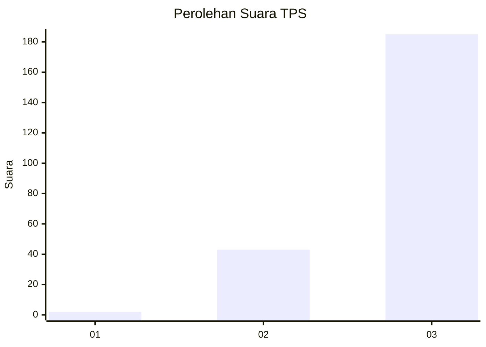
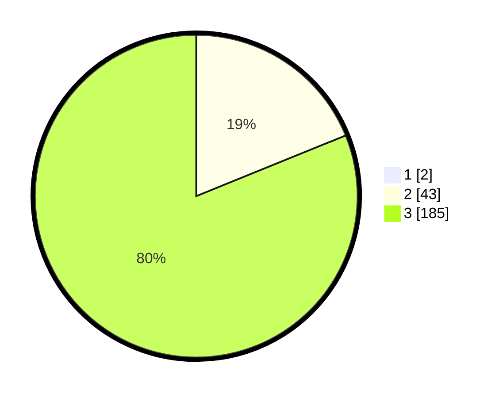

# Hasil

## Grafik

## Tabel

| No. | Nama Paslon    | Suara | Suara (raw) | Persentase |
|:--- |:-------------- | -----:| -----------:| ----------:|
| 1   | ANIES MUHAIMIN | 2     | [2][p-1]    | 0,87       |
| 2   | PRABOWO GIBRAN | 43    | [43][p-2]   | 18,70      |
| 3   | GANJAR MAHFUD  | 185   | [185][p-3]  | 80,43      |

[p-1]: https://github.com/gigit-pemilu/pemilu-2024-33-jawa-tengah/blob/main/pilpres/hitung-suara/sub/33-jawa-tengah/sub/09-boyolali/sub/02-ampel/sub/2009-gondangslamet/sub/004-tps/sub/paslon-1.txt
[p-2]: https://github.com/gigit-pemilu/pemilu-2024-33-jawa-tengah/blob/main/pilpres/hitung-suara/sub/33-jawa-tengah/sub/09-boyolali/sub/02-ampel/sub/2009-gondangslamet/sub/004-tps/sub/paslon-2.txt
[p-3]: https://github.com/gigit-pemilu/pemilu-2024-33-jawa-tengah/blob/main/pilpres/hitung-suara/sub/33-jawa-tengah/sub/09-boyolali/sub/02-ampel/sub/2009-gondangslamet/sub/004-tps/sub/paslon-3.txt

## Foto C Plano

https://sirekap-obj-formc.kpu.go.id/3edb/pemilu/ppwp/33/09/02/20/09/3309022009004-20240214-141749--f8d4773a-7f3a-4ab0-bf1a-d09b1357c1ab.jpg

https://sirekap-obj-formc.kpu.go.id/3edb/pemilu/ppwp/33/09/02/20/09/3309022009004-20240214-203720--2e0188f9-77ce-49c8-a358-a0f60f8da245.jpg

https://sirekap-obj-formc.kpu.go.id/3edb/pemilu/ppwp/33/09/02/20/09/3309022009004-20240214-203724--3e71bf35-5c0e-4304-80a2-20c8843cc5c0.jpg

## Metadata

| Key        | Value               |
| ---------- | ------------------- |
| Time Stamp | 2024-02-15 12:00:28 |

