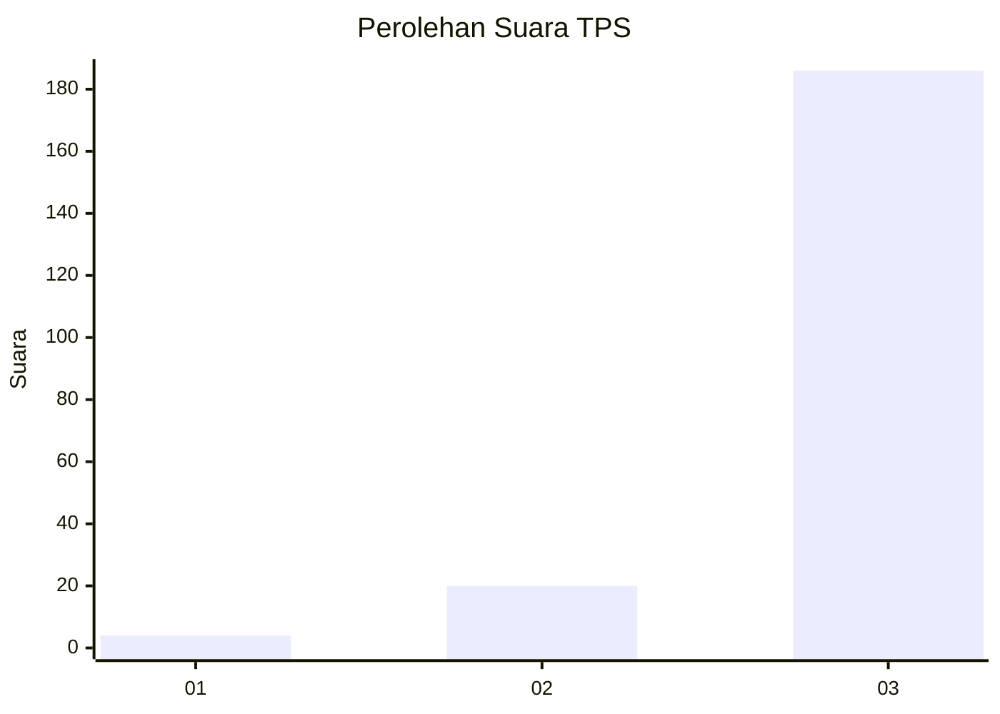
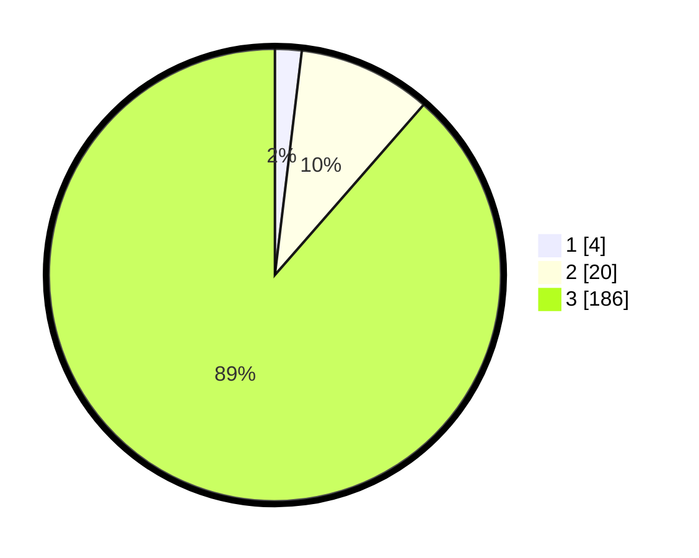

# Hasil

## Grafik

## Tabel

| No. | Nama Paslon    | Suara | Suara (raw) | Persentase |
|:--- |:-------------- | -----:| -----------:| ----------:|
| 1   | ANIES MUHAIMIN | 4     | [4][p-1]    | 1,90       |
| 2   | PRABOWO GIBRAN | 20    | [20][p-2]   | 9,52       |
| 3   | GANJAR MAHFUD  | 186   | [186][p-3]  | 88,57      |

[p-1]: https://github.com/gigit-pemilu/pemilu-2024/blob/main/pilpres/hitung-suara/sub/33-jawa-tengah/sub/09-boyolali/sub/02-ampel/sub/2009-gondangslamet/sub/005-tps/sub/paslon-1.txt
[p-2]: https://github.com/gigit-pemilu/pemilu-2024/blob/main/pilpres/hitung-suara/sub/33-jawa-tengah/sub/09-boyolali/sub/02-ampel/sub/2009-gondangslamet/sub/005-tps/sub/paslon-2.txt
[p-3]: https://github.com/gigit-pemilu/pemilu-2024/blob/main/pilpres/hitung-suara/sub/33-jawa-tengah/sub/09-boyolali/sub/02-ampel/sub/2009-gondangslamet/sub/005-tps/sub/paslon-3.txt

## Foto C Plano

https://sirekap-obj-formc.kpu.go.id/4852/pemilu/ppwp/33/09/02/20/09/3309022009005-20240215-005046--bbe35854-eea4-40ec-b996-0873fd37070a.jpg

https://sirekap-obj-formc.kpu.go.id/4852/pemilu/ppwp/33/09/02/20/09/3309022009005-20240215-005135--aaa30a4b-3487-4486-9d48-e3f6e9488d0e.jpg

https://sirekap-obj-formc.kpu.go.id/4852/pemilu/ppwp/33/09/02/20/09/3309022009005-20240215-005345--cef9a9e0-0927-46d4-8c8d-7827a7d54868.jpg

## Metadata

| Key        | Value               |
| ---------- | ------------------- |
| Time Stamp | 2024-02-15 21:01:18 |

