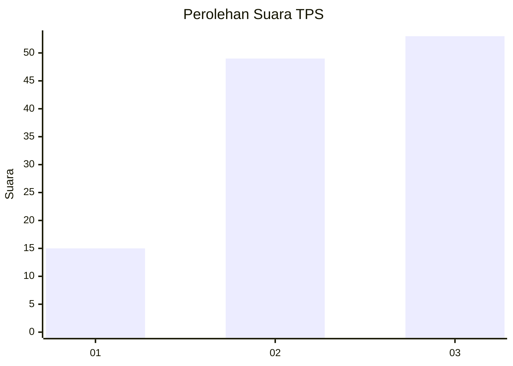
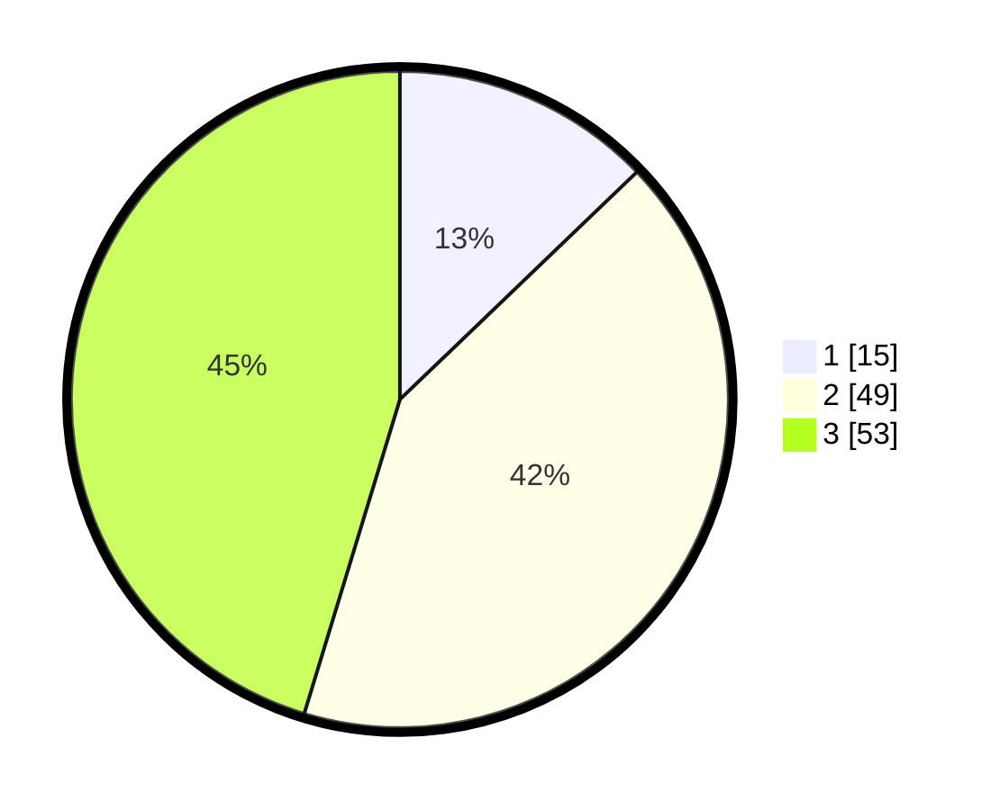

# Hasil

## Grafik

## Tabel

| No. | Nama Paslon    | Suara | Suara (raw) | Persentase |
|:--- |:-------------- | -----:| -----------:| ----------:|
| 1   | ANIES MUHAIMIN | 15    | [15][p-1]   | 12,82      |
| 2   | PRABOWO GIBRAN | 49    | [49][p-2]   | 41,88      |
| 3   | GANJAR MAHFUD  | 53    | [53][p-3]   | 45,30      |

[p-1]: https://github.com/gigit-pemilu/pemilu-2024-33-jawa-tengah/blob/main/pilpres/hitung-suara/sub/33-jawa-tengah/sub/09-boyolali/sub/02-ampel/sub/2011-urutsewu/sub/001-tps/sub/paslon-1.txt
[p-2]: https://github.com/gigit-pemilu/pemilu-2024-33-jawa-tengah/blob/main/pilpres/hitung-suara/sub/33-jawa-tengah/sub/09-boyolali/sub/02-ampel/sub/2011-urutsewu/sub/001-tps/sub/paslon-2.txt
[p-3]: https://github.com/gigit-pemilu/pemilu-2024-33-jawa-tengah/blob/main/pilpres/hitung-suara/sub/33-jawa-tengah/sub/09-boyolali/sub/02-ampel/sub/2011-urutsewu/sub/001-tps/sub/paslon-3.txt

## Foto C Plano

https://sirekap-obj-formc.kpu.go.id/d54e/pemilu/ppwp/33/09/02/20/11/3309022011001-20240215-001850--a4439c49-09f8-4d90-83f1-d186e1c9159f.jpg

https://sirekap-obj-formc.kpu.go.id/d54e/pemilu/ppwp/33/09/02/20/11/3309022011001-20240215-001655--bb8d5e15-93ba-40db-9730-3825434a1ca7.jpg

https://sirekap-obj-formc.kpu.go.id/d54e/pemilu/ppwp/33/09/02/20/11/3309022011001-20240215-001751--b6625bac-546e-4a53-9a03-48bcc5f9e5ff.jpg

## Metadata

| Key        | Value               |
| ---------- | ------------------- |
| Time Stamp | 2024-02-15 21:01:18 |

