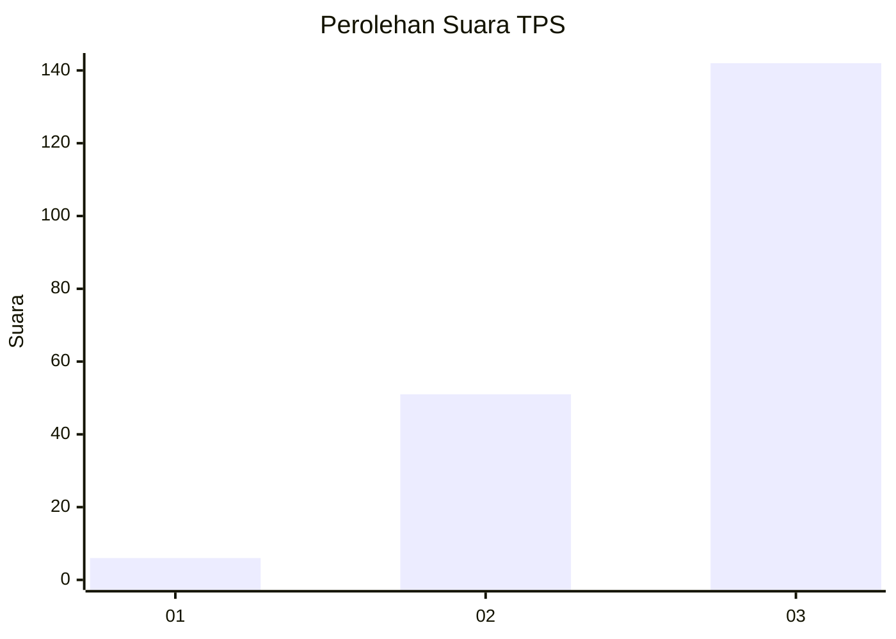
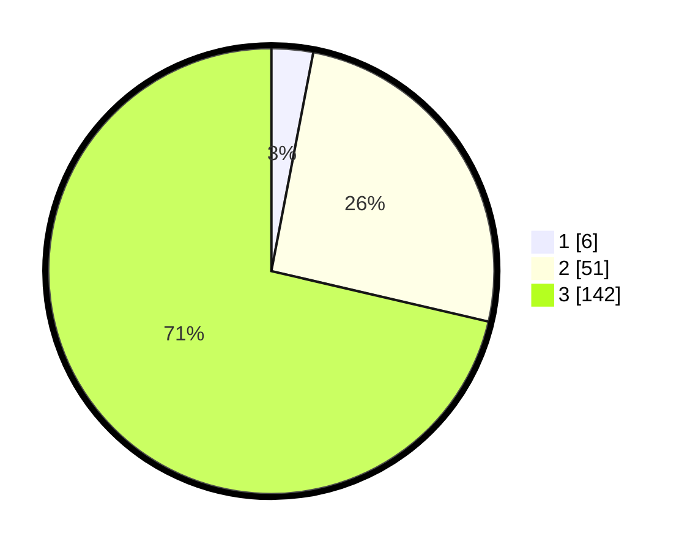

# Hasil

## Grafik

## Tabel

| No. | Nama Paslon    | Suara | Suara (raw) | Persentase |
|:--- |:-------------- | -----:| -----------:| ----------:|
| 1   | ANIES MUHAIMIN | 6     | [6][p-1]    | 3,02       |
| 2   | PRABOWO GIBRAN | 51    | [51][p-2]   | 25,63      |
| 3   | GANJAR MAHFUD  | 142   | [142][p-3]  | 71,36      |

[p-1]: https://github.com/gigit-pemilu/pemilu-2024-33-jawa-tengah/blob/main/pilpres/hitung-suara/sub/33-jawa-tengah/sub/09-boyolali/sub/03-cepogo/sub/2006-jelok/sub/006-tps/sub/paslon-1.txt
[p-2]: https://github.com/gigit-pemilu/pemilu-2024-33-jawa-tengah/blob/main/pilpres/hitung-suara/sub/33-jawa-tengah/sub/09-boyolali/sub/03-cepogo/sub/2006-jelok/sub/006-tps/sub/paslon-2.txt
[p-3]: https://github.com/gigit-pemilu/pemilu-2024-33-jawa-tengah/blob/main/pilpres/hitung-suara/sub/33-jawa-tengah/sub/09-boyolali/sub/03-cepogo/sub/2006-jelok/sub/006-tps/sub/paslon-3.txt

## Foto C Plano

https://sirekap-obj-formc.kpu.go.id/b453/pemilu/ppwp/33/09/03/20/06/3309032006006-20240216-055219--af015bcc-e9e1-4397-85cf-c1038c5b0f43.jpg

https://sirekap-obj-formc.kpu.go.id/b453/pemilu/ppwp/33/09/03/20/06/3309032006006-20240216-153942--5d3c5fcf-34c8-40f0-a846-84909fccbf59.jpg

https://sirekap-obj-formc.kpu.go.id/b453/pemilu/ppwp/33/09/03/20/06/3309032006006-20240214-231559--8c74a5dd-ab6b-49ba-bb7b-20bf861f0516.jpg

## Metadata

| Key        | Value               |
| ---------- | ------------------- |
| Time Stamp | 2024-02-16 16:25:10 |

