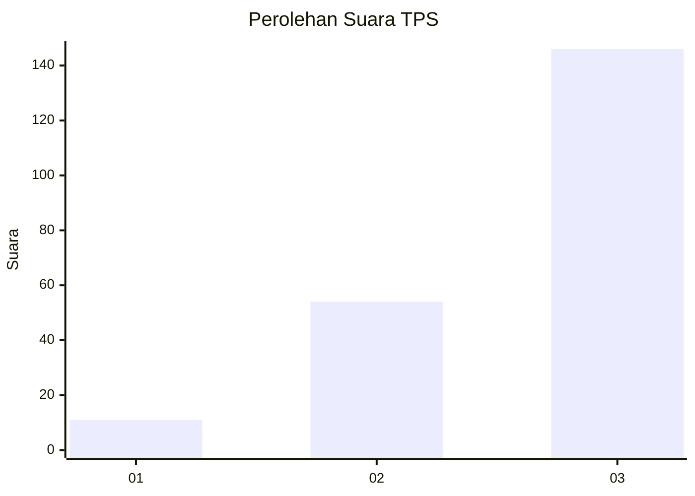
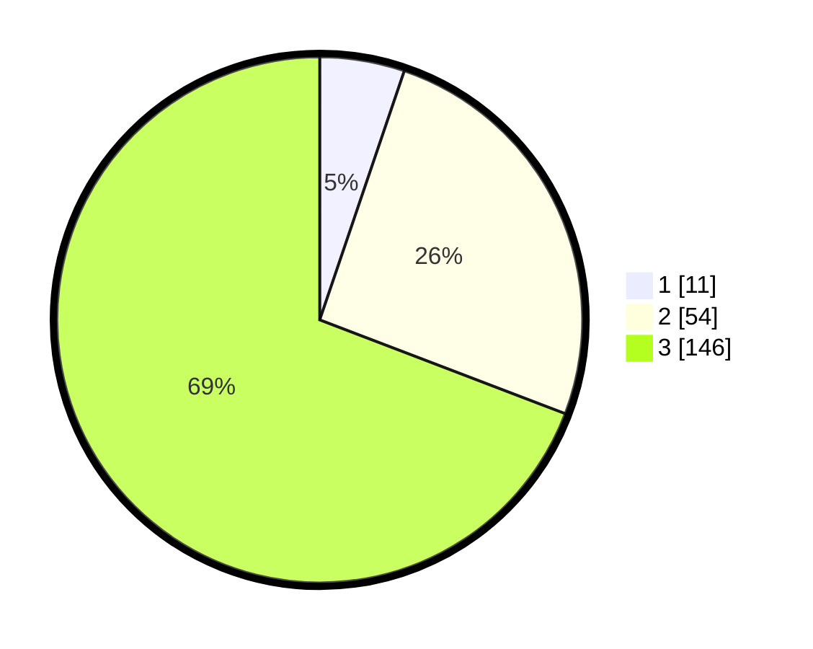

# Hasil

## Grafik

## Tabel

| No. | Nama Paslon    | Suara | Suara (raw) | Persentase |
|:--- |:-------------- | -----:| -----------:| ----------:|
| 1   | ANIES MUHAIMIN | 11    | [11][p-1]   | 5,21       |
| 2   | PRABOWO GIBRAN | 54    | [54][p-2]   | 25,59      |
| 3   | GANJAR MAHFUD  | 146   | [146][p-3]  | 69,19      |

[p-1]: https://github.com/gigit-pemilu/pemilu-2024/blob/main/pilpres/hitung-suara/sub/33-jawa-tengah/sub/09-boyolali/sub/03-cepogo/sub/2006-jelok/sub/014-tps/sub/paslon-1.txt
[p-2]: https://github.com/gigit-pemilu/pemilu-2024/blob/main/pilpres/hitung-suara/sub/33-jawa-tengah/sub/09-boyolali/sub/03-cepogo/sub/2006-jelok/sub/014-tps/sub/paslon-2.txt
[p-3]: https://github.com/gigit-pemilu/pemilu-2024/blob/main/pilpres/hitung-suara/sub/33-jawa-tengah/sub/09-boyolali/sub/03-cepogo/sub/2006-jelok/sub/014-tps/sub/paslon-3.txt

## Foto C Plano

https://sirekap-obj-formc.kpu.go.id/c910/pemilu/ppwp/33/09/03/20/06/3309032006014-20240214-222448--d2efba5f-f4f7-418d-b8b4-142b629f2cd1.jpg

https://sirekap-obj-formc.kpu.go.id/c910/pemilu/ppwp/33/09/03/20/06/3309032006014-20240214-222634--25d216ed-bb37-488f-af2e-0ec3e700e618.jpg

https://sirekap-obj-formc.kpu.go.id/c910/pemilu/ppwp/33/09/03/20/06/3309032006014-20240217-133037--a43d999b-04bb-4125-9c33-6194eed8cc56.jpg

## Metadata

| Key        | Value               |
| ---------- | ------------------- |
| Time Stamp | 2024-02-17 13:37:34 |

