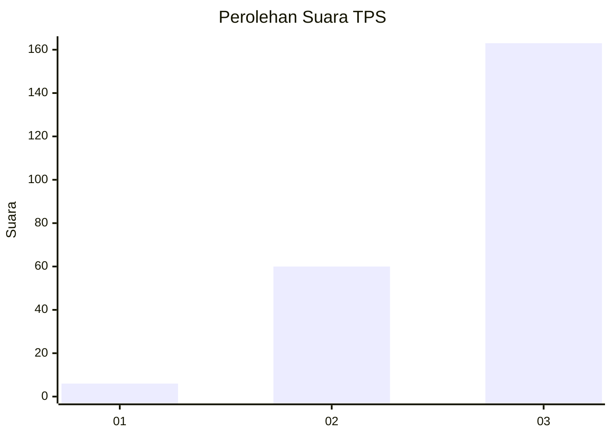
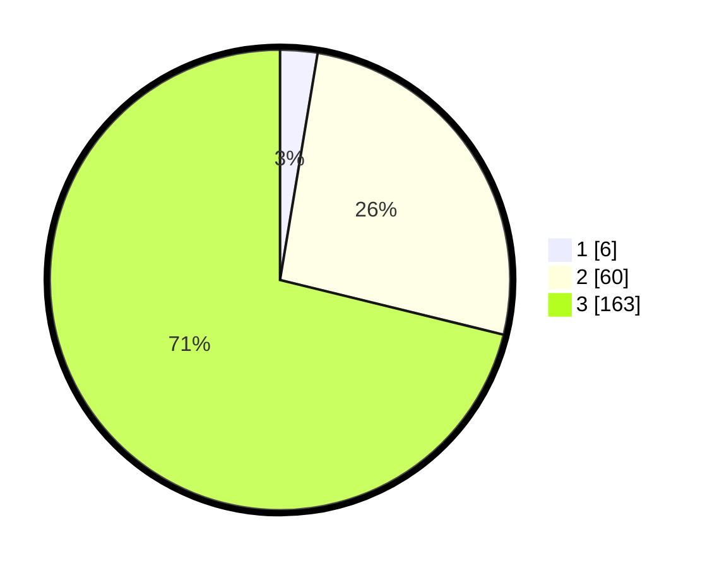

# Hasil

## Grafik

## Tabel

| No. | Nama Paslon    | Suara | Suara (raw) | Persentase |
|:--- |:-------------- | -----:| -----------:| ----------:|
| 1   | ANIES MUHAIMIN | 6     | [6][p-1]    | 2,62       |
| 2   | PRABOWO GIBRAN | 60    | [60][p-2]   | 26,20      |
| 3   | GANJAR MAHFUD  | 163   | [163][p-3]  | 71,18      |

[p-1]: https://github.com/gigit-pemilu/pemilu-2024/blob/main/pilpres/hitung-suara/sub/33-jawa-tengah/sub/09-boyolali/sub/03-cepogo/sub/2009-cabeankunti/sub/008-tps/sub/paslon-1.txt
[p-2]: https://github.com/gigit-pemilu/pemilu-2024/blob/main/pilpres/hitung-suara/sub/33-jawa-tengah/sub/09-boyolali/sub/03-cepogo/sub/2009-cabeankunti/sub/008-tps/sub/paslon-2.txt
[p-3]: https://github.com/gigit-pemilu/pemilu-2024/blob/main/pilpres/hitung-suara/sub/33-jawa-tengah/sub/09-boyolali/sub/03-cepogo/sub/2009-cabeankunti/sub/008-tps/sub/paslon-3.txt

## Foto C Plano

https://sirekap-obj-formc.kpu.go.id/7fd2/pemilu/ppwp/33/09/03/20/09/3309032009008-20240214-220253--7e8d54cb-437d-4d70-8f1f-eb80466c3947.jpg

https://sirekap-obj-formc.kpu.go.id/7fd2/pemilu/ppwp/33/09/03/20/09/3309032009008-20240214-201843--4e3c62d0-49c7-4f54-9814-6d472f5d7cd4.jpg

https://sirekap-obj-formc.kpu.go.id/7fd2/pemilu/ppwp/33/09/03/20/09/3309032009008-20240214-190744--e0ab9353-6dbe-4c2c-92e1-7736a36d13b4.jpg

## Metadata

| Key        | Value               |
| ---------- | ------------------- |
| Time Stamp | 2024-02-15 15:00:29 |

