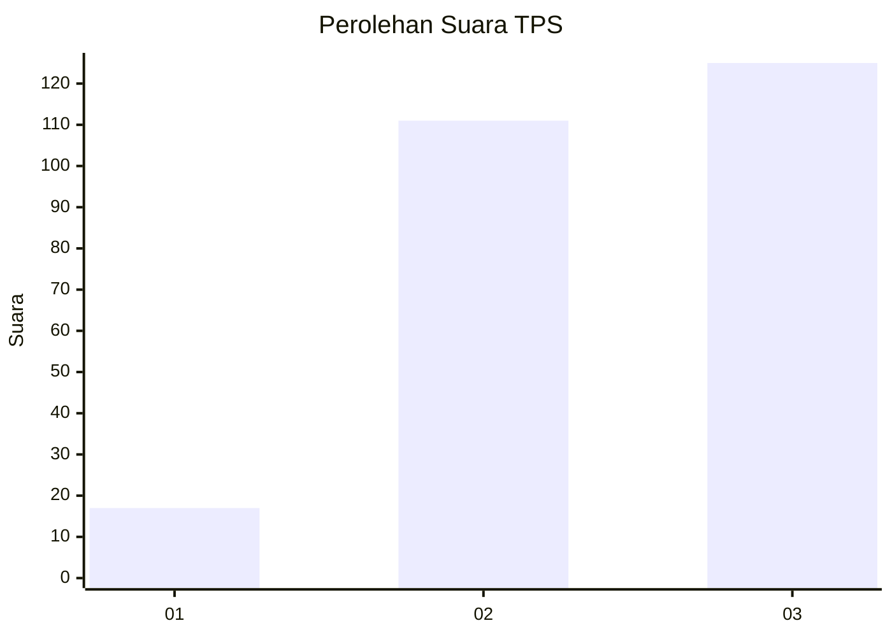
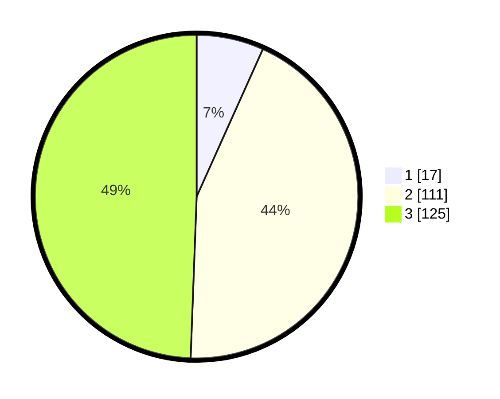

# Hasil

## Grafik

## Tabel

| No. | Nama Paslon    | Suara | Suara (raw) | Persentase |
|:--- |:-------------- | -----:| -----------:| ----------:|
| 1   | ANIES MUHAIMIN | 17    | [17][p-1]   | 6,72       |
| 2   | PRABOWO GIBRAN | 111   | [111][p-2]  | 43,87      |
| 3   | GANJAR MAHFUD  | 125   | [125][p-3]  | 49,41      |

[p-1]: https://github.com/gigit-pemilu/pemilu-2024/blob/main/pilpres/hitung-suara/sub/33-jawa-tengah/sub/09-boyolali/sub/03-cepogo/sub/2010-mliwis/sub/018-tps/sub/paslon-1.txt
[p-2]: https://github.com/gigit-pemilu/pemilu-2024/blob/main/pilpres/hitung-suara/sub/33-jawa-tengah/sub/09-boyolali/sub/03-cepogo/sub/2010-mliwis/sub/018-tps/sub/paslon-2.txt
[p-3]: https://github.com/gigit-pemilu/pemilu-2024/blob/main/pilpres/hitung-suara/sub/33-jawa-tengah/sub/09-boyolali/sub/03-cepogo/sub/2010-mliwis/sub/018-tps/sub/paslon-3.txt

## Foto C Plano

https://sirekap-obj-formc.kpu.go.id/4ba9/pemilu/ppwp/33/09/03/20/10/3309032010018-20240219-213551--ce02b82c-e97a-42d9-aaaf-fcdfab24e58e.jpg

https://sirekap-obj-formc.kpu.go.id/4ba9/pemilu/ppwp/33/09/03/20/10/3309032010018-20240219-213851--638e0efa-6890-4b68-933c-e0f56937e88d.jpg

https://sirekap-obj-formc.kpu.go.id/4ba9/pemilu/ppwp/33/09/03/20/10/3309032010018-20240215-182317--e02099cd-4598-4a3f-94ee-a3c111475ff5.jpg

## Metadata

| Key        | Value               |
| ---------- | ------------------- |
| Time Stamp | 2024-02-24 22:31:28 |

