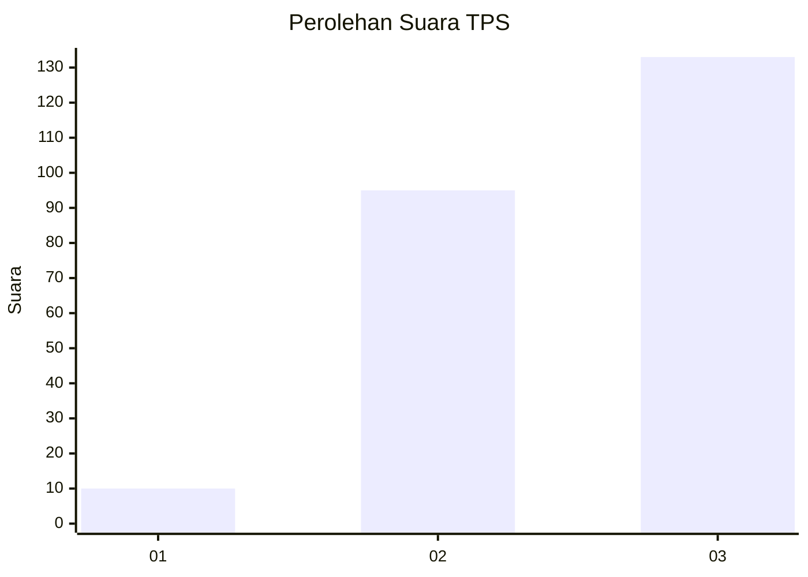
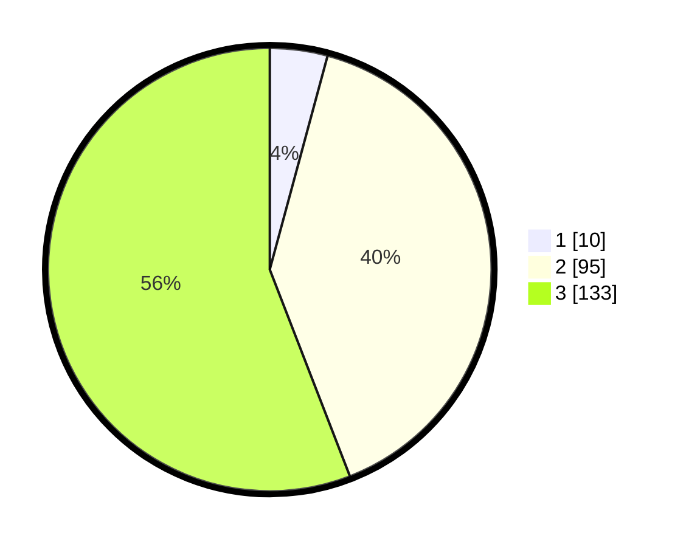

# Hasil

## Grafik

## Tabel

| No. | Nama Paslon    | Suara | Suara (raw) | Persentase |
|:--- |:-------------- | -----:| -----------:| ----------:|
| 1   | ANIES MUHAIMIN | 10    | [10][p-1]   | 4,20       |
| 2   | PRABOWO GIBRAN | 95    | [95][p-2]   | 39,92      |
| 3   | GANJAR MAHFUD  | 133   | [133][p-3]  | 55,88      |

[p-1]: https://github.com/gigit-pemilu/pemilu-2024/blob/main/pilpres/hitung-suara/sub/33-jawa-tengah/sub/09-boyolali/sub/03-cepogo/sub/2012-genting/sub/003-tps/sub/paslon-1.txt
[p-2]: https://github.com/gigit-pemilu/pemilu-2024/blob/main/pilpres/hitung-suara/sub/33-jawa-tengah/sub/09-boyolali/sub/03-cepogo/sub/2012-genting/sub/003-tps/sub/paslon-2.txt
[p-3]: https://github.com/gigit-pemilu/pemilu-2024/blob/main/pilpres/hitung-suara/sub/33-jawa-tengah/sub/09-boyolali/sub/03-cepogo/sub/2012-genting/sub/003-tps/sub/paslon-3.txt

## Foto C Plano

https://sirekap-obj-formc.kpu.go.id/29b7/pemilu/ppwp/33/09/03/20/12/3309032012003-20240214-225932--ec3f73b3-298d-4265-af13-df312e02e23d.jpg

https://sirekap-obj-formc.kpu.go.id/29b7/pemilu/ppwp/33/09/03/20/12/3309032012003-20240214-230704--680b5b3e-4572-4784-b52b-a00ccca6ab77.jpg

https://sirekap-obj-formc.kpu.go.id/29b7/pemilu/ppwp/33/09/03/20/12/3309032012003-20240214-231113--708bfbcf-a661-40c2-9316-011d883655e9.jpg

## Metadata

| Key        | Value               |
| ---------- | ------------------- |
| Time Stamp | 2024-02-15 22:00:27 |

