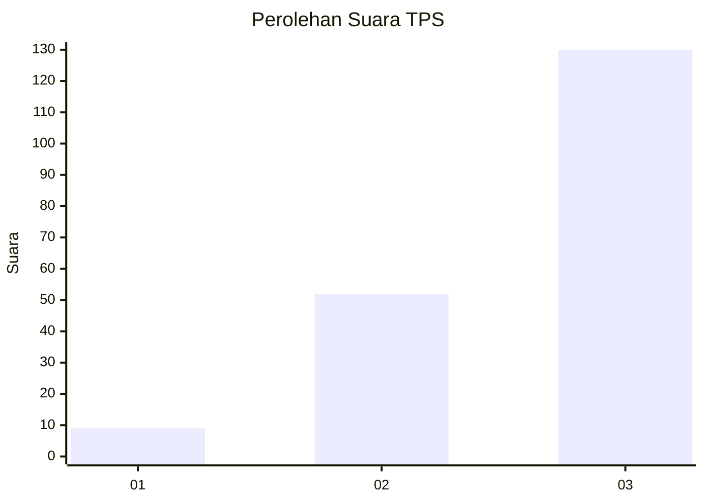
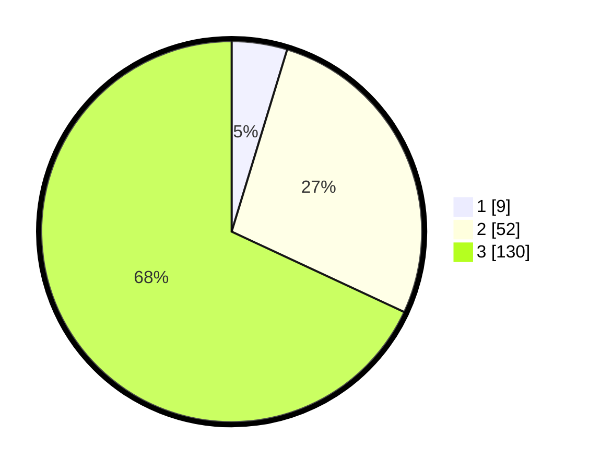

# Hasil

## Grafik

## Tabel

| No. | Nama Paslon    | Suara | Suara (raw) | Persentase |
|:--- |:-------------- | -----:| -----------:| ----------:|
| 1   | ANIES MUHAIMIN | 9     | [9][p-1]    | 4,71       |
| 2   | PRABOWO GIBRAN | 52    | [52][p-2]   | 27,23      |
| 3   | GANJAR MAHFUD  | 130   | [130][p-3]  | 68,06      |

[p-1]: https://github.com/gigit-pemilu/pemilu-2024-33-jawa-tengah/blob/main/pilpres/hitung-suara/sub/33-jawa-tengah/sub/09-boyolali/sub/04-musuk/sub/2012-sukorejo/sub/003-tps/sub/paslon-1.txt
[p-2]: https://github.com/gigit-pemilu/pemilu-2024-33-jawa-tengah/blob/main/pilpres/hitung-suara/sub/33-jawa-tengah/sub/09-boyolali/sub/04-musuk/sub/2012-sukorejo/sub/003-tps/sub/paslon-2.txt
[p-3]: https://github.com/gigit-pemilu/pemilu-2024-33-jawa-tengah/blob/main/pilpres/hitung-suara/sub/33-jawa-tengah/sub/09-boyolali/sub/04-musuk/sub/2012-sukorejo/sub/003-tps/sub/paslon-3.txt

## Foto C Plano

https://sirekap-obj-formc.kpu.go.id/1e58/pemilu/ppwp/33/09/04/20/12/3309042012003-20240214-221532--a51fa9fc-9241-4a41-ad18-cb185caf8814.jpg

https://sirekap-obj-formc.kpu.go.id/1e58/pemilu/ppwp/33/09/04/20/12/3309042012003-20240214-221713--94b6379e-e520-4453-a366-9034c354e31a.jpg

https://sirekap-obj-formc.kpu.go.id/1e58/pemilu/ppwp/33/09/04/20/12/3309042012003-20240215-023005--e366a4bf-e653-4936-9b84-5df566050ba5.jpg

## Metadata

| Key        | Value               |
| ---------- | ------------------- |
| Time Stamp | 2024-02-15 20:00:44 |

