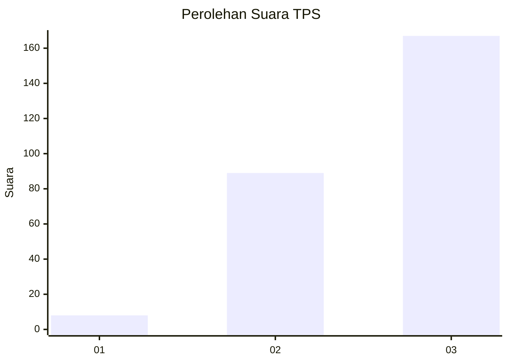
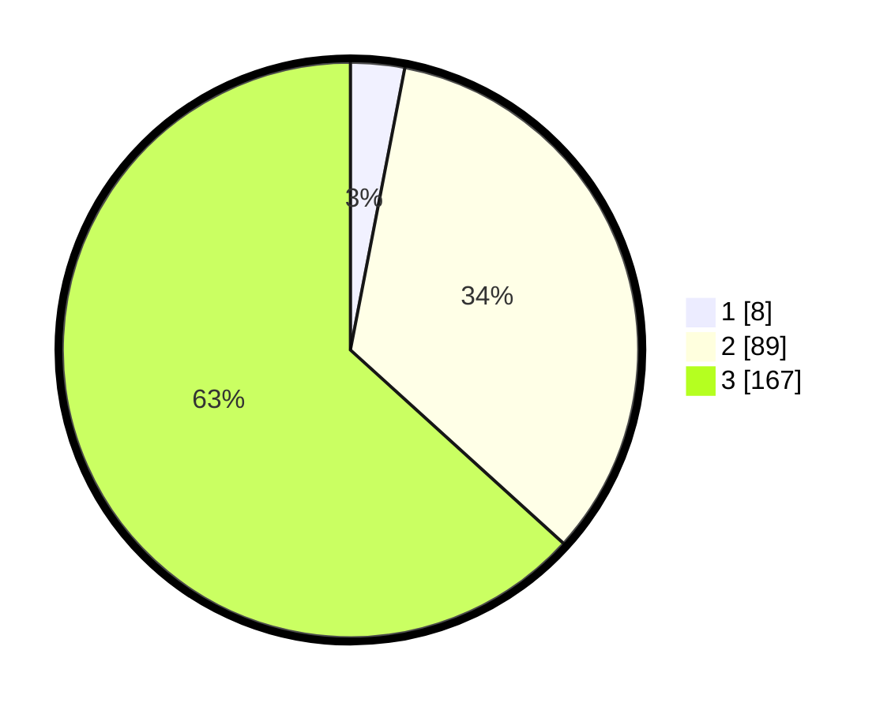

# Hasil

## Grafik

## Tabel

| No. | Nama Paslon    | Suara | Suara (raw) | Persentase |
|:--- |:-------------- | -----:| -----------:| ----------:|
| 1   | ANIES MUHAIMIN | 8     | [8][p-1]    | 3,03       |
| 2   | PRABOWO GIBRAN | 89    | [89][p-2]   | 33,71      |
| 3   | GANJAR MAHFUD  | 167   | [167][p-3]  | 63,26      |

[p-1]: https://github.com/gigit-pemilu/pemilu-2024/blob/main/pilpres/hitung-suara/sub/33-jawa-tengah/sub/09-boyolali/sub/04-musuk/sub/2012-sukorejo/sub/006-tps/sub/paslon-1.txt
[p-2]: https://github.com/gigit-pemilu/pemilu-2024/blob/main/pilpres/hitung-suara/sub/33-jawa-tengah/sub/09-boyolali/sub/04-musuk/sub/2012-sukorejo/sub/006-tps/sub/paslon-2.txt
[p-3]: https://github.com/gigit-pemilu/pemilu-2024/blob/main/pilpres/hitung-suara/sub/33-jawa-tengah/sub/09-boyolali/sub/04-musuk/sub/2012-sukorejo/sub/006-tps/sub/paslon-3.txt

## Foto C Plano

https://sirekap-obj-formc.kpu.go.id/d51c/pemilu/ppwp/33/09/04/20/12/3309042012006-20240214-215251--ec5ea6e5-82de-484b-9cbb-db4a5934c3bb.jpg

https://sirekap-obj-formc.kpu.go.id/d51c/pemilu/ppwp/33/09/04/20/12/3309042012006-20240215-014706--51432aa3-cd3f-4d26-8858-5dc6dbd1c349.jpg

https://sirekap-obj-formc.kpu.go.id/d51c/pemilu/ppwp/33/09/04/20/12/3309042012006-20240214-215239--31492c93-94cf-4529-9828-5edfbc46ea80.jpg

## Metadata

| Key        | Value               |
| ---------- | ------------------- |
| Time Stamp | 2024-02-15 20:00:44 |

