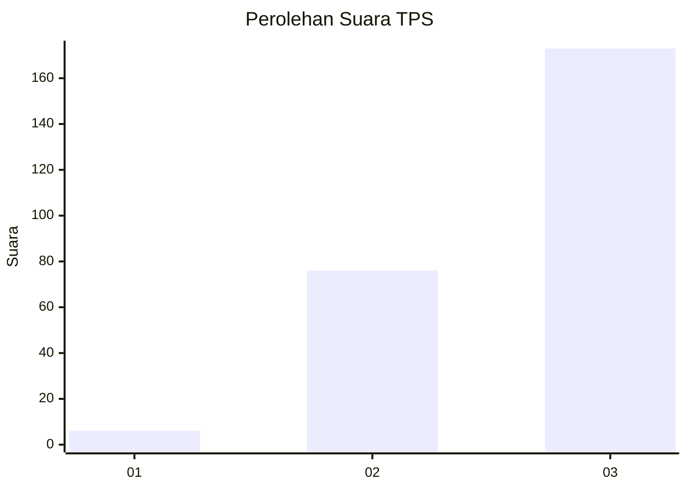
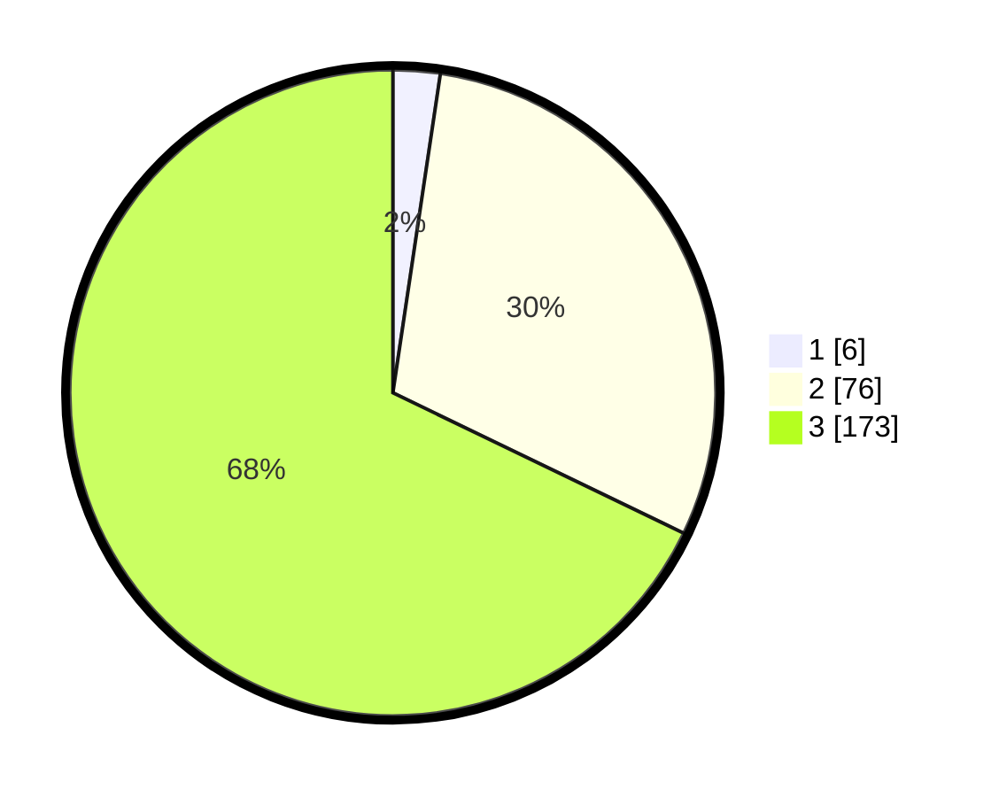

# Hasil

## Grafik

## Tabel

| No. | Nama Paslon    | Suara | Suara (raw) | Persentase |
|:--- |:-------------- | -----:| -----------:| ----------:|
| 1   | ANIES MUHAIMIN | 6     | [6][p-1]    | 2,35       |
| 2   | PRABOWO GIBRAN | 76    | [76][p-2]   | 29,80      |
| 3   | GANJAR MAHFUD  | 173   | [173][p-3]  | 67,84      |

[p-1]: https://github.com/gigit-pemilu/pemilu-2024/blob/main/pilpres/hitung-suara/sub/33-jawa-tengah/sub/09-boyolali/sub/04-musuk/sub/2012-sukorejo/sub/015-tps/sub/paslon-1.txt
[p-2]: https://github.com/gigit-pemilu/pemilu-2024/blob/main/pilpres/hitung-suara/sub/33-jawa-tengah/sub/09-boyolali/sub/04-musuk/sub/2012-sukorejo/sub/015-tps/sub/paslon-2.txt
[p-3]: https://github.com/gigit-pemilu/pemilu-2024/blob/main/pilpres/hitung-suara/sub/33-jawa-tengah/sub/09-boyolali/sub/04-musuk/sub/2012-sukorejo/sub/015-tps/sub/paslon-3.txt

## Foto C Plano

https://sirekap-obj-formc.kpu.go.id/907e/pemilu/ppwp/33/09/04/20/12/3309042012015-20240214-225340--a669c27c-8519-457b-862c-b96ec65eceaa.jpg

https://sirekap-obj-formc.kpu.go.id/907e/pemilu/ppwp/33/09/04/20/12/3309042012015-20240214-230028--8a191267-f4b3-4be1-b193-a497718805ab.jpg

https://sirekap-obj-formc.kpu.go.id/907e/pemilu/ppwp/33/09/04/20/12/3309042012015-20240214-230133--9e2c3c74-b2ca-4249-a42a-a5489ca6b4e2.jpg

## Metadata

| Key        | Value               |
| ---------- | ------------------- |
| Time Stamp | 2024-02-15 20:00:44 |

