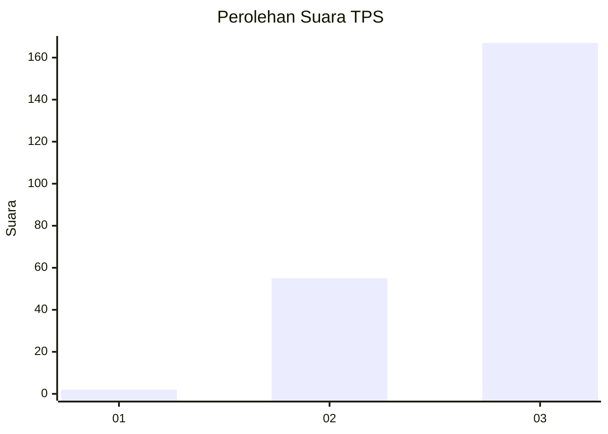
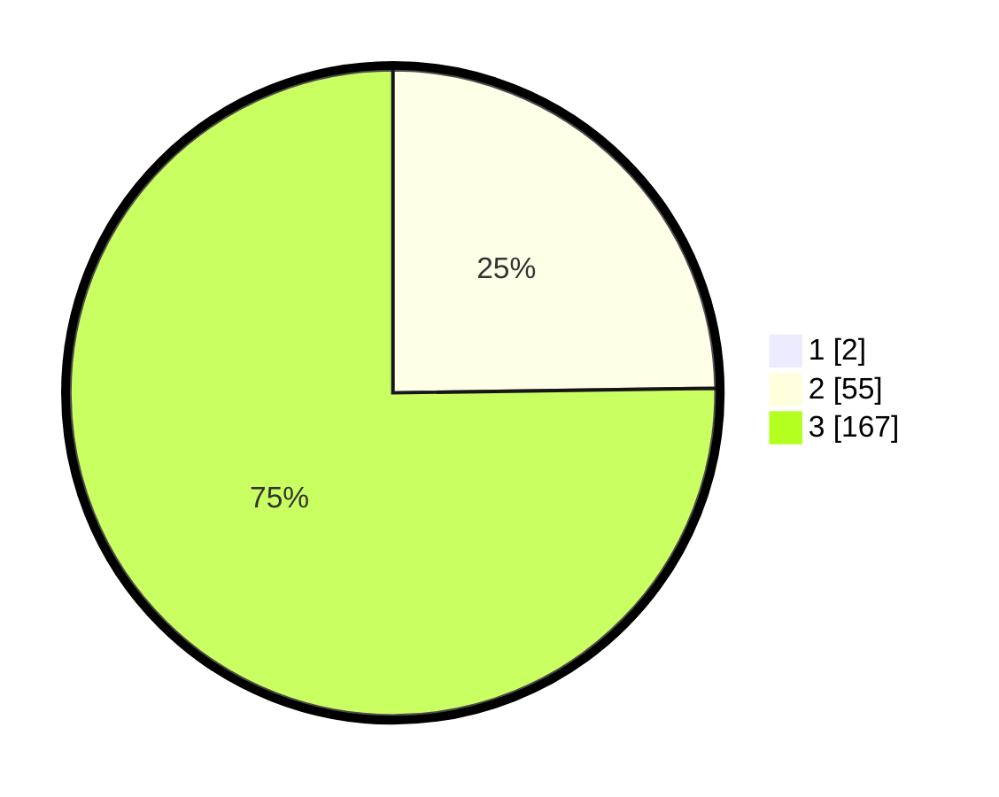

# Hasil

## Grafik

## Tabel

| No. | Nama Paslon    | Suara | Suara (raw) | Persentase |
|:--- |:-------------- | -----:| -----------:| ----------:|
| 1   | ANIES MUHAIMIN | 2     | [2][p-1]    | 0,89       |
| 2   | PRABOWO GIBRAN | 55    | [55][p-2]   | 24,55      |
| 3   | GANJAR MAHFUD  | 167   | [167][p-3]  | 74,55      |

[p-1]: https://github.com/gigit-pemilu/pemilu-2024/blob/main/pilpres/hitung-suara/sub/33-jawa-tengah/sub/09-boyolali/sub/04-musuk/sub/2012-sukorejo/sub/017-tps/sub/paslon-1.txt
[p-2]: https://github.com/gigit-pemilu/pemilu-2024/blob/main/pilpres/hitung-suara/sub/33-jawa-tengah/sub/09-boyolali/sub/04-musuk/sub/2012-sukorejo/sub/017-tps/sub/paslon-2.txt
[p-3]: https://github.com/gigit-pemilu/pemilu-2024/blob/main/pilpres/hitung-suara/sub/33-jawa-tengah/sub/09-boyolali/sub/04-musuk/sub/2012-sukorejo/sub/017-tps/sub/paslon-3.txt

## Foto C Plano

https://sirekap-obj-formc.kpu.go.id/2c65/pemilu/ppwp/33/09/04/20/12/3309042012017-20240214-223012--1cb2849f-02bd-4ec4-b55a-f3808775babe.jpg

https://sirekap-obj-formc.kpu.go.id/2c65/pemilu/ppwp/33/09/04/20/12/3309042012017-20240214-223401--0d66f5ef-6df3-46e3-a8d7-68fd45c70e85.jpg

https://sirekap-obj-formc.kpu.go.id/2c65/pemilu/ppwp/33/09/04/20/12/3309042012017-20240214-223729--18c823a5-7a44-47e2-a406-aa911fe7c699.jpg

## Metadata

| Key        | Value               |
| ---------- | ------------------- |
| Time Stamp | 2024-02-15 15:00:29 |

