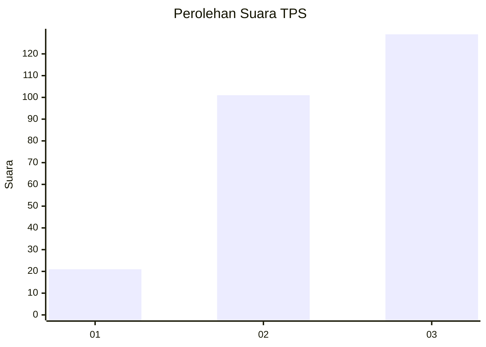
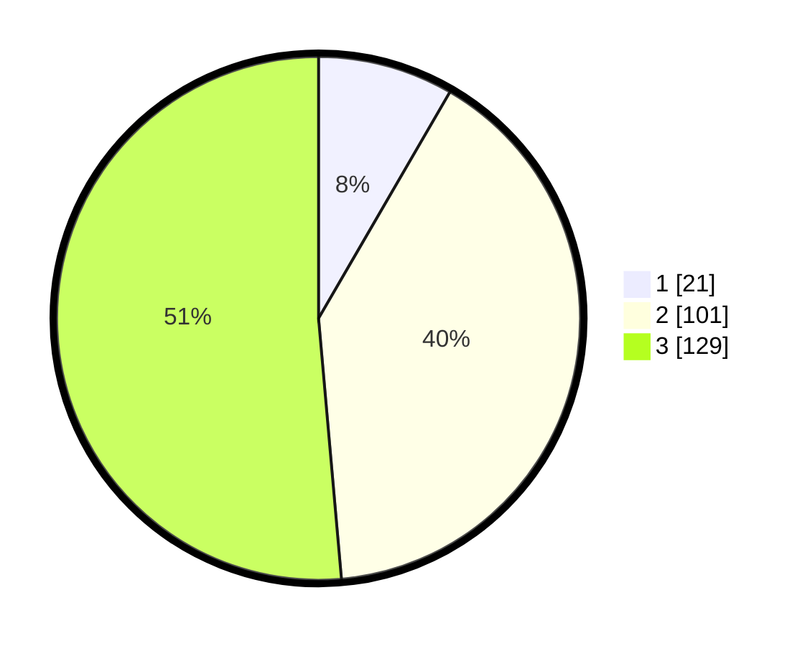

# Hasil

## Grafik

## Tabel

| No. | Nama Paslon    | Suara | Suara (raw) | Persentase |
|:--- |:-------------- | -----:| -----------:| ----------:|
| 1   | ANIES MUHAIMIN | 21    | [21][p-1]   | 8,37       |
| 2   | PRABOWO GIBRAN | 101   | [101][p-2]  | 40,24      |
| 3   | GANJAR MAHFUD  | 129   | [129][p-3]  | 51,39      |

[p-1]: https://github.com/gigit-pemilu/pemilu-2024-33-jawa-tengah/blob/main/pilpres/hitung-suara/sub/33-jawa-tengah/sub/09-boyolali/sub/04-musuk/sub/2016-ringinlarik/sub/003-tps/sub/paslon-1.txt
[p-2]: https://github.com/gigit-pemilu/pemilu-2024-33-jawa-tengah/blob/main/pilpres/hitung-suara/sub/33-jawa-tengah/sub/09-boyolali/sub/04-musuk/sub/2016-ringinlarik/sub/003-tps/sub/paslon-2.txt
[p-3]: https://github.com/gigit-pemilu/pemilu-2024-33-jawa-tengah/blob/main/pilpres/hitung-suara/sub/33-jawa-tengah/sub/09-boyolali/sub/04-musuk/sub/2016-ringinlarik/sub/003-tps/sub/paslon-3.txt

## Foto C Plano

https://sirekap-obj-formc.kpu.go.id/2b45/pemilu/ppwp/33/09/04/20/16/3309042016003-20240219-132609--df7b4943-7d0e-47a5-9de2-e698dc52bb1f.jpg

https://sirekap-obj-formc.kpu.go.id/2b45/pemilu/ppwp/33/09/04/20/16/3309042016003-20240214-222648--789448a0-0937-4294-bf08-ae451fc5134c.jpg

https://sirekap-obj-formc.kpu.go.id/2b45/pemilu/ppwp/33/09/04/20/16/3309042016003-20240214-222853--3ad70080-e960-42ef-9a18-f3e8544090d1.jpg

## Metadata

| Key        | Value               |
| ---------- | ------------------- |
| Time Stamp | 2024-02-19 14:00:00 |

