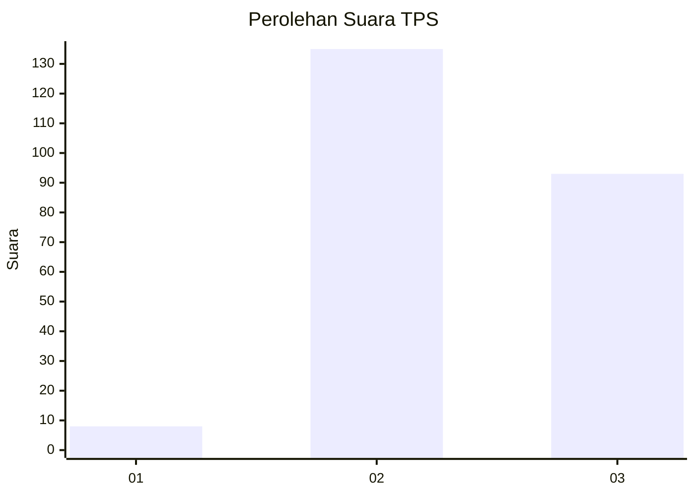
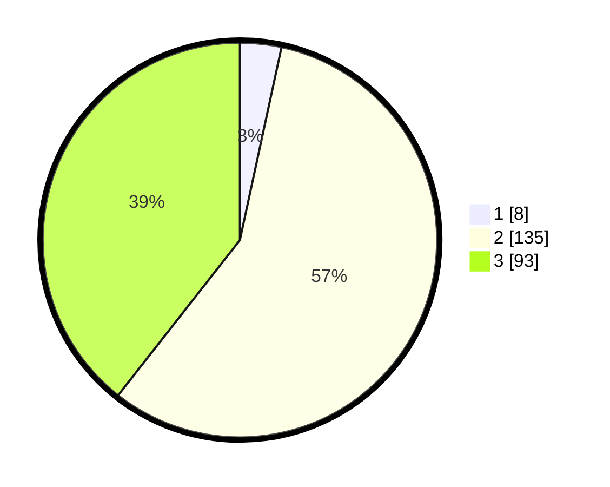

# Hasil

## Grafik

## Tabel

| No. | Nama Paslon    | Suara | Suara (raw) | Persentase |
|:--- |:-------------- | -----:| -----------:| ----------:|
| 1   | ANIES MUHAIMIN | 8     | [8][p-1]    | 3,39       |
| 2   | PRABOWO GIBRAN | 135   | [135][p-2]  | 57,20      |
| 3   | GANJAR MAHFUD  | 93    | [93][p-3]   | 39,41      |

[p-1]: https://github.com/gigit-pemilu/pemilu-2024/blob/main/pilpres/hitung-suara/sub/33-jawa-tengah/sub/09-boyolali/sub/04-musuk/sub/2017-kebongulo/sub/003-tps/sub/paslon-1.txt
[p-2]: https://github.com/gigit-pemilu/pemilu-2024/blob/main/pilpres/hitung-suara/sub/33-jawa-tengah/sub/09-boyolali/sub/04-musuk/sub/2017-kebongulo/sub/003-tps/sub/paslon-2.txt
[p-3]: https://github.com/gigit-pemilu/pemilu-2024/blob/main/pilpres/hitung-suara/sub/33-jawa-tengah/sub/09-boyolali/sub/04-musuk/sub/2017-kebongulo/sub/003-tps/sub/paslon-3.txt

## Foto C Plano

https://sirekap-obj-formc.kpu.go.id/580d/pemilu/ppwp/33/09/04/20/17/3309042017003-20240215-021419--f689b8ac-5f15-4687-a75b-18dd193e26ff.jpg

https://sirekap-obj-formc.kpu.go.id/580d/pemilu/ppwp/33/09/04/20/17/3309042017003-20240215-021640--35e59949-e60a-470e-9984-35e917c4ef31.jpg

https://sirekap-obj-formc.kpu.go.id/580d/pemilu/ppwp/33/09/04/20/17/3309042017003-20240215-021943--5fb4dd38-a1cf-45c9-86cb-6e9c463d0c9b.jpg

## Metadata

| Key        | Value               |
| ---------- | ------------------- |
| Time Stamp | 2024-02-15 20:00:44 |

