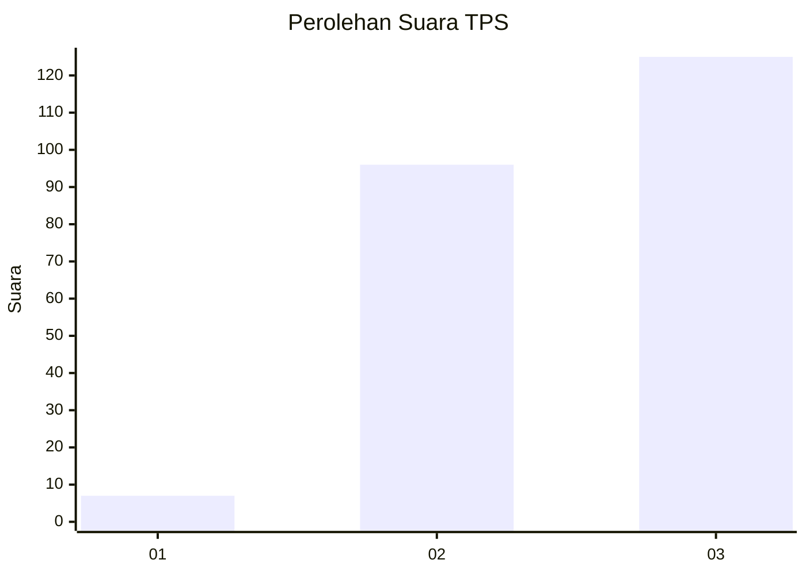
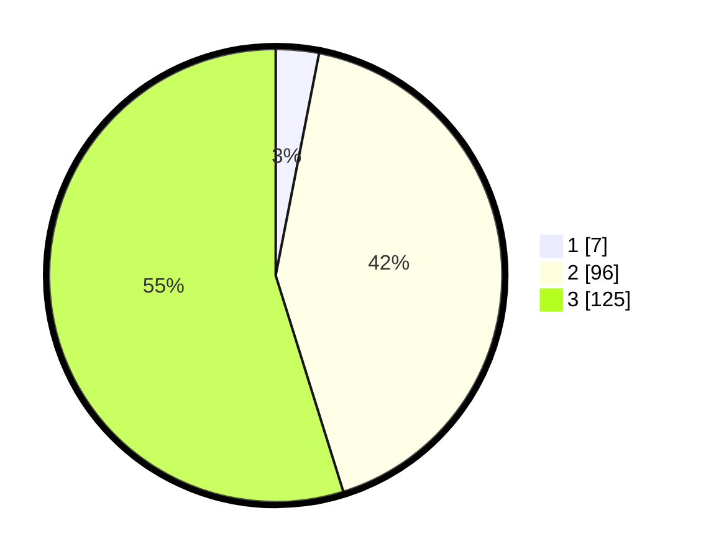

# Hasil

## Grafik

## Tabel

| No. | Nama Paslon    | Suara | Suara (raw) | Persentase |
|:--- |:-------------- | -----:| -----------:| ----------:|
| 1   | ANIES MUHAIMIN | 7     | [7][p-1]    | 3,07       |
| 2   | PRABOWO GIBRAN | 96    | [96][p-2]   | 42,11      |
| 3   | GANJAR MAHFUD  | 125   | [125][p-3]  | 54,82      |

[p-1]: https://github.com/gigit-pemilu/pemilu-2024-33-jawa-tengah/blob/main/pilpres/hitung-suara/sub/33-jawa-tengah/sub/09-boyolali/sub/04-musuk/sub/2017-kebongulo/sub/004-tps/sub/paslon-1.txt
[p-2]: https://github.com/gigit-pemilu/pemilu-2024-33-jawa-tengah/blob/main/pilpres/hitung-suara/sub/33-jawa-tengah/sub/09-boyolali/sub/04-musuk/sub/2017-kebongulo/sub/004-tps/sub/paslon-2.txt
[p-3]: https://github.com/gigit-pemilu/pemilu-2024-33-jawa-tengah/blob/main/pilpres/hitung-suara/sub/33-jawa-tengah/sub/09-boyolali/sub/04-musuk/sub/2017-kebongulo/sub/004-tps/sub/paslon-3.txt

## Foto C Plano

https://sirekap-obj-formc.kpu.go.id/e362/pemilu/ppwp/33/09/04/20/17/3309042017004-20240215-033533--6a0f2b7f-40a6-4164-ab8c-d8e5c0ce0e37.jpg

https://sirekap-obj-formc.kpu.go.id/e362/pemilu/ppwp/33/09/04/20/17/3309042017004-20240215-034631--8cb52aab-8e12-4f05-bad5-bbafbdd0e342.jpg

https://sirekap-obj-formc.kpu.go.id/e362/pemilu/ppwp/33/09/04/20/17/3309042017004-20240215-033821--6c9a9f2b-6641-4cd2-9a7e-fda919c6cbd9.jpg

## Metadata

| Key        | Value               |
| ---------- | ------------------- |
| Time Stamp | 2024-02-15 21:01:18 |

