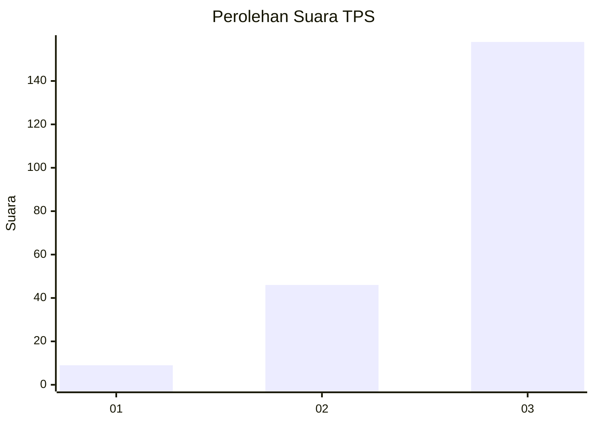
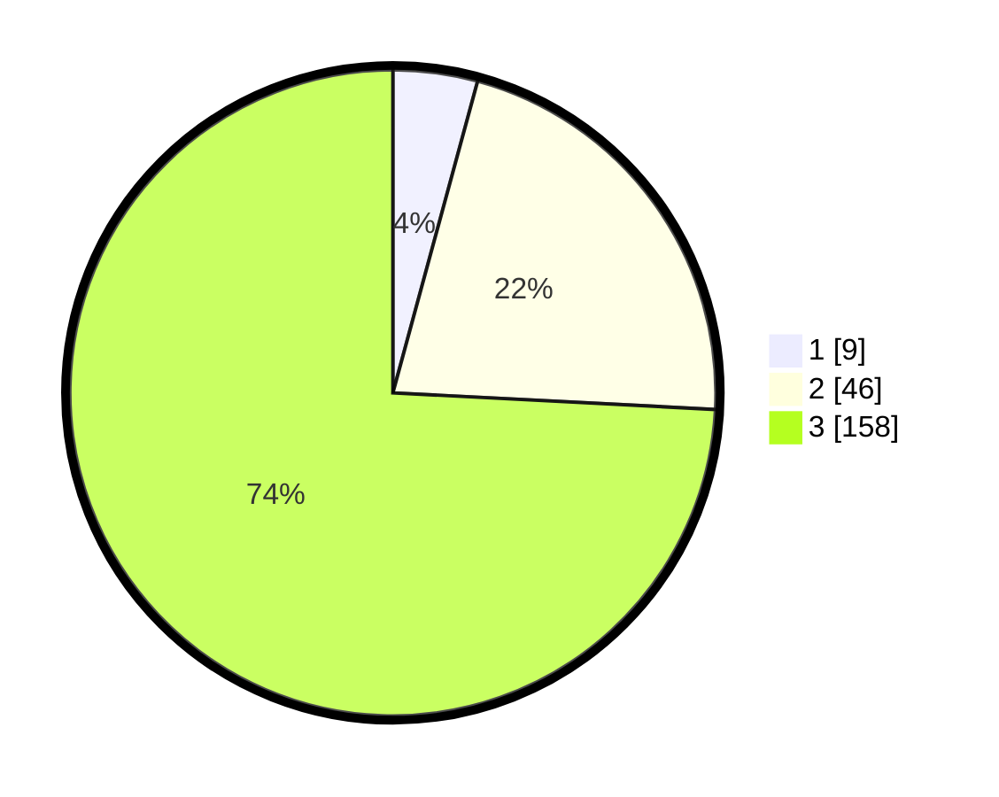

# Hasil

## Grafik

## Tabel

| No. | Nama Paslon    | Suara | Suara (raw) | Persentase |
|:--- |:-------------- | -----:| -----------:| ----------:|
| 1   | ANIES MUHAIMIN | 9     | [9][p-1]    | 4,23       |
| 2   | PRABOWO GIBRAN | 46    | [46][p-2]   | 21,60      |
| 3   | GANJAR MAHFUD  | 158   | [158][p-3]  | 74,18      |

[p-1]: https://github.com/gigit-pemilu/pemilu-2024/blob/main/pilpres/hitung-suara/sub/33-jawa-tengah/sub/09-boyolali/sub/04-musuk/sub/2019-sukorame/sub/006-tps/sub/paslon-1.txt
[p-2]: https://github.com/gigit-pemilu/pemilu-2024/blob/main/pilpres/hitung-suara/sub/33-jawa-tengah/sub/09-boyolali/sub/04-musuk/sub/2019-sukorame/sub/006-tps/sub/paslon-2.txt
[p-3]: https://github.com/gigit-pemilu/pemilu-2024/blob/main/pilpres/hitung-suara/sub/33-jawa-tengah/sub/09-boyolali/sub/04-musuk/sub/2019-sukorame/sub/006-tps/sub/paslon-3.txt

## Foto C Plano

https://sirekap-obj-formc.kpu.go.id/8724/pemilu/ppwp/33/09/04/20/19/3309042019006-20240214-185852--185f9f48-33cb-40cd-8035-a210c3eb2894.jpg

https://sirekap-obj-formc.kpu.go.id/8724/pemilu/ppwp/33/09/04/20/19/3309042019006-20240214-185911--bb2ab217-1f8d-49fa-8248-c6cf50c03071.jpg

https://sirekap-obj-formc.kpu.go.id/8724/pemilu/ppwp/33/09/04/20/19/3309042019006-20240215-083135--1c4c0afd-699a-4a98-ba4b-a07c2b61bd68.jpg

## Metadata

| Key        | Value               |
| ---------- | ------------------- |
| Time Stamp | 2024-02-15 20:30:46 |

