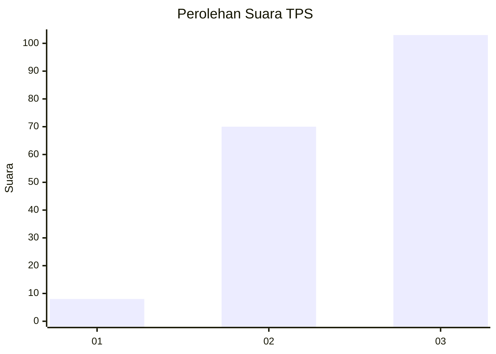
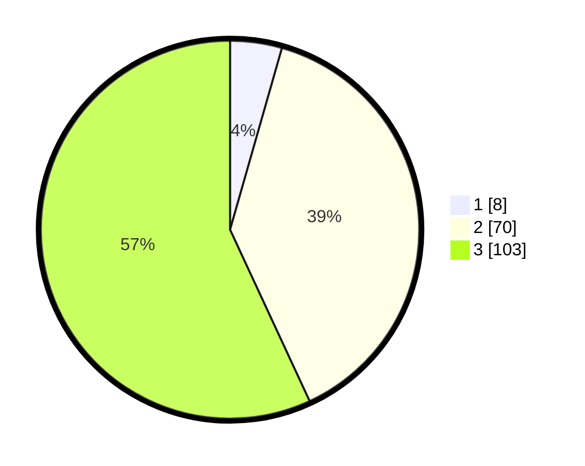

# Hasil

## Grafik

## Tabel

| No. | Nama Paslon    | Suara | Suara (raw) | Persentase |
|:--- |:-------------- | -----:| -----------:| ----------:|
| 1   | ANIES MUHAIMIN | 8     | [8][p-1]    | 4,42       |
| 2   | PRABOWO GIBRAN | 70    | [70][p-2]   | 38,67      |
| 3   | GANJAR MAHFUD  | 103   | [103][p-3]  | 56,91      |

[p-1]: https://github.com/gigit-pemilu/pemilu-2024/blob/main/pilpres/hitung-suara/sub/33-jawa-tengah/sub/09-boyolali/sub/04-musuk/sub/2019-sukorame/sub/007-tps/sub/paslon-1.txt
[p-2]: https://github.com/gigit-pemilu/pemilu-2024/blob/main/pilpres/hitung-suara/sub/33-jawa-tengah/sub/09-boyolali/sub/04-musuk/sub/2019-sukorame/sub/007-tps/sub/paslon-2.txt
[p-3]: https://github.com/gigit-pemilu/pemilu-2024/blob/main/pilpres/hitung-suara/sub/33-jawa-tengah/sub/09-boyolali/sub/04-musuk/sub/2019-sukorame/sub/007-tps/sub/paslon-3.txt

## Foto C Plano

https://sirekap-obj-formc.kpu.go.id/37d9/pemilu/ppwp/33/09/04/20/19/3309042019007-20240214-225829--3537d066-c219-496c-bd55-bb4cdad4e85c.jpg

https://sirekap-obj-formc.kpu.go.id/37d9/pemilu/ppwp/33/09/04/20/19/3309042019007-20240214-230111--0415b343-8ede-4b60-8202-35991ea70c5a.jpg

https://sirekap-obj-formc.kpu.go.id/37d9/pemilu/ppwp/33/09/04/20/19/3309042019007-20240214-230357--6b289459-083c-4a21-b0dd-034d997c0da0.jpg

## Metadata

| Key        | Value               |
| ---------- | ------------------- |
| Time Stamp | 2024-02-15 20:30:46 |

