# Hasil

## Grafik

```mermaid
%%{init: {"pie": {"textPosition": 0.5}, "themeVariables": {"pieOuterStrokeWidth": "5px"}} }%%
pie showData
    "1" : 6
    "2" : 73
    "3" : 127
```

## Tabel

| No. | Nama Paslon    | Suara | Suara (raw) | Persentase |
|:--- |:-------------- | -----:| -----------:| ----------:|
| 1   | ANIES MUHAIMIN | 6     | [6][p-1]    | 2,91       |
| 2   | PRABOWO GIBRAN | 73    | [73][p-2]   | 35,44      |
| 3   | GANJAR MAHFUD  | 127   | [127][p-3]  | 61,65      |

[p-1]: https://github.com/gigit-pemilu/pemilu-2024/blob/main/pilpres/hitung-suara/sub/33-jawa-tengah/sub/09-boyolali/sub/04-musuk/sub/2020-pusporenggo/sub/001-tps/sub/paslon-1.txt
[p-2]: https://github.com/gigit-pemilu/pemilu-2024/blob/main/pilpres/hitung-suara/sub/33-jawa-tengah/sub/09-boyolali/sub/04-musuk/sub/2020-pusporenggo/sub/001-tps/sub/paslon-2.txt
[p-3]: https://github.com/gigit-pemilu/pemilu-2024/blob/main/pilpres/hitung-suara/sub/33-jawa-tengah/sub/09-boyolali/sub/04-musuk/sub/2020-pusporenggo/sub/001-tps/sub/paslon-3.txt

## Foto C Plano

https://sirekap-obj-formc.kpu.go.id/1251/pemilu/ppwp/33/09/04/20/20/3309042020001-20240214-201133--fb041758-5c7b-4a73-b658-15f062aa7622.jpg

https://sirekap-obj-formc.kpu.go.id/1251/pemilu/ppwp/33/09/04/20/20/3309042020001-20240214-201505--089842cc-03e2-4662-abf6-ea476db5af64.jpg

https://sirekap-obj-formc.kpu.go.id/1251/pemilu/ppwp/33/09/04/20/20/3309042020001-20240214-201648--f59d02d4-2035-4f52-b039-8d6f87497f46.jpg

## Metadata

| Key        | Value               |
| ---------- | ------------------- |
| Time Stamp | 2024-02-15 21:01:18 |

