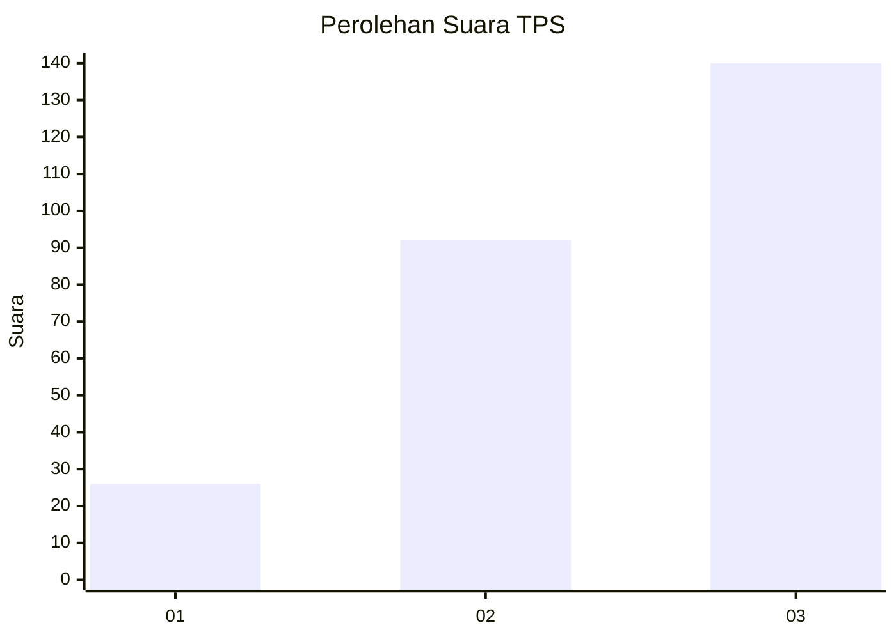
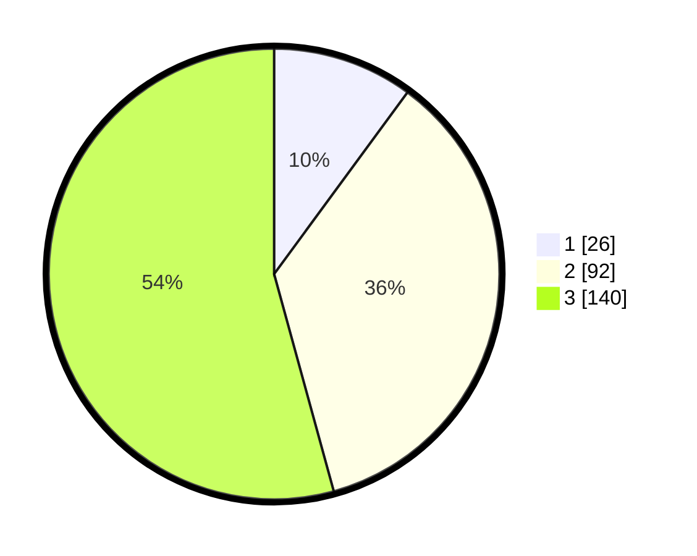

# Hasil

## Grafik

## Tabel

| No. | Nama Paslon    | Suara | Suara (raw) | Persentase |
|:--- |:-------------- | -----:| -----------:| ----------:|
| 1   | ANIES MUHAIMIN | 26    | [26][p-1]   | 10,08      |
| 2   | PRABOWO GIBRAN | 92    | [92][p-2]   | 35,66      |
| 3   | GANJAR MAHFUD  | 140   | [140][p-3]  | 54,26      |

[p-1]: https://github.com/gigit-pemilu/pemilu-2024-33-jawa-tengah/blob/main/pilpres/hitung-suara/sub/33-jawa-tengah/sub/09-boyolali/sub/05-boyolali/sub/1001-pulisen/sub/022-tps/sub/paslon-1.txt
[p-2]: https://github.com/gigit-pemilu/pemilu-2024-33-jawa-tengah/blob/main/pilpres/hitung-suara/sub/33-jawa-tengah/sub/09-boyolali/sub/05-boyolali/sub/1001-pulisen/sub/022-tps/sub/paslon-2.txt
[p-3]: https://github.com/gigit-pemilu/pemilu-2024-33-jawa-tengah/blob/main/pilpres/hitung-suara/sub/33-jawa-tengah/sub/09-boyolali/sub/05-boyolali/sub/1001-pulisen/sub/022-tps/sub/paslon-3.txt

## Foto C Plano

https://sirekap-obj-formc.kpu.go.id/47be/pemilu/ppwp/33/09/05/10/01/3309051001022-20240214-211832--f03d95be-fee3-40f1-a6db-c9fc74939573.jpg

https://sirekap-obj-formc.kpu.go.id/47be/pemilu/ppwp/33/09/05/10/01/3309051001022-20240214-211914--4d7d1447-ceb6-4a7d-b642-0de7329666a2.jpg

https://sirekap-obj-formc.kpu.go.id/47be/pemilu/ppwp/33/09/05/10/01/3309051001022-20240214-211929--1518774d-63a7-4fb8-b3e5-306a4af24b31.jpg

## Metadata

| Key        | Value               |
| ---------- | ------------------- |
| Time Stamp | 2024-02-16 12:51:22 |

