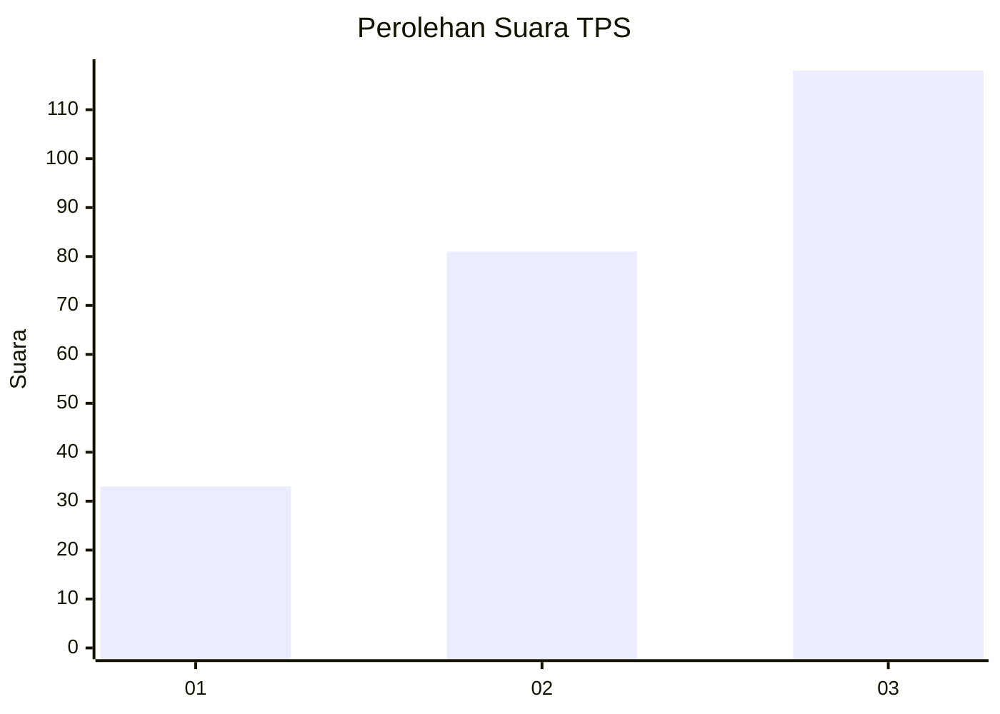
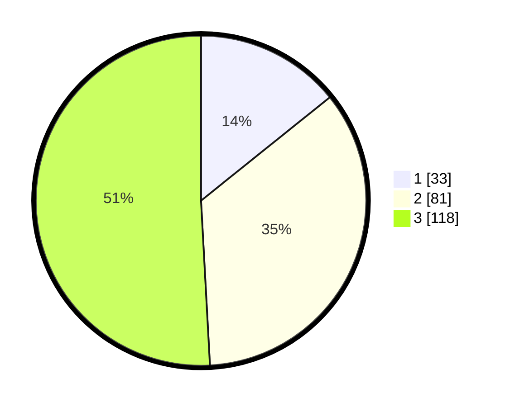

# Hasil

## Grafik

## Tabel

| No. | Nama Paslon    | Suara | Suara (raw) | Persentase |
|:--- |:-------------- | -----:| -----------:| ----------:|
| 1   | ANIES MUHAIMIN | 33    | [33][p-1]   | 14,22      |
| 2   | PRABOWO GIBRAN | 81    | [81][p-2]   | 34,91      |
| 3   | GANJAR MAHFUD  | 118   | [118][p-3]  | 50,86      |

[p-1]: https://github.com/gigit-pemilu/pemilu-2024/blob/main/pilpres/hitung-suara/sub/33-jawa-tengah/sub/09-boyolali/sub/05-boyolali/sub/1002-siswodipuran/sub/016-tps/sub/paslon-1.txt
[p-2]: https://github.com/gigit-pemilu/pemilu-2024/blob/main/pilpres/hitung-suara/sub/33-jawa-tengah/sub/09-boyolali/sub/05-boyolali/sub/1002-siswodipuran/sub/016-tps/sub/paslon-2.txt
[p-3]: https://github.com/gigit-pemilu/pemilu-2024/blob/main/pilpres/hitung-suara/sub/33-jawa-tengah/sub/09-boyolali/sub/05-boyolali/sub/1002-siswodipuran/sub/016-tps/sub/paslon-3.txt

## Foto C Plano

https://sirekap-obj-formc.kpu.go.id/0e26/pemilu/ppwp/33/09/05/10/02/3309051002016-20240214-155308--75898a89-0e78-4c11-8eb2-fc6b12cabde7.jpg

https://sirekap-obj-formc.kpu.go.id/0e26/pemilu/ppwp/33/09/05/10/02/3309051002016-20240214-155803--48d0a2d7-29bc-415d-8f7f-ab6ee60e8989.jpg

https://sirekap-obj-formc.kpu.go.id/0e26/pemilu/ppwp/33/09/05/10/02/3309051002016-20240214-155859--04eb336c-2310-43ac-93c5-176b3c1c614d.jpg

## Metadata

| Key        | Value               |
| ---------- | ------------------- |
| Time Stamp | 2024-02-16 12:51:22 |

