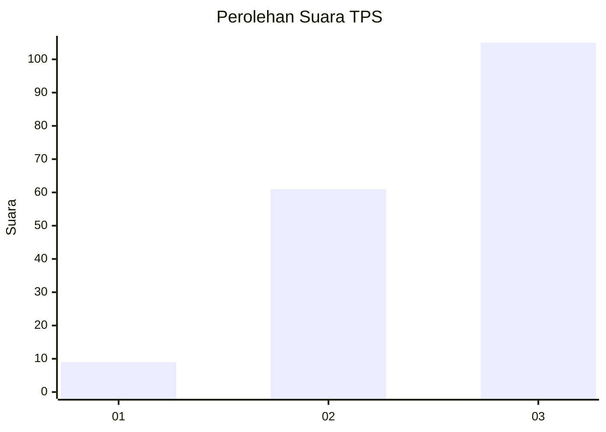
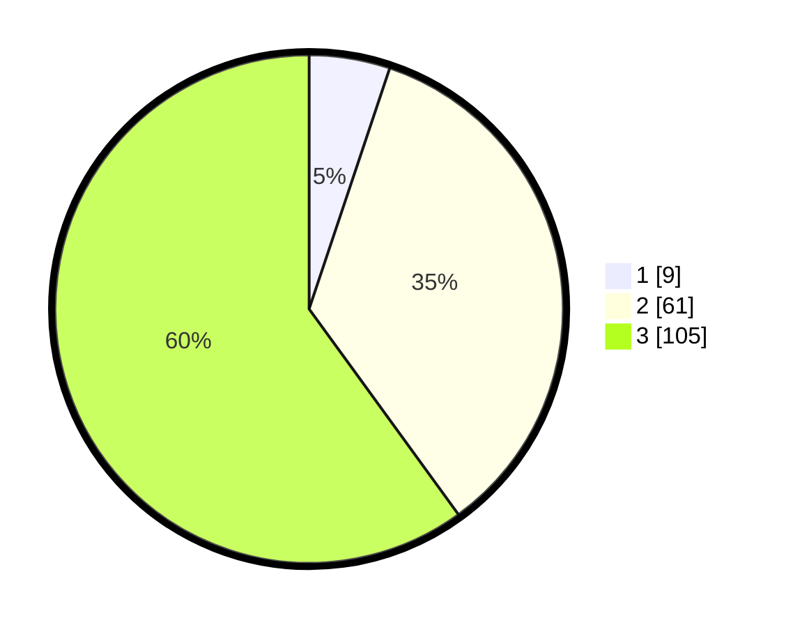

# Hasil

## Grafik

## Tabel

| No. | Nama Paslon    | Suara | Suara (raw) | Persentase |
|:--- |:-------------- | -----:| -----------:| ----------:|
| 1   | ANIES MUHAIMIN | 9     | [9][p-1]    | 5,14       |
| 2   | PRABOWO GIBRAN | 61    | [61][p-2]   | 34,86      |
| 3   | GANJAR MAHFUD  | 105   | [105][p-3]  | 60,00      |

[p-1]: https://github.com/gigit-pemilu/pemilu-2024-33-jawa-tengah/blob/main/pilpres/hitung-suara/sub/33-jawa-tengah/sub/09-boyolali/sub/05-boyolali/sub/1002-siswodipuran/sub/022-tps/sub/paslon-1.txt
[p-2]: https://github.com/gigit-pemilu/pemilu-2024-33-jawa-tengah/blob/main/pilpres/hitung-suara/sub/33-jawa-tengah/sub/09-boyolali/sub/05-boyolali/sub/1002-siswodipuran/sub/022-tps/sub/paslon-2.txt
[p-3]: https://github.com/gigit-pemilu/pemilu-2024-33-jawa-tengah/blob/main/pilpres/hitung-suara/sub/33-jawa-tengah/sub/09-boyolali/sub/05-boyolali/sub/1002-siswodipuran/sub/022-tps/sub/paslon-3.txt

## Foto C Plano

https://sirekap-obj-formc.kpu.go.id/ee7f/pemilu/ppwp/33/09/05/10/02/3309051002022-20240214-215334--76450766-b324-407c-85a5-bdc83dc63e8f.jpg

https://sirekap-obj-formc.kpu.go.id/ee7f/pemilu/ppwp/33/09/05/10/02/3309051002022-20240214-215421--16a38067-b374-42b6-937d-46b0f25c2ca9.jpg

https://sirekap-obj-formc.kpu.go.id/ee7f/pemilu/ppwp/33/09/05/10/02/3309051002022-20240214-215439--a351fe1d-1673-44a2-aff6-78403125a72f.jpg

## Metadata

| Key        | Value               |
| ---------- | ------------------- |
| Time Stamp | 2024-02-16 12:51:22 |

