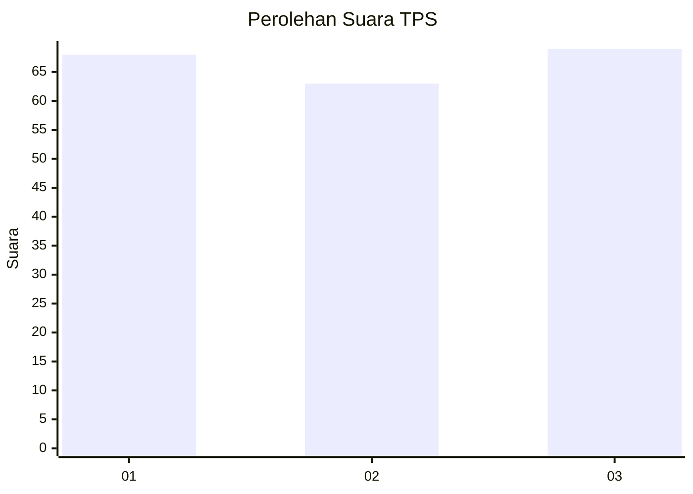
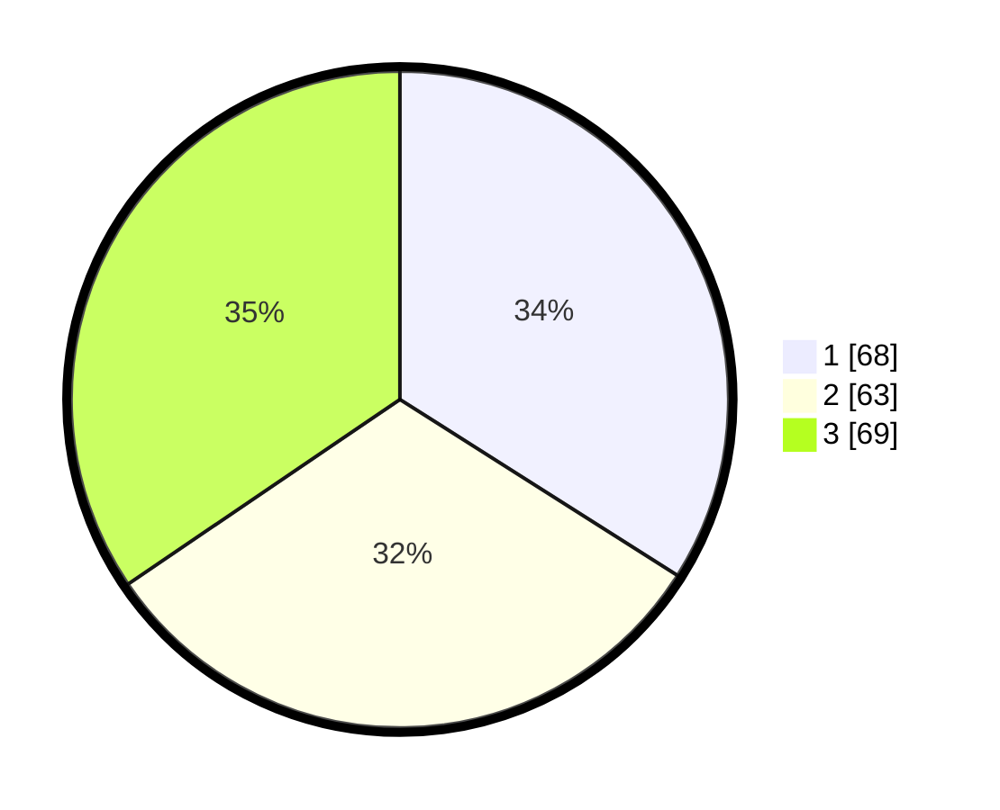

# Hasil

## Grafik

## Tabel

| No. | Nama Paslon    | Suara | Suara (raw) | Persentase |
|:--- |:-------------- | -----:| -----------:| ----------:|
| 1   | ANIES MUHAIMIN | 68    | [68][p-1]   | 34,00      |
| 2   | PRABOWO GIBRAN | 63    | [63][p-2]   | 31,50      |
| 3   | GANJAR MAHFUD  | 69    | [69][p-3]   | 34,50      |

[p-1]: https://github.com/gigit-pemilu/pemilu-2024/blob/main/pilpres/hitung-suara/sub/33-jawa-tengah/sub/09-boyolali/sub/05-boyolali/sub/1004-banaran/sub/013-tps/sub/paslon-1.txt
[p-2]: https://github.com/gigit-pemilu/pemilu-2024/blob/main/pilpres/hitung-suara/sub/33-jawa-tengah/sub/09-boyolali/sub/05-boyolali/sub/1004-banaran/sub/013-tps/sub/paslon-2.txt
[p-3]: https://github.com/gigit-pemilu/pemilu-2024/blob/main/pilpres/hitung-suara/sub/33-jawa-tengah/sub/09-boyolali/sub/05-boyolali/sub/1004-banaran/sub/013-tps/sub/paslon-3.txt

## Foto C Plano

https://sirekap-obj-formc.kpu.go.id/f6f5/pemilu/ppwp/33/09/05/10/04/3309051004013-20240214-231805--853a7be5-bf1b-45cc-94d5-fafa6f5810b9.jpg

https://sirekap-obj-formc.kpu.go.id/f6f5/pemilu/ppwp/33/09/05/10/04/3309051004013-20240214-231834--f5dc7145-4900-4fcb-a112-9c7bd4fba9d7.jpg

https://sirekap-obj-formc.kpu.go.id/f6f5/pemilu/ppwp/33/09/05/10/04/3309051004013-20240214-231858--9bc8401b-744c-40cc-bf01-de791dbe217d.jpg

## Metadata

| Key        | Value               |
| ---------- | ------------------- |
| Time Stamp | 2024-02-16 12:51:22 |

