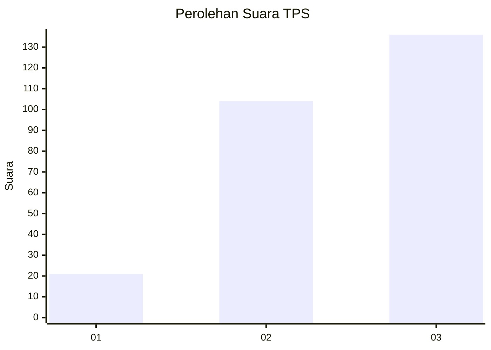
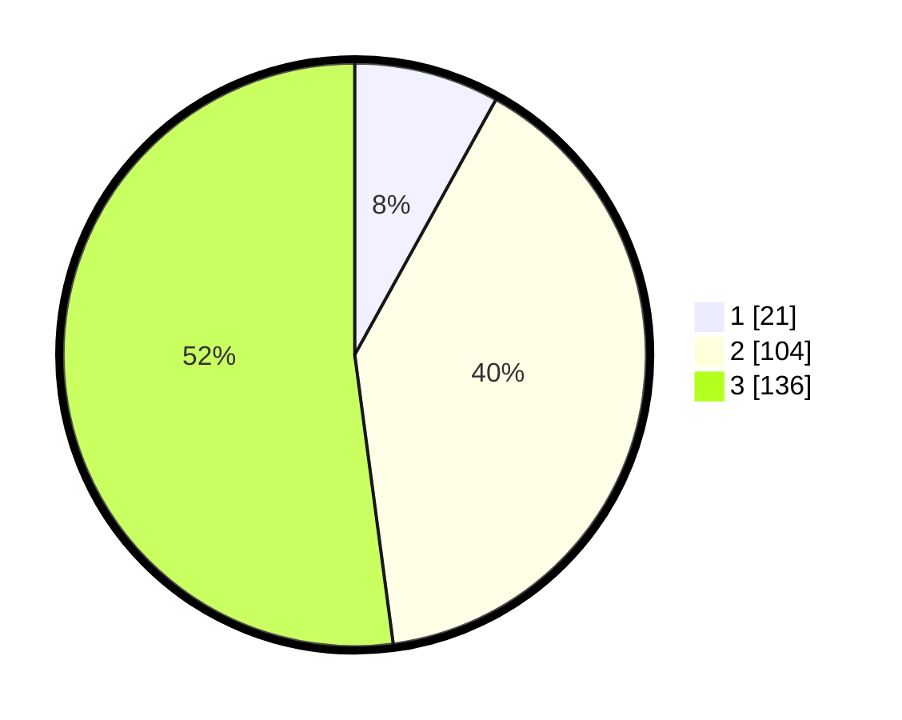

# Hasil

## Grafik

## Tabel

| No. | Nama Paslon    | Suara | Suara (raw) | Persentase |
|:--- |:-------------- | -----:| -----------:| ----------:|
| 1   | ANIES MUHAIMIN | 21    | [21][p-1]   | 8,05       |
| 2   | PRABOWO GIBRAN | 104   | [104][p-2]  | 39,85      |
| 3   | GANJAR MAHFUD  | 136   | [136][p-3]  | 52,11      |

[p-1]: https://github.com/gigit-pemilu/pemilu-2024/blob/main/pilpres/hitung-suara/sub/33-jawa-tengah/sub/09-boyolali/sub/05-boyolali/sub/2003-karanggeneng/sub/003-tps/sub/paslon-1.txt
[p-2]: https://github.com/gigit-pemilu/pemilu-2024/blob/main/pilpres/hitung-suara/sub/33-jawa-tengah/sub/09-boyolali/sub/05-boyolali/sub/2003-karanggeneng/sub/003-tps/sub/paslon-2.txt
[p-3]: https://github.com/gigit-pemilu/pemilu-2024/blob/main/pilpres/hitung-suara/sub/33-jawa-tengah/sub/09-boyolali/sub/05-boyolali/sub/2003-karanggeneng/sub/003-tps/sub/paslon-3.txt

## Foto C Plano

https://sirekap-obj-formc.kpu.go.id/6792/pemilu/ppwp/33/09/05/20/03/3309052003003-20240214-224800--0d43880f-5ad1-4d6d-b71b-3cc4d64d5c8b.jpg

https://sirekap-obj-formc.kpu.go.id/6792/pemilu/ppwp/33/09/05/20/03/3309052003003-20240214-224452--77162f07-4294-4539-a6c1-e300947ffa0c.jpg

https://sirekap-obj-formc.kpu.go.id/6792/pemilu/ppwp/33/09/05/20/03/3309052003003-20240214-224947--962a538a-931d-4103-b003-e0250e0a0f2b.jpg

## Metadata

| Key        | Value               |
| ---------- | ------------------- |
| Time Stamp | 2024-02-15 15:00:29 |

