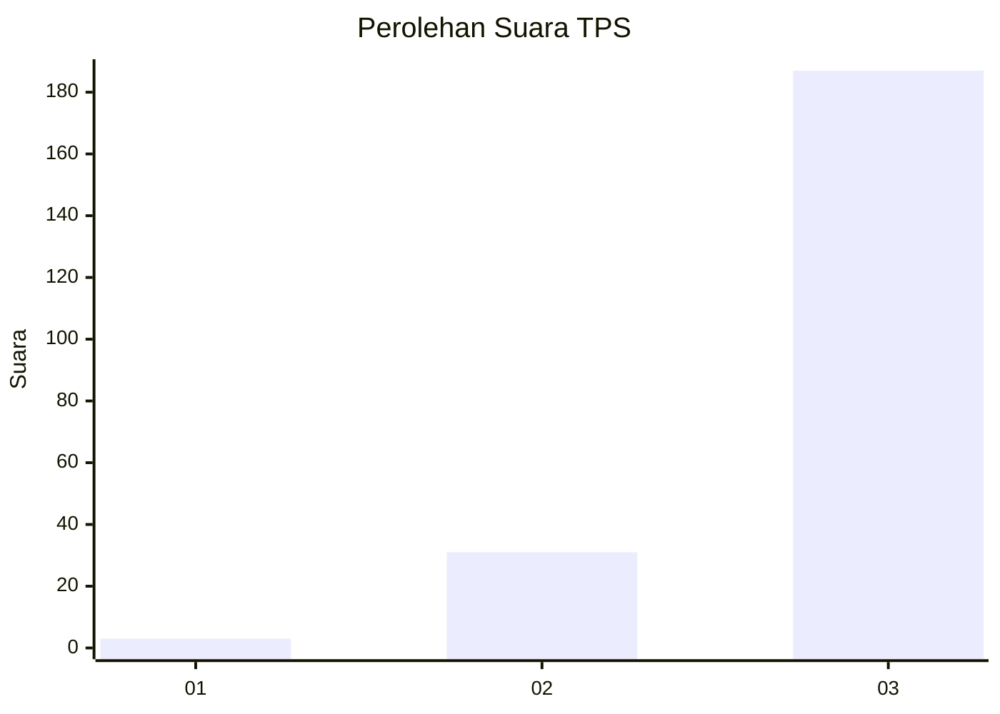
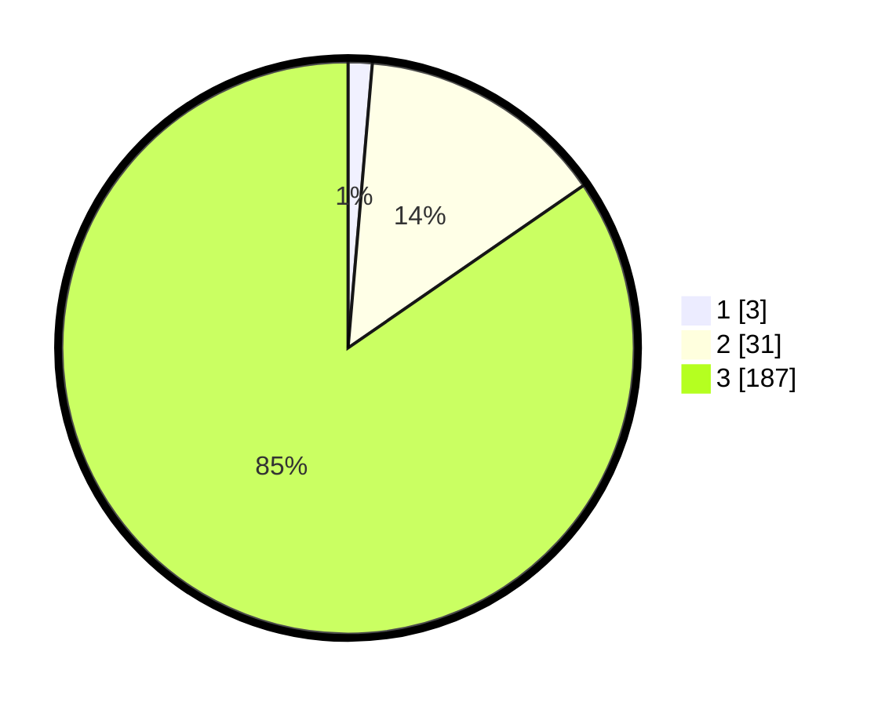

# Hasil

## Grafik

## Tabel

| No. | Nama Paslon    | Suara | Suara (raw) | Persentase |
|:--- |:-------------- | -----:| -----------:| ----------:|
| 1   | ANIES MUHAIMIN | 3     | [3][p-1]    | 1,36       |
| 2   | PRABOWO GIBRAN | 31    | [31][p-2]   | 14,03      |
| 3   | GANJAR MAHFUD  | 187   | [187][p-3]  | 84,62      |

[p-1]: https://github.com/gigit-pemilu/pemilu-2024/blob/main/pilpres/hitung-suara/sub/33-jawa-tengah/sub/09-boyolali/sub/05-boyolali/sub/2005-winong/sub/013-tps/sub/paslon-1.txt
[p-2]: https://github.com/gigit-pemilu/pemilu-2024/blob/main/pilpres/hitung-suara/sub/33-jawa-tengah/sub/09-boyolali/sub/05-boyolali/sub/2005-winong/sub/013-tps/sub/paslon-2.txt
[p-3]: https://github.com/gigit-pemilu/pemilu-2024/blob/main/pilpres/hitung-suara/sub/33-jawa-tengah/sub/09-boyolali/sub/05-boyolali/sub/2005-winong/sub/013-tps/sub/paslon-3.txt

## Foto C Plano

https://sirekap-obj-formc.kpu.go.id/d6e7/pemilu/ppwp/33/09/05/20/05/3309052005013-20240214-155316--191b3fb6-cb08-4cf2-88f9-e4a2a7f6fe37.jpg

https://sirekap-obj-formc.kpu.go.id/d6e7/pemilu/ppwp/33/09/05/20/05/3309052005013-20240214-155628--2219918f-2537-4f8e-b449-cbb9dae80597.jpg

https://sirekap-obj-formc.kpu.go.id/d6e7/pemilu/ppwp/33/09/05/20/05/3309052005013-20240214-155750--6564c003-66e1-4d84-bdfb-e57be67f4692.jpg

## Metadata

| Key        | Value               |
| ---------- | ------------------- |
| Time Stamp | 2024-02-16 12:51:22 |

