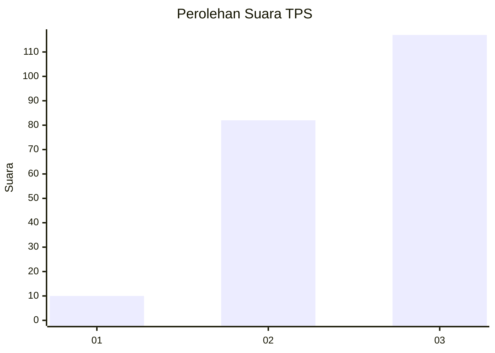
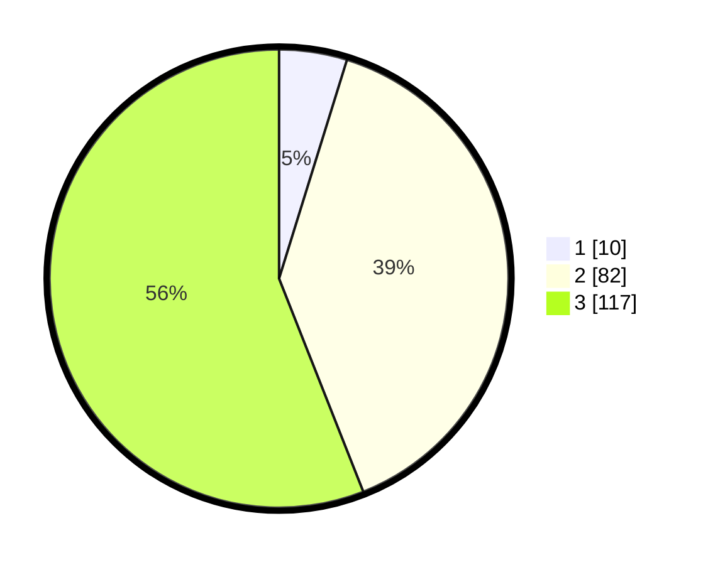

# Hasil

## Grafik

## Tabel

| No. | Nama Paslon    | Suara | Suara (raw) | Persentase |
|:--- |:-------------- | -----:| -----------:| ----------:|
| 1   | ANIES MUHAIMIN | 10    | [10][p-1]   | 4,78       |
| 2   | PRABOWO GIBRAN | 82    | [82][p-2]   | 39,23      |
| 3   | GANJAR MAHFUD  | 117   | [117][p-3]  | 55,98      |

[p-1]: https://github.com/gigit-pemilu/pemilu-2024-33-jawa-tengah/blob/main/pilpres/hitung-suara/sub/33-jawa-tengah/sub/09-boyolali/sub/05-boyolali/sub/2005-winong/sub/022-tps/sub/paslon-1.txt
[p-2]: https://github.com/gigit-pemilu/pemilu-2024-33-jawa-tengah/blob/main/pilpres/hitung-suara/sub/33-jawa-tengah/sub/09-boyolali/sub/05-boyolali/sub/2005-winong/sub/022-tps/sub/paslon-2.txt
[p-3]: https://github.com/gigit-pemilu/pemilu-2024-33-jawa-tengah/blob/main/pilpres/hitung-suara/sub/33-jawa-tengah/sub/09-boyolali/sub/05-boyolali/sub/2005-winong/sub/022-tps/sub/paslon-3.txt

## Foto C Plano

https://sirekap-obj-formc.kpu.go.id/f8b5/pemilu/ppwp/33/09/05/20/05/3309052005022-20240214-205939--8ea6bc12-bc48-487b-bc20-44fe62d05522.jpg

https://sirekap-obj-formc.kpu.go.id/f8b5/pemilu/ppwp/33/09/05/20/05/3309052005022-20240214-210059--86ee5538-e3c7-47b2-b485-cbc02b1c476c.jpg

https://sirekap-obj-formc.kpu.go.id/f8b5/pemilu/ppwp/33/09/05/20/05/3309052005022-20240214-210151--5e818a32-34d6-4a47-9109-fc5f47cae581.jpg

## Metadata

| Key        | Value               |
| ---------- | ------------------- |
| Time Stamp | 2024-02-16 12:51:22 |

