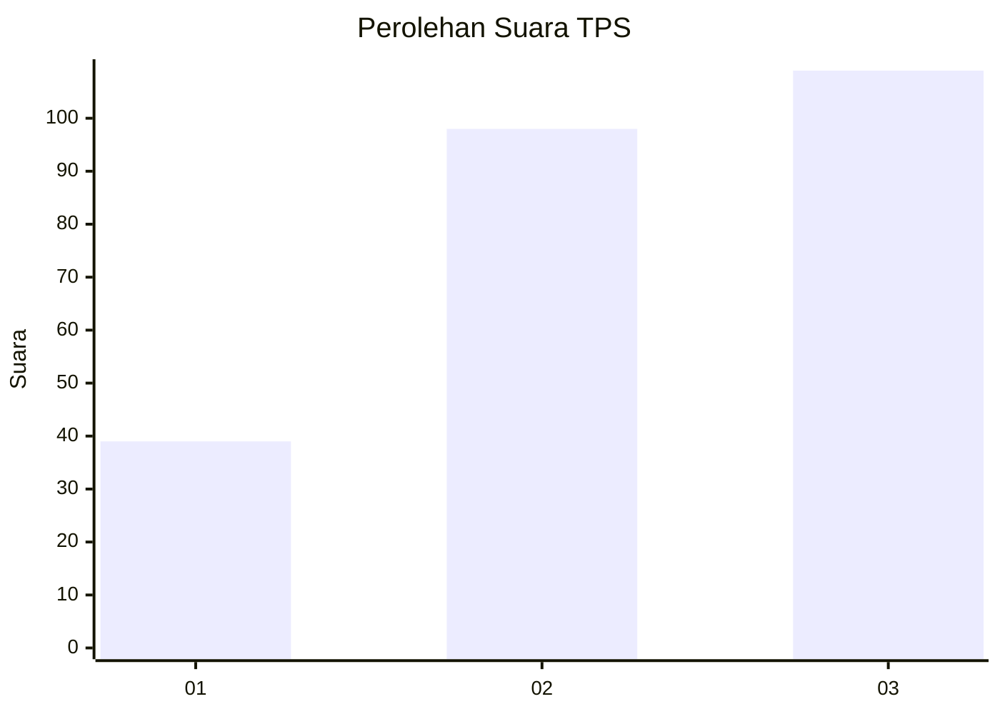
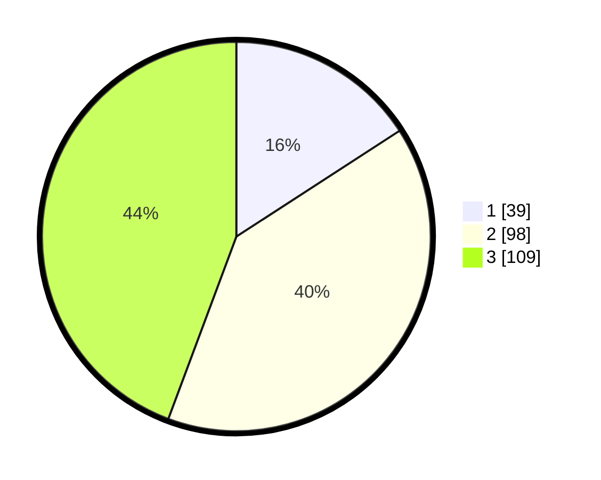

# Hasil

## Grafik

## Tabel

| No. | Nama Paslon    | Suara | Suara (raw) | Persentase |
|:--- |:-------------- | -----:| -----------:| ----------:|
| 1   | ANIES MUHAIMIN | 39    | [39][p-1]   | 15,85      |
| 2   | PRABOWO GIBRAN | 98    | [98][p-2]   | 39,84      |
| 3   | GANJAR MAHFUD  | 109   | [109][p-3]  | 44,31      |

[p-1]: https://github.com/gigit-pemilu/pemilu-2024/blob/main/pilpres/hitung-suara/sub/33-jawa-tengah/sub/09-boyolali/sub/05-boyolali/sub/2007-kiringan/sub/006-tps/sub/paslon-1.txt
[p-2]: https://github.com/gigit-pemilu/pemilu-2024/blob/main/pilpres/hitung-suara/sub/33-jawa-tengah/sub/09-boyolali/sub/05-boyolali/sub/2007-kiringan/sub/006-tps/sub/paslon-2.txt
[p-3]: https://github.com/gigit-pemilu/pemilu-2024/blob/main/pilpres/hitung-suara/sub/33-jawa-tengah/sub/09-boyolali/sub/05-boyolali/sub/2007-kiringan/sub/006-tps/sub/paslon-3.txt

## Foto C Plano

https://sirekap-obj-formc.kpu.go.id/8a1d/pemilu/ppwp/33/09/05/20/07/3309052007006-20240214-225007--94877de8-fca9-4ae6-8d14-a075bebdfc93.jpg

https://sirekap-obj-formc.kpu.go.id/8a1d/pemilu/ppwp/33/09/05/20/07/3309052007006-20240214-193935--94640703-7f55-4600-9bb2-bd64482ed158.jpg

https://sirekap-obj-formc.kpu.go.id/8a1d/pemilu/ppwp/33/09/05/20/07/3309052007006-20240214-194057--91d89926-14b4-4fbe-a87c-a520f63aacad.jpg

## Metadata

| Key        | Value               |
| ---------- | ------------------- |
| Time Stamp | 2024-02-16 12:51:22 |

