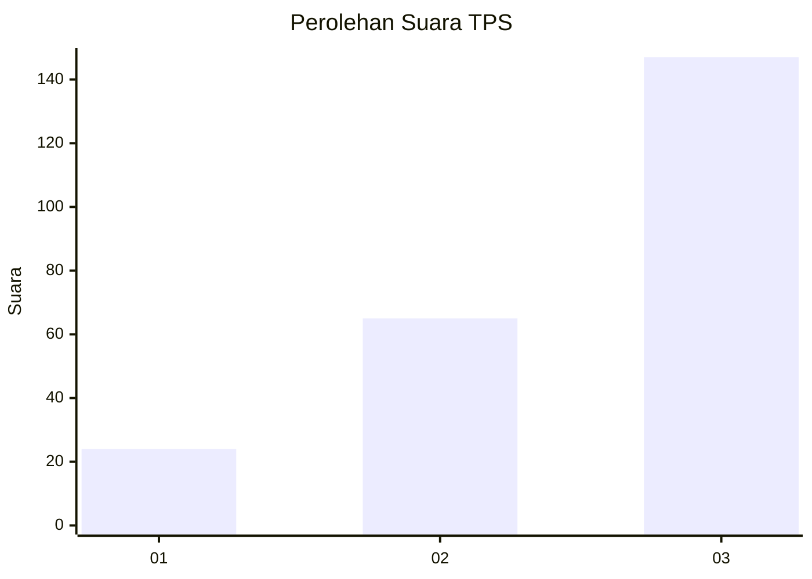
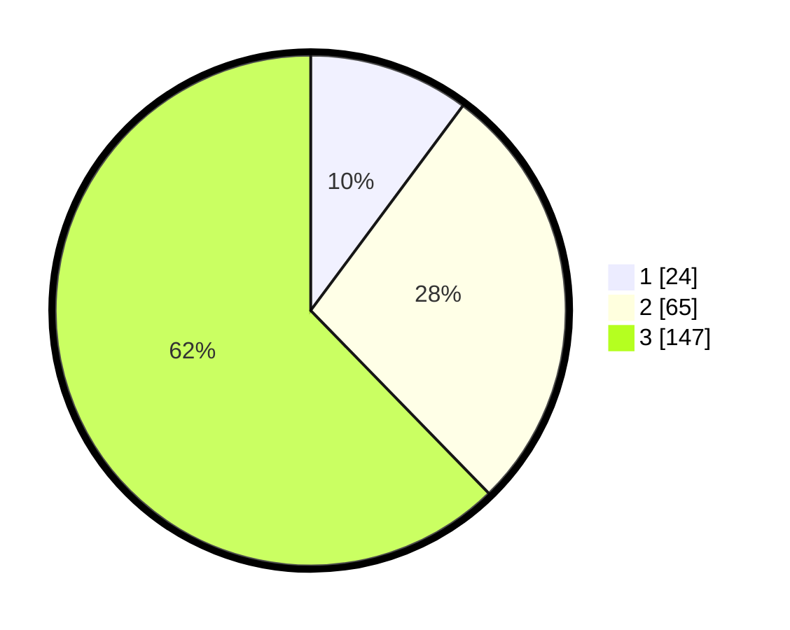

# Hasil

## Grafik

## Tabel

| No. | Nama Paslon    | Suara | Suara (raw) | Persentase |
|:--- |:-------------- | -----:| -----------:| ----------:|
| 1   | ANIES MUHAIMIN | 24    | [24][p-1]   | 10,17      |
| 2   | PRABOWO GIBRAN | 65    | [65][p-2]   | 27,54      |
| 3   | GANJAR MAHFUD  | 147   | [147][p-3]  | 62,29      |

[p-1]: https://github.com/gigit-pemilu/pemilu-2024-33-jawa-tengah/blob/main/pilpres/hitung-suara/sub/33-jawa-tengah/sub/09-boyolali/sub/05-boyolali/sub/2007-kiringan/sub/011-tps/sub/paslon-1.txt
[p-2]: https://github.com/gigit-pemilu/pemilu-2024-33-jawa-tengah/blob/main/pilpres/hitung-suara/sub/33-jawa-tengah/sub/09-boyolali/sub/05-boyolali/sub/2007-kiringan/sub/011-tps/sub/paslon-2.txt
[p-3]: https://github.com/gigit-pemilu/pemilu-2024-33-jawa-tengah/blob/main/pilpres/hitung-suara/sub/33-jawa-tengah/sub/09-boyolali/sub/05-boyolali/sub/2007-kiringan/sub/011-tps/sub/paslon-3.txt

## Foto C Plano

https://sirekap-obj-formc.kpu.go.id/5ee7/pemilu/ppwp/33/09/05/20/07/3309052007011-20240215-023300--0fdb64d5-dcba-4209-91fb-a945a633344c.jpg

https://sirekap-obj-formc.kpu.go.id/5ee7/pemilu/ppwp/33/09/05/20/07/3309052007011-20240215-032429--554de036-4fbf-4337-aafa-9537164cf809.jpg

https://sirekap-obj-formc.kpu.go.id/5ee7/pemilu/ppwp/33/09/05/20/07/3309052007011-20240215-032807--005e5095-2f8d-418d-8dc2-ee14dab7a331.jpg

## Metadata

| Key        | Value               |
| ---------- | ------------------- |
| Time Stamp | 2024-02-16 12:51:22 |

