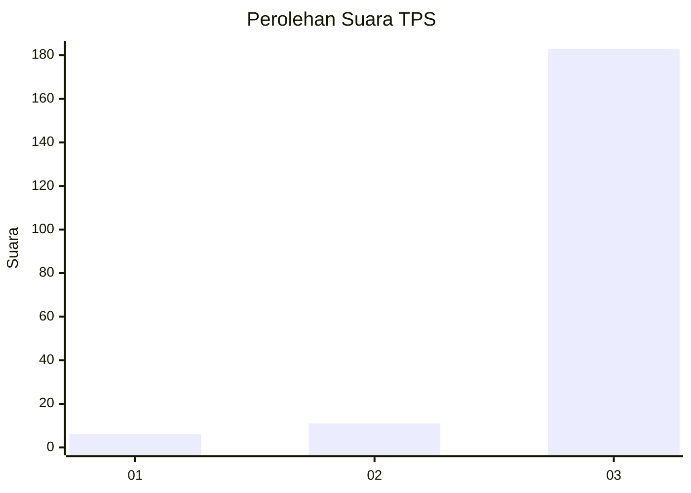
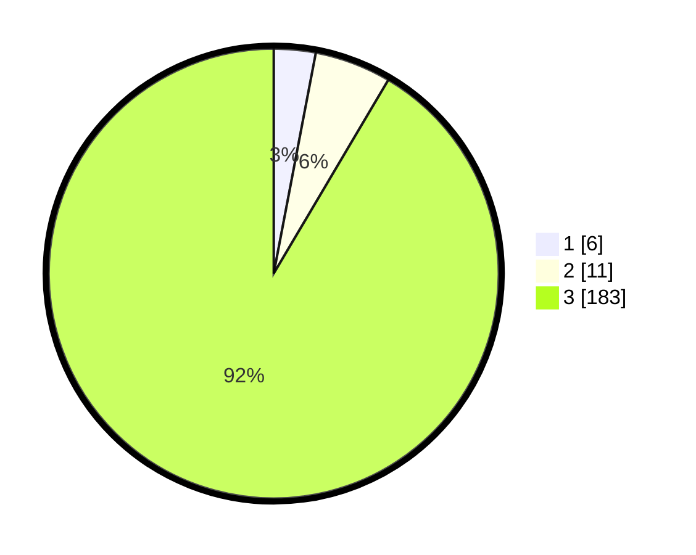

# Hasil

## Grafik

## Tabel

| No. | Nama Paslon    | Suara | Suara (raw) | Persentase |
|:--- |:-------------- | -----:| -----------:| ----------:|
| 1   | ANIES MUHAIMIN | 6     | [6][p-1]    | 3,00       |
| 2   | PRABOWO GIBRAN | 11    | [11][p-2]   | 5,50       |
| 3   | GANJAR MAHFUD  | 183   | [183][p-3]  | 91,50      |

[p-1]: https://github.com/gigit-pemilu/pemilu-2024/blob/main/pilpres/hitung-suara/sub/33-jawa-tengah/sub/09-boyolali/sub/05-boyolali/sub/2008-mudal/sub/006-tps/sub/paslon-1.txt
[p-2]: https://github.com/gigit-pemilu/pemilu-2024/blob/main/pilpres/hitung-suara/sub/33-jawa-tengah/sub/09-boyolali/sub/05-boyolali/sub/2008-mudal/sub/006-tps/sub/paslon-2.txt
[p-3]: https://github.com/gigit-pemilu/pemilu-2024/blob/main/pilpres/hitung-suara/sub/33-jawa-tengah/sub/09-boyolali/sub/05-boyolali/sub/2008-mudal/sub/006-tps/sub/paslon-3.txt

## Foto C Plano

https://sirekap-obj-formc.kpu.go.id/9f0a/pemilu/ppwp/33/09/05/20/08/3309052008006-20240214-234632--becd2257-0d87-49b2-8ab1-bebbe68a0efb.jpg

https://sirekap-obj-formc.kpu.go.id/9f0a/pemilu/ppwp/33/09/05/20/08/3309052008006-20240214-234507--2923c1cd-d6b2-493d-865b-50877f48668e.jpg

https://sirekap-obj-formc.kpu.go.id/9f0a/pemilu/ppwp/33/09/05/20/08/3309052008006-20240214-234311--6c0f79c9-9fc7-48b7-a1d2-424ce2dd84c1.jpg

## Metadata

| Key        | Value               |
| ---------- | ------------------- |
| Time Stamp | 2024-02-16 13:00:29 |

