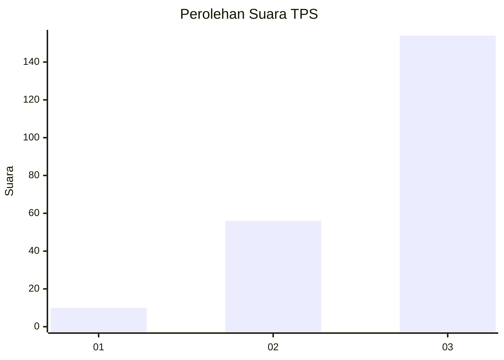
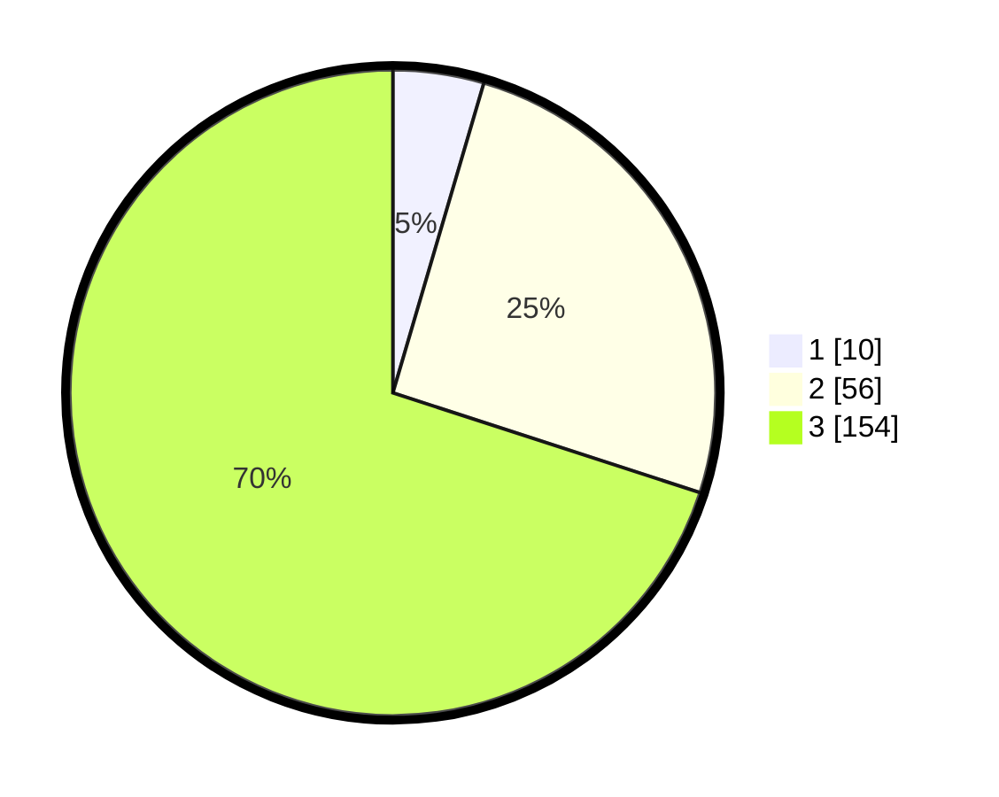

# Hasil

## Grafik

## Tabel

| No. | Nama Paslon    | Suara | Suara (raw) | Persentase |
|:--- |:-------------- | -----:| -----------:| ----------:|
| 1   | ANIES MUHAIMIN | 10    | [10][p-1]   | 4,55       |
| 2   | PRABOWO GIBRAN | 56    | [56][p-2]   | 25,45      |
| 3   | GANJAR MAHFUD  | 154   | [154][p-3]  | 70,00      |

[p-1]: https://github.com/gigit-pemilu/pemilu-2024/blob/main/pilpres/hitung-suara/sub/33-jawa-tengah/sub/09-boyolali/sub/06-mojosongo/sub/1007-kemiri/sub/001-tps/sub/paslon-1.txt
[p-2]: https://github.com/gigit-pemilu/pemilu-2024/blob/main/pilpres/hitung-suara/sub/33-jawa-tengah/sub/09-boyolali/sub/06-mojosongo/sub/1007-kemiri/sub/001-tps/sub/paslon-2.txt
[p-3]: https://github.com/gigit-pemilu/pemilu-2024/blob/main/pilpres/hitung-suara/sub/33-jawa-tengah/sub/09-boyolali/sub/06-mojosongo/sub/1007-kemiri/sub/001-tps/sub/paslon-3.txt

## Foto C Plano

https://sirekap-obj-formc.kpu.go.id/1944/pemilu/ppwp/33/09/06/10/07/3309061007001-20240215-164917--1603134d-7968-4259-a479-aabda3770a44.jpg

https://sirekap-obj-formc.kpu.go.id/1944/pemilu/ppwp/33/09/06/10/07/3309061007001-20240216-124114--0bb54a94-6824-4673-a034-0b162232fef9.jpg

https://sirekap-obj-formc.kpu.go.id/1944/pemilu/ppwp/33/09/06/10/07/3309061007001-20240216-124220--c3b28346-afaf-409c-a871-de646cf4d006.jpg

## Metadata

| Key        | Value               |
| ---------- | ------------------- |
| Time Stamp | 2024-02-25 21:00:00 |

