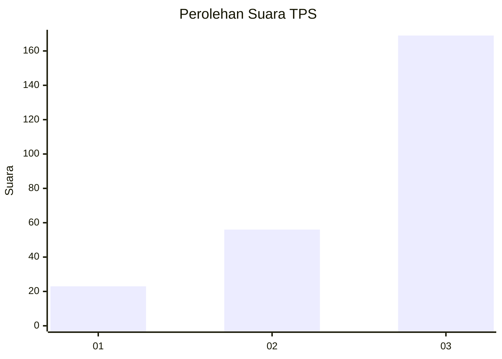
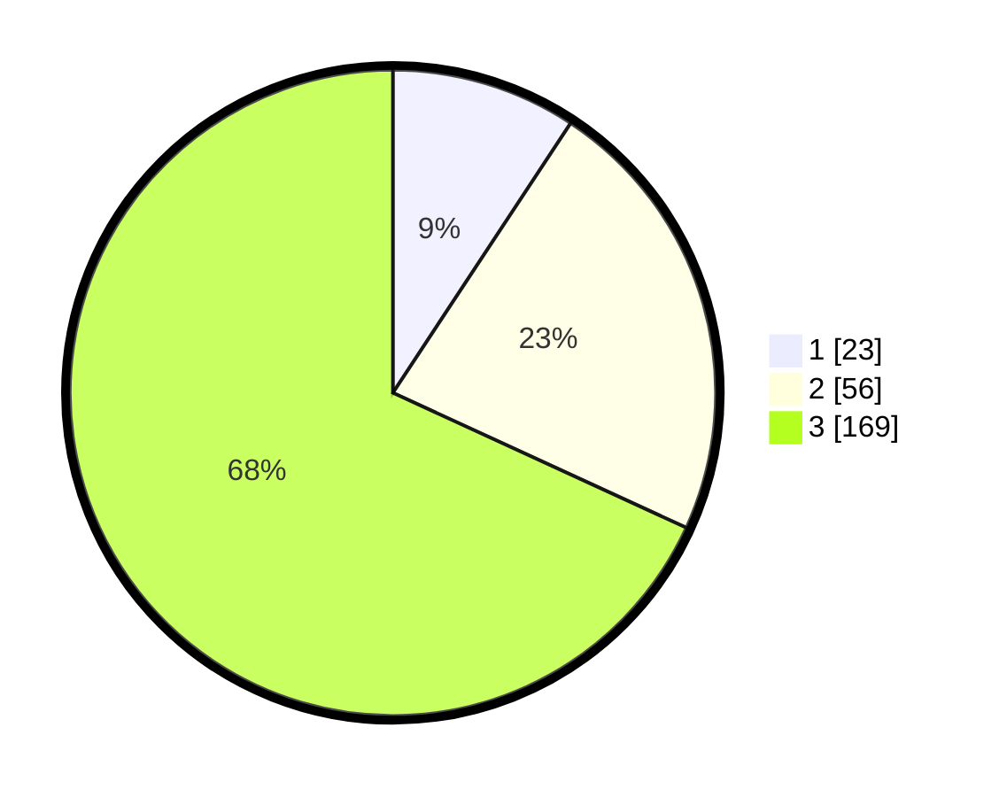

# Hasil

## Grafik

## Tabel

| No. | Nama Paslon    | Suara | Suara (raw) | Persentase |
|:--- |:-------------- | -----:| -----------:| ----------:|
| 1   | ANIES MUHAIMIN | 23    | [23][p-1]   | 9,27       |
| 2   | PRABOWO GIBRAN | 56    | [56][p-2]   | 22,58      |
| 3   | GANJAR MAHFUD  | 169   | [169][p-3]  | 68,15      |

[p-1]: https://github.com/gigit-pemilu/pemilu-2024-33-jawa-tengah/blob/main/pilpres/hitung-suara/sub/33-jawa-tengah/sub/09-boyolali/sub/06-mojosongo/sub/1007-kemiri/sub/006-tps/sub/paslon-1.txt
[p-2]: https://github.com/gigit-pemilu/pemilu-2024-33-jawa-tengah/blob/main/pilpres/hitung-suara/sub/33-jawa-tengah/sub/09-boyolali/sub/06-mojosongo/sub/1007-kemiri/sub/006-tps/sub/paslon-2.txt
[p-3]: https://github.com/gigit-pemilu/pemilu-2024-33-jawa-tengah/blob/main/pilpres/hitung-suara/sub/33-jawa-tengah/sub/09-boyolali/sub/06-mojosongo/sub/1007-kemiri/sub/006-tps/sub/paslon-3.txt

## Foto C Plano

https://sirekap-obj-formc.kpu.go.id/87b6/pemilu/ppwp/33/09/06/10/07/3309061007006-20240214-203954--db370db5-b8af-4b9b-991a-6cfce5ca6c5e.jpg

https://sirekap-obj-formc.kpu.go.id/87b6/pemilu/ppwp/33/09/06/10/07/3309061007006-20240214-204149--6540c921-56f1-4b68-8988-576764e253c6.jpg

https://sirekap-obj-formc.kpu.go.id/87b6/pemilu/ppwp/33/09/06/10/07/3309061007006-20240214-204326--84e425a6-0165-4808-bf4e-23e23dc21a8f.jpg

## Metadata

| Key        | Value               |
| ---------- | ------------------- |
| Time Stamp | 2024-02-15 17:00:25 |

