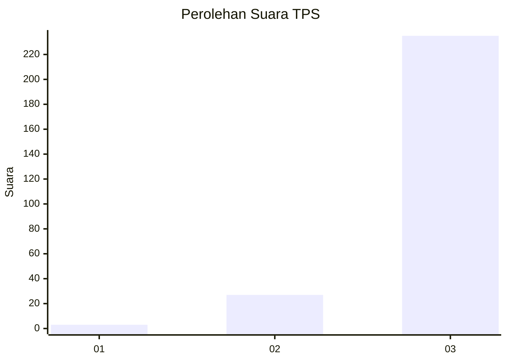
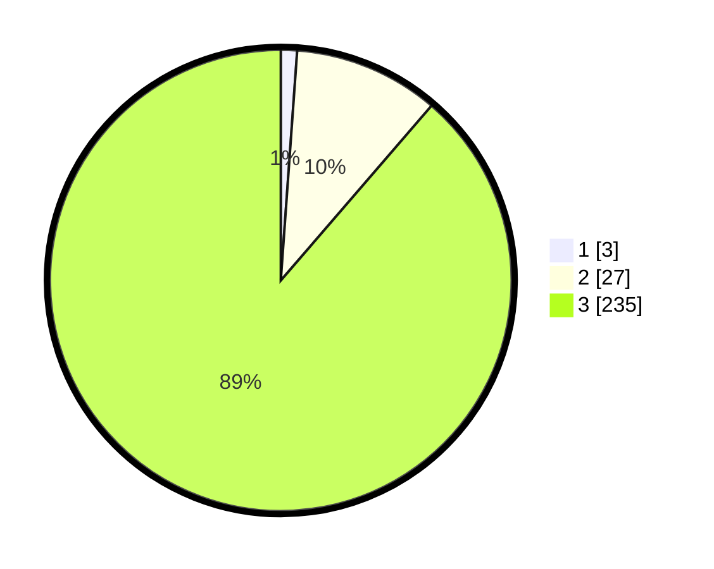

# Hasil

## Grafik

## Tabel

| No. | Nama Paslon    | Suara | Suara (raw) | Persentase |
|:--- |:-------------- | -----:| -----------:| ----------:|
| 1   | ANIES MUHAIMIN | 3     | [3][p-1]    | 1,13       |
| 2   | PRABOWO GIBRAN | 27    | [27][p-2]   | 10,19      |
| 3   | GANJAR MAHFUD  | 235   | [235][p-3]  | 88,68      |

[p-1]: https://github.com/gigit-pemilu/pemilu-2024-33-jawa-tengah/blob/main/pilpres/hitung-suara/sub/33-jawa-tengah/sub/09-boyolali/sub/06-mojosongo/sub/1007-kemiri/sub/007-tps/sub/paslon-1.txt
[p-2]: https://github.com/gigit-pemilu/pemilu-2024-33-jawa-tengah/blob/main/pilpres/hitung-suara/sub/33-jawa-tengah/sub/09-boyolali/sub/06-mojosongo/sub/1007-kemiri/sub/007-tps/sub/paslon-2.txt
[p-3]: https://github.com/gigit-pemilu/pemilu-2024-33-jawa-tengah/blob/main/pilpres/hitung-suara/sub/33-jawa-tengah/sub/09-boyolali/sub/06-mojosongo/sub/1007-kemiri/sub/007-tps/sub/paslon-3.txt

## Foto C Plano

https://sirekap-obj-formc.kpu.go.id/9423/pemilu/ppwp/33/09/06/10/07/3309061007007-20240214-215522--d7b2ef05-8312-4299-acbf-0e895292d90e.jpg

https://sirekap-obj-formc.kpu.go.id/9423/pemilu/ppwp/33/09/06/10/07/3309061007007-20240214-215742--f320afad-9025-47ed-88b5-1e38368eb4e6.jpg

https://sirekap-obj-formc.kpu.go.id/9423/pemilu/ppwp/33/09/06/10/07/3309061007007-20240214-215924--34f10649-bb34-4ceb-8cc5-697b697d3475.jpg

## Metadata

| Key        | Value               |
| ---------- | ------------------- |
| Time Stamp | 2024-02-15 21:01:18 |

