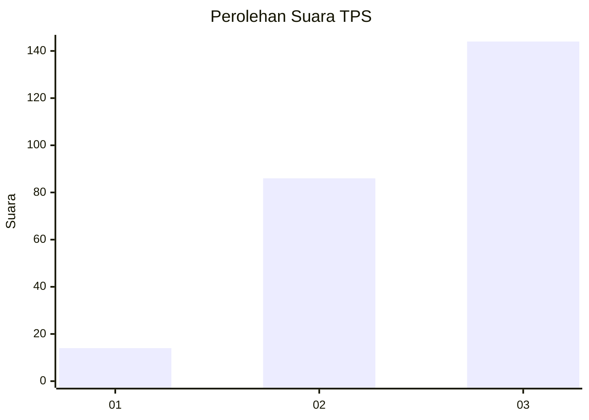
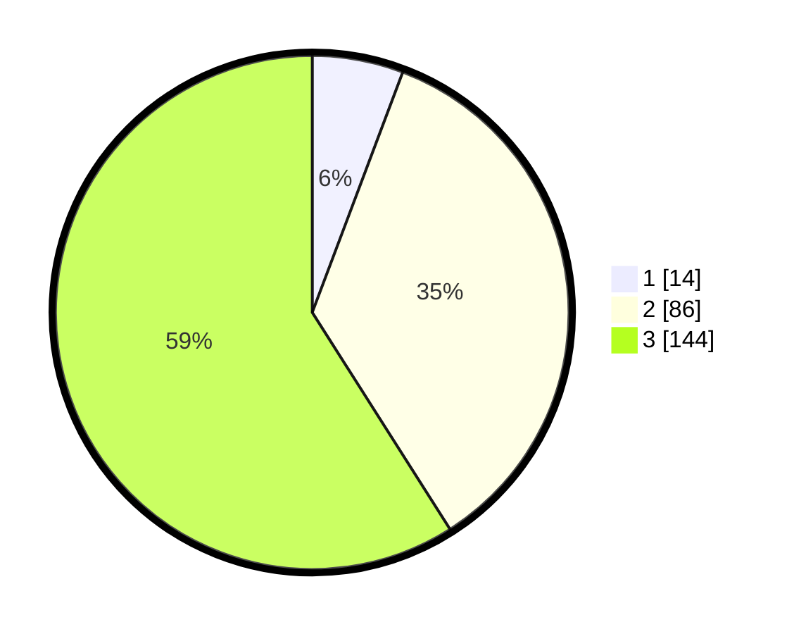

# Hasil

## Grafik

## Tabel

| No. | Nama Paslon    | Suara | Suara (raw) | Persentase |
|:--- |:-------------- | -----:| -----------:| ----------:|
| 1   | ANIES MUHAIMIN | 14    | [14][p-1]   | 5,74       |
| 2   | PRABOWO GIBRAN | 86    | [86][p-2]   | 35,25      |
| 3   | GANJAR MAHFUD  | 144   | [144][p-3]  | 59,02      |

[p-1]: https://github.com/gigit-pemilu/pemilu-2024-33-jawa-tengah/blob/main/pilpres/hitung-suara/sub/33-jawa-tengah/sub/09-boyolali/sub/06-mojosongo/sub/1007-kemiri/sub/012-tps/sub/paslon-1.txt
[p-2]: https://github.com/gigit-pemilu/pemilu-2024-33-jawa-tengah/blob/main/pilpres/hitung-suara/sub/33-jawa-tengah/sub/09-boyolali/sub/06-mojosongo/sub/1007-kemiri/sub/012-tps/sub/paslon-2.txt
[p-3]: https://github.com/gigit-pemilu/pemilu-2024-33-jawa-tengah/blob/main/pilpres/hitung-suara/sub/33-jawa-tengah/sub/09-boyolali/sub/06-mojosongo/sub/1007-kemiri/sub/012-tps/sub/paslon-3.txt

## Foto C Plano

https://sirekap-obj-formc.kpu.go.id/6283/pemilu/ppwp/33/09/06/10/07/3309061007012-20240214-233149--fafea49c-21ed-4a8f-bdc6-2fcaf013d74d.jpg

https://sirekap-obj-formc.kpu.go.id/6283/pemilu/ppwp/33/09/06/10/07/3309061007012-20240214-233252--59c69da9-c8f8-43e7-b71e-7023ae70f78f.jpg

https://sirekap-obj-formc.kpu.go.id/6283/pemilu/ppwp/33/09/06/10/07/3309061007012-20240214-233338--a70cd527-6bc2-4b98-acb4-e3c67b76261b.jpg

## Metadata

| Key        | Value               |
| ---------- | ------------------- |
| Time Stamp | 2024-02-15 21:01:18 |

