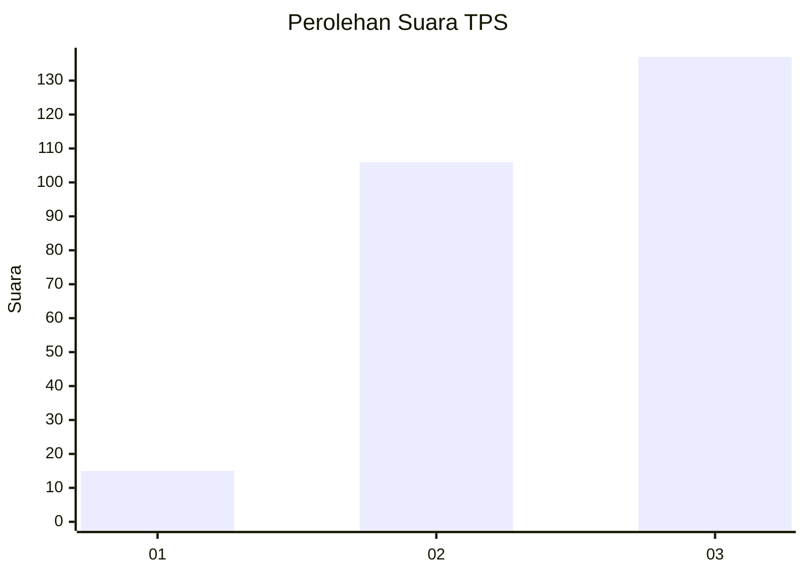
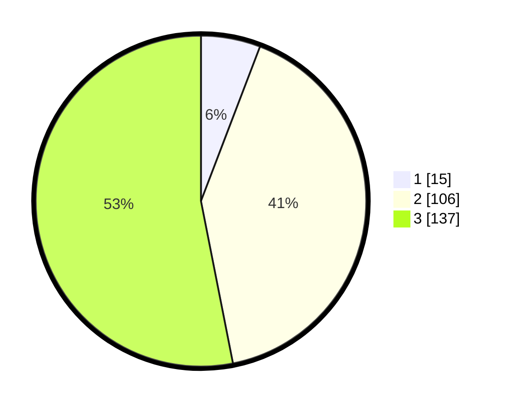

# Hasil

## Grafik

## Tabel

| No. | Nama Paslon    | Suara | Suara (raw) | Persentase |
|:--- |:-------------- | -----:| -----------:| ----------:|
| 1   | ANIES MUHAIMIN | 15    | [15][p-1]   | 5,81       |
| 2   | PRABOWO GIBRAN | 106   | [106][p-2]  | 41,09      |
| 3   | GANJAR MAHFUD  | 137   | [137][p-3]  | 53,10      |

[p-1]: https://github.com/gigit-pemilu/pemilu-2024-33-jawa-tengah/blob/main/pilpres/hitung-suara/sub/33-jawa-tengah/sub/09-boyolali/sub/06-mojosongo/sub/1007-kemiri/sub/014-tps/sub/paslon-1.txt
[p-2]: https://github.com/gigit-pemilu/pemilu-2024-33-jawa-tengah/blob/main/pilpres/hitung-suara/sub/33-jawa-tengah/sub/09-boyolali/sub/06-mojosongo/sub/1007-kemiri/sub/014-tps/sub/paslon-2.txt
[p-3]: https://github.com/gigit-pemilu/pemilu-2024-33-jawa-tengah/blob/main/pilpres/hitung-suara/sub/33-jawa-tengah/sub/09-boyolali/sub/06-mojosongo/sub/1007-kemiri/sub/014-tps/sub/paslon-3.txt

## Foto C Plano

https://sirekap-obj-formc.kpu.go.id/f1cd/pemilu/ppwp/33/09/06/10/07/3309061007014-20240214-215504--5a6e75d3-20d8-474b-867a-7ca620e76e4f.jpg

https://sirekap-obj-formc.kpu.go.id/f1cd/pemilu/ppwp/33/09/06/10/07/3309061007014-20240214-215618--5d0cb1bf-0d17-42dd-b5fc-5b669741f713.jpg

https://sirekap-obj-formc.kpu.go.id/f1cd/pemilu/ppwp/33/09/06/10/07/3309061007014-20240214-215701--6a57b418-49bb-4898-993c-b1ee9f0c0bb1.jpg

## Metadata

| Key        | Value               |
| ---------- | ------------------- |
| Time Stamp | 2024-02-15 21:01:18 |

