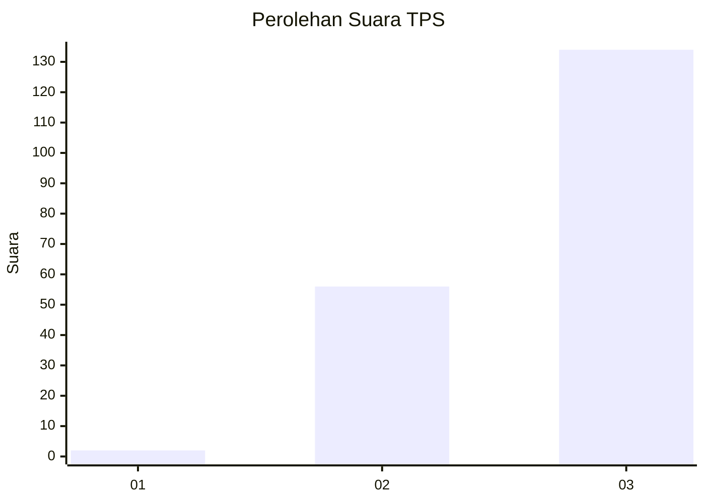
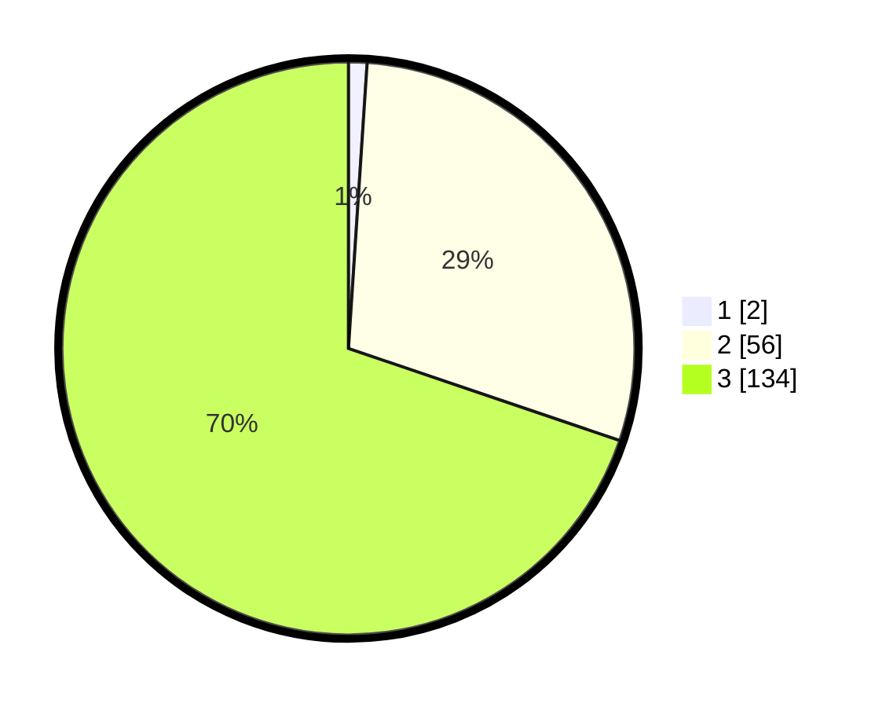

# Hasil

## Grafik

## Tabel

| No. | Nama Paslon    | Suara | Suara (raw) | Persentase |
|:--- |:-------------- | -----:| -----------:| ----------:|
| 1   | ANIES MUHAIMIN | 2     | [2][p-1]    | 1,04       |
| 2   | PRABOWO GIBRAN | 56    | [56][p-2]   | 29,17      |
| 3   | GANJAR MAHFUD  | 134   | [134][p-3]  | 69,79      |

[p-1]: https://github.com/gigit-pemilu/pemilu-2024-33-jawa-tengah/blob/main/pilpres/hitung-suara/sub/33-jawa-tengah/sub/09-boyolali/sub/06-mojosongo/sub/1007-kemiri/sub/020-tps/sub/paslon-1.txt
[p-2]: https://github.com/gigit-pemilu/pemilu-2024-33-jawa-tengah/blob/main/pilpres/hitung-suara/sub/33-jawa-tengah/sub/09-boyolali/sub/06-mojosongo/sub/1007-kemiri/sub/020-tps/sub/paslon-2.txt
[p-3]: https://github.com/gigit-pemilu/pemilu-2024-33-jawa-tengah/blob/main/pilpres/hitung-suara/sub/33-jawa-tengah/sub/09-boyolali/sub/06-mojosongo/sub/1007-kemiri/sub/020-tps/sub/paslon-3.txt

## Foto C Plano

https://sirekap-obj-formc.kpu.go.id/5c76/pemilu/ppwp/33/09/06/10/07/3309061007020-20240214-225749--a943fb9d-6bb7-45dc-bd60-8454565201da.jpg

https://sirekap-obj-formc.kpu.go.id/5c76/pemilu/ppwp/33/09/06/10/07/3309061007020-20240214-225955--577da62f-f3c6-4161-ad60-9647e037bbd4.jpg

https://sirekap-obj-formc.kpu.go.id/5c76/pemilu/ppwp/33/09/06/10/07/3309061007020-20240214-230050--75332b55-da1d-4f52-941b-adf1e593cdaa.jpg

## Metadata

| Key        | Value               |
| ---------- | ------------------- |
| Time Stamp | 2024-02-15 21:01:18 |

