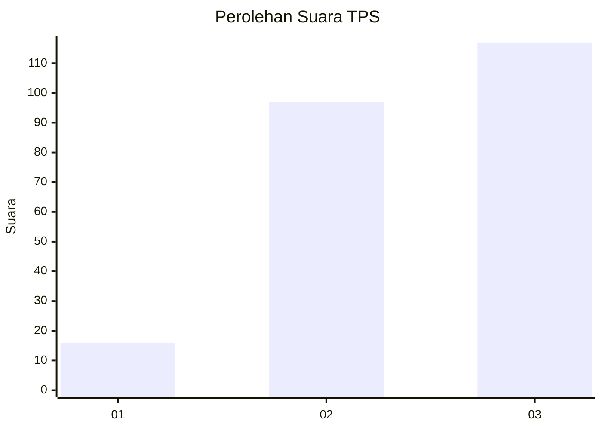
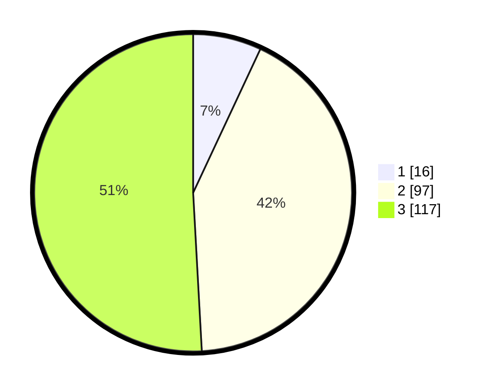

# Hasil

## Grafik

## Tabel

| No. | Nama Paslon    | Suara | Suara (raw) | Persentase |
|:--- |:-------------- | -----:| -----------:| ----------:|
| 1   | ANIES MUHAIMIN | 16    | [16][p-1]   | 6,96       |
| 2   | PRABOWO GIBRAN | 97    | [97][p-2]   | 42,17      |
| 3   | GANJAR MAHFUD  | 117   | [117][p-3]  | 50,87      |

[p-1]: https://github.com/gigit-pemilu/pemilu-2024-33-jawa-tengah/blob/main/pilpres/hitung-suara/sub/33-jawa-tengah/sub/09-boyolali/sub/06-mojosongo/sub/1009-mojosongo/sub/014-tps/sub/paslon-1.txt
[p-2]: https://github.com/gigit-pemilu/pemilu-2024-33-jawa-tengah/blob/main/pilpres/hitung-suara/sub/33-jawa-tengah/sub/09-boyolali/sub/06-mojosongo/sub/1009-mojosongo/sub/014-tps/sub/paslon-2.txt
[p-3]: https://github.com/gigit-pemilu/pemilu-2024-33-jawa-tengah/blob/main/pilpres/hitung-suara/sub/33-jawa-tengah/sub/09-boyolali/sub/06-mojosongo/sub/1009-mojosongo/sub/014-tps/sub/paslon-3.txt

## Foto C Plano

https://sirekap-obj-formc.kpu.go.id/ea2f/pemilu/ppwp/33/09/06/10/09/3309061009014-20240217-123048--97109c1b-1f63-4255-b4da-3c0017f0617a.jpg

https://sirekap-obj-formc.kpu.go.id/ea2f/pemilu/ppwp/33/09/06/10/09/3309061009014-20240220-223744--fa2620b9-d7fc-4c95-9d3e-741331c71827.jpg

https://sirekap-obj-formc.kpu.go.id/ea2f/pemilu/ppwp/33/09/06/10/09/3309061009014-20240217-123328--5233b699-5dde-4aec-a846-3f35a94a783f.jpg

## Metadata

| Key        | Value               |
| ---------- | ------------------- |
| Time Stamp | 2024-02-25 18:00:00 |

