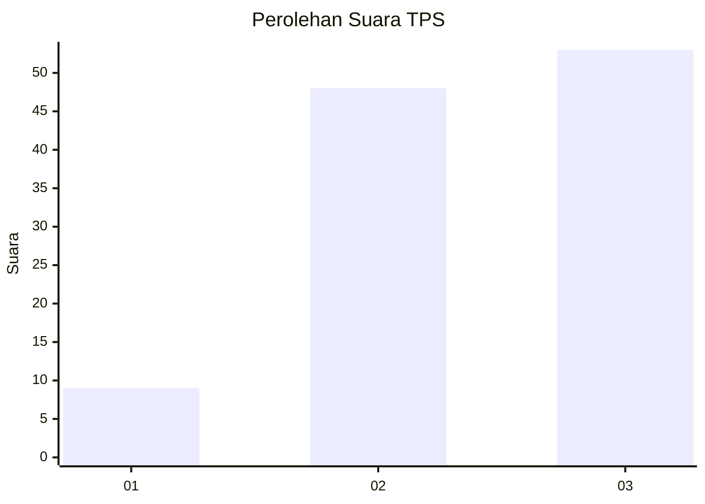
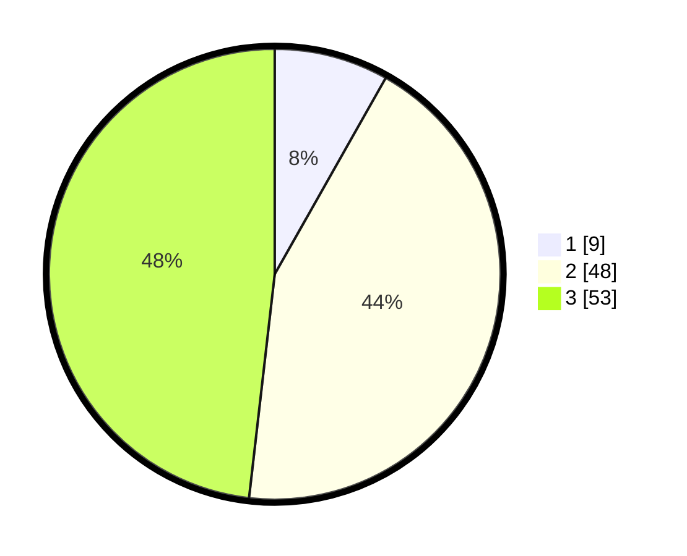

# Hasil

## Grafik

## Tabel

| No. | Nama Paslon    | Suara | Suara (raw) | Persentase |
|:--- |:-------------- | -----:| -----------:| ----------:|
| 1   | ANIES MUHAIMIN | 9     | [9][p-1]    | 8,18       |
| 2   | PRABOWO GIBRAN | 48    | [48][p-2]   | 43,64      |
| 3   | GANJAR MAHFUD  | 53    | [53][p-3]   | 48,18      |

[p-1]: https://github.com/gigit-pemilu/pemilu-2024/blob/main/pilpres/hitung-suara/sub/33-jawa-tengah/sub/09-boyolali/sub/06-mojosongo/sub/1009-mojosongo/sub/901-tps/sub/paslon-1.txt
[p-2]: https://github.com/gigit-pemilu/pemilu-2024/blob/main/pilpres/hitung-suara/sub/33-jawa-tengah/sub/09-boyolali/sub/06-mojosongo/sub/1009-mojosongo/sub/901-tps/sub/paslon-2.txt
[p-3]: https://github.com/gigit-pemilu/pemilu-2024/blob/main/pilpres/hitung-suara/sub/33-jawa-tengah/sub/09-boyolali/sub/06-mojosongo/sub/1009-mojosongo/sub/901-tps/sub/paslon-3.txt

## Foto C Plano

https://sirekap-obj-formc.kpu.go.id/ae22/pemilu/ppwp/33/09/06/10/09/3309061009901-20240216-221616--45908cf3-aed4-4898-98fd-98bacb54783a.jpg

https://sirekap-obj-formc.kpu.go.id/ae22/pemilu/ppwp/33/09/06/10/09/3309061009901-20240216-221618--c350de59-062e-4930-af79-746f5a16d2c9.jpg

https://sirekap-obj-formc.kpu.go.id/ae22/pemilu/ppwp/33/09/06/10/09/3309061009901-20240216-221617--c12c3700-1e8e-4d72-951e-4b7eedc6455c.jpg

## Metadata

| Key        | Value               |
| ---------- | ------------------- |
| Time Stamp | 2024-02-17 09:30:03 |

## DATA PEMILIH TETAP

Jumlah pemilih dalam DPT: **117**.
 * L: **113**.
 * P: **4**.

## DATA PENGGUNA HAK PILIH

Jumlah pengguna hak pilih dalam DPT: **80**.
 * L: **77**.
 * P: **3**.

Jumlah pengguna hak pilih dalam DPTb: **33**.
 * L: **31**.
 * P: **2**.

Jumlah pengguna hak pilih dalam DPK: **0**.
 * L: **0**.
 * P: **0**.

Jumlah pengguna hak pilih: **113**.
 * L: **108**.
 * P: **5**.

## JUMLAH SUARA SAH DAN TIDAK SAH

JUMLAH SELURUH SUARA SAH: **110**.

JUMLAH SUARA TIDAK SAH: **3**.

JUMLAH SELURUH SUARA SAH DAN SUARA TIDAK SAH: **113**.

