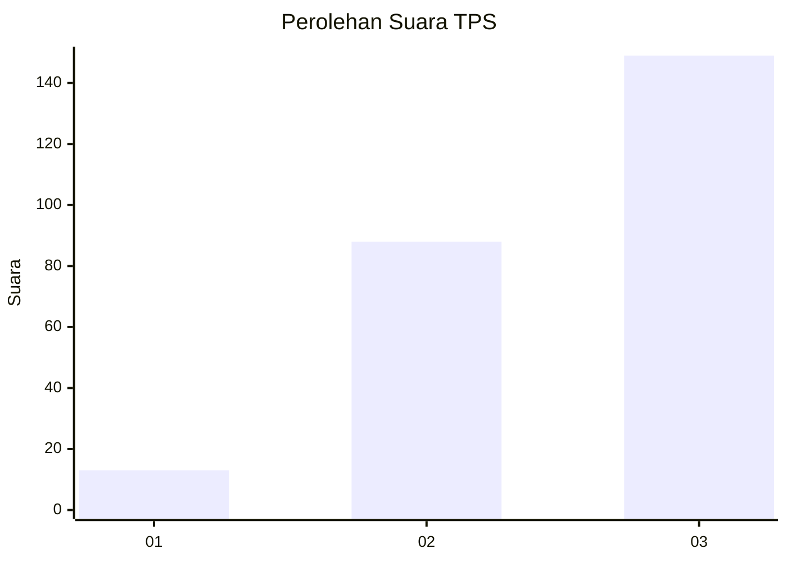
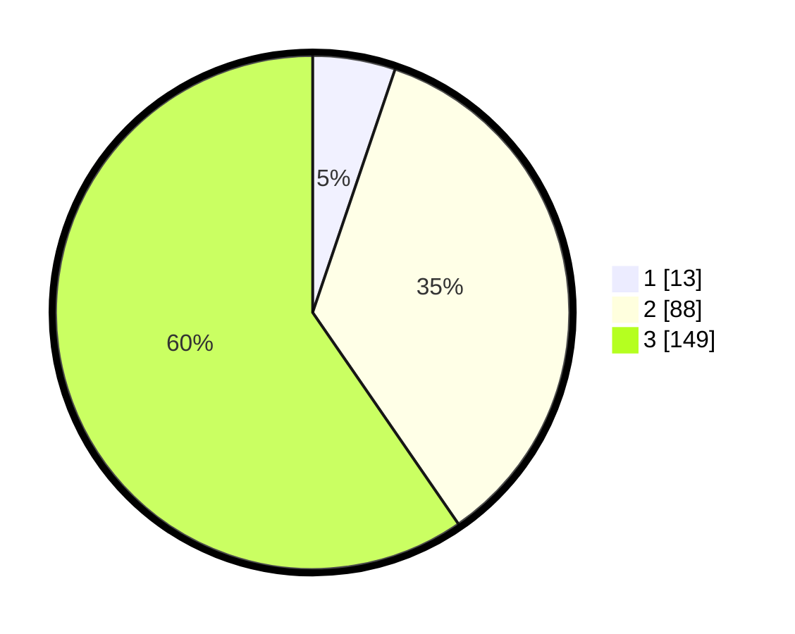

# Hasil

## Grafik

## Tabel

| No. | Nama Paslon    | Suara | Suara (raw) | Persentase |
|:--- |:-------------- | -----:| -----------:| ----------:|
| 1   | ANIES MUHAIMIN | 13    | [13][p-1]   | 5,20       |
| 2   | PRABOWO GIBRAN | 88    | [88][p-2]   | 35,20      |
| 3   | GANJAR MAHFUD  | 149   | [149][p-3]  | 59,60      |

[p-1]: https://github.com/gigit-pemilu/pemilu-2024-33-jawa-tengah/blob/main/pilpres/hitung-suara/sub/33-jawa-tengah/sub/09-boyolali/sub/06-mojosongo/sub/2002-singosari/sub/004-tps/sub/paslon-1.txt
[p-2]: https://github.com/gigit-pemilu/pemilu-2024-33-jawa-tengah/blob/main/pilpres/hitung-suara/sub/33-jawa-tengah/sub/09-boyolali/sub/06-mojosongo/sub/2002-singosari/sub/004-tps/sub/paslon-2.txt
[p-3]: https://github.com/gigit-pemilu/pemilu-2024-33-jawa-tengah/blob/main/pilpres/hitung-suara/sub/33-jawa-tengah/sub/09-boyolali/sub/06-mojosongo/sub/2002-singosari/sub/004-tps/sub/paslon-3.txt

## Foto C Plano

https://sirekap-obj-formc.kpu.go.id/4e97/pemilu/ppwp/33/09/06/20/02/3309062002004-20240220-135910--c8be77d0-5a36-4a82-ab8e-85297ed03f9b.jpg

https://sirekap-obj-formc.kpu.go.id/4e97/pemilu/ppwp/33/09/06/20/02/3309062002004-20240220-140553--072edab2-d16f-4049-8219-cf2ac8a0c64d.jpg

https://sirekap-obj-formc.kpu.go.id/4e97/pemilu/ppwp/33/09/06/20/02/3309062002004-20240220-141123--19fc167d-0241-47bc-a040-cf2830dfab50.jpg

## Metadata

| Key        | Value               |
| ---------- | ------------------- |
| Time Stamp | 2024-02-25 15:00:00 |

