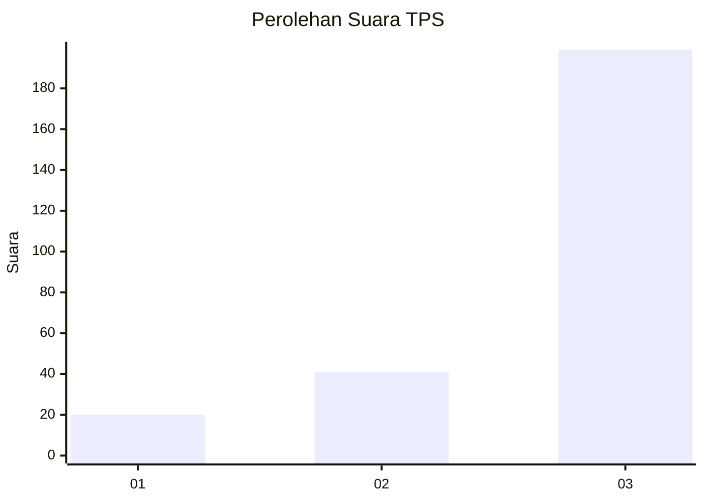
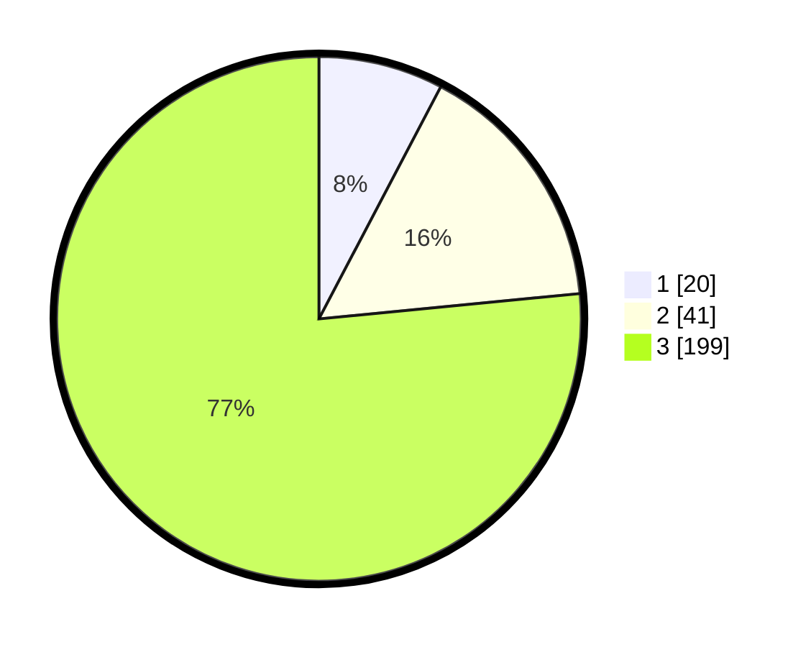

# Hasil

## Grafik

## Tabel

| No. | Nama Paslon    | Suara | Suara (raw) | Persentase |
|:--- |:-------------- | -----:| -----------:| ----------:|
| 1   | ANIES MUHAIMIN | 20    | [20][p-1]   | 7,69       |
| 2   | PRABOWO GIBRAN | 41    | [41][p-2]   | 15,77      |
| 3   | GANJAR MAHFUD  | 199   | [199][p-3]  | 76,54      |

[p-1]: https://github.com/gigit-pemilu/pemilu-2024-33-jawa-tengah/blob/main/pilpres/hitung-suara/sub/33-jawa-tengah/sub/09-boyolali/sub/06-mojosongo/sub/2002-singosari/sub/010-tps/sub/paslon-1.txt
[p-2]: https://github.com/gigit-pemilu/pemilu-2024-33-jawa-tengah/blob/main/pilpres/hitung-suara/sub/33-jawa-tengah/sub/09-boyolali/sub/06-mojosongo/sub/2002-singosari/sub/010-tps/sub/paslon-2.txt
[p-3]: https://github.com/gigit-pemilu/pemilu-2024-33-jawa-tengah/blob/main/pilpres/hitung-suara/sub/33-jawa-tengah/sub/09-boyolali/sub/06-mojosongo/sub/2002-singosari/sub/010-tps/sub/paslon-3.txt

## Foto C Plano

https://sirekap-obj-formc.kpu.go.id/54db/pemilu/ppwp/33/09/06/20/02/3309062002010-20240215-211933--74357453-029c-4c7b-9069-d82230789486.jpg

https://sirekap-obj-formc.kpu.go.id/54db/pemilu/ppwp/33/09/06/20/02/3309062002010-20240215-225350--263dccab-f0a4-4e4b-bb61-464dcf6f0fee.jpg

https://sirekap-obj-formc.kpu.go.id/54db/pemilu/ppwp/33/09/06/20/02/3309062002010-20240215-212429--3d2cf09b-1526-40ab-8a90-eddce8d40a18.jpg

## Metadata

| Key        | Value               |
| ---------- | ------------------- |
| Time Stamp | 2024-02-16 01:00:27 |

