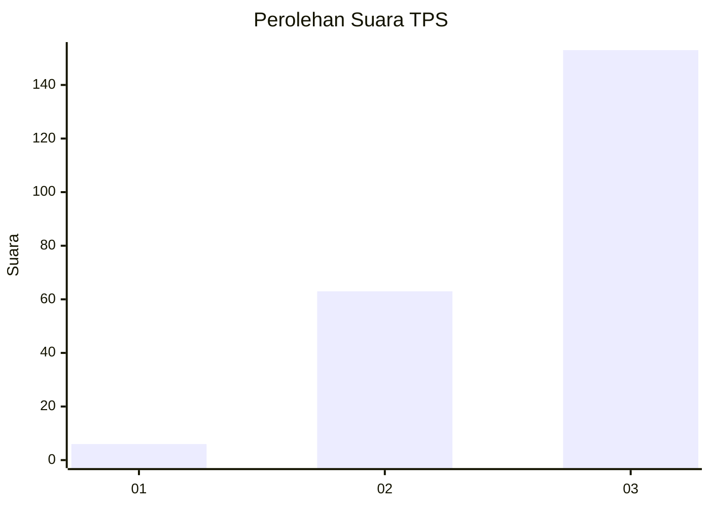
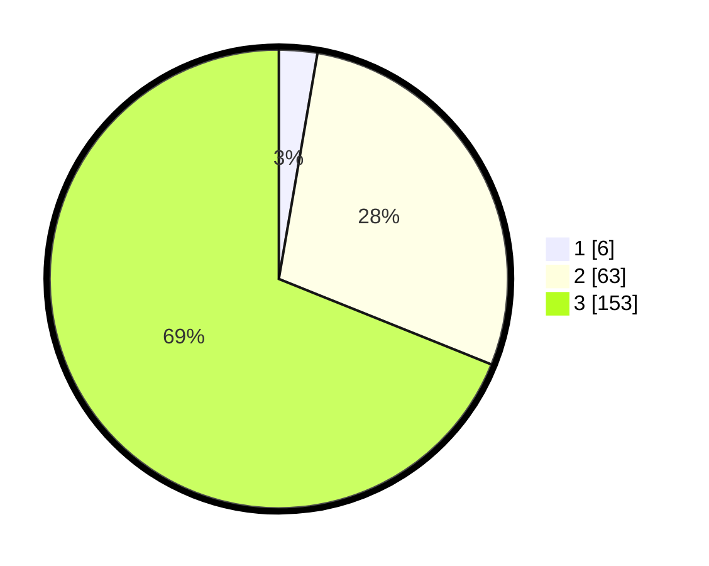

# Hasil

## Grafik

## Tabel

| No. | Nama Paslon    | Suara | Suara (raw) | Persentase |
|:--- |:-------------- | -----:| -----------:| ----------:|
| 1   | ANIES MUHAIMIN | 6     | [6][p-1]    | 2,70       |
| 2   | PRABOWO GIBRAN | 63    | [63][p-2]   | 28,38      |
| 3   | GANJAR MAHFUD  | 153   | [153][p-3]  | 68,92      |

[p-1]: https://github.com/gigit-pemilu/pemilu-2024/blob/main/pilpres/hitung-suara/sub/33-jawa-tengah/sub/09-boyolali/sub/06-mojosongo/sub/2004-manggis/sub/003-tps/sub/paslon-1.txt
[p-2]: https://github.com/gigit-pemilu/pemilu-2024/blob/main/pilpres/hitung-suara/sub/33-jawa-tengah/sub/09-boyolali/sub/06-mojosongo/sub/2004-manggis/sub/003-tps/sub/paslon-2.txt
[p-3]: https://github.com/gigit-pemilu/pemilu-2024/blob/main/pilpres/hitung-suara/sub/33-jawa-tengah/sub/09-boyolali/sub/06-mojosongo/sub/2004-manggis/sub/003-tps/sub/paslon-3.txt

## Foto C Plano

https://sirekap-obj-formc.kpu.go.id/bbcd/pemilu/ppwp/33/09/06/20/04/3309062004003-20240215-212332--4f52e57d-c487-48b9-8a56-8ad75bce3dba.jpg

https://sirekap-obj-formc.kpu.go.id/bbcd/pemilu/ppwp/33/09/06/20/04/3309062004003-20240215-212336--fe70cd0a-aa4f-4f36-92ca-e245c53da7d0.jpg

https://sirekap-obj-formc.kpu.go.id/bbcd/pemilu/ppwp/33/09/06/20/04/3309062004003-20240215-212349--3fd5b960-3ca3-4e89-a6ef-aef5a6bc2f10.jpg

## Metadata

| Key        | Value               |
| ---------- | ------------------- |
| Time Stamp | 2024-02-25 14:00:00 |

