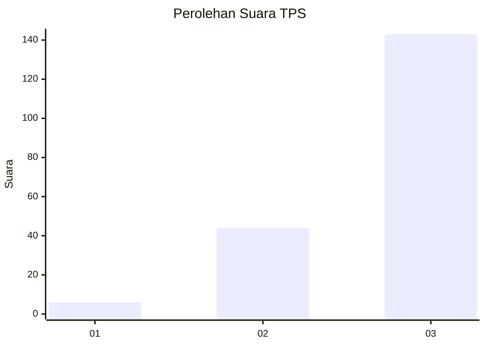
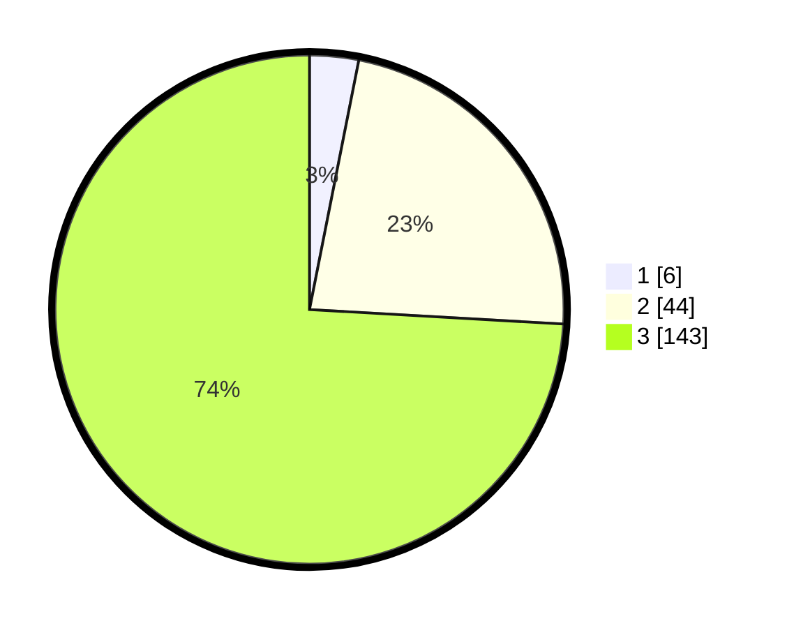

# Hasil

## Grafik

## Tabel

| No. | Nama Paslon    | Suara | Suara (raw) | Persentase |
|:--- |:-------------- | -----:| -----------:| ----------:|
| 1   | ANIES MUHAIMIN | 6     | [6][p-1]    | 3,11       |
| 2   | PRABOWO GIBRAN | 44    | [44][p-2]   | 22,80      |
| 3   | GANJAR MAHFUD  | 143   | [143][p-3]  | 74,09      |

[p-1]: https://github.com/gigit-pemilu/pemilu-2024-33-jawa-tengah/blob/main/pilpres/hitung-suara/sub/33-jawa-tengah/sub/09-boyolali/sub/06-mojosongo/sub/2004-manggis/sub/022-tps/sub/paslon-1.txt
[p-2]: https://github.com/gigit-pemilu/pemilu-2024-33-jawa-tengah/blob/main/pilpres/hitung-suara/sub/33-jawa-tengah/sub/09-boyolali/sub/06-mojosongo/sub/2004-manggis/sub/022-tps/sub/paslon-2.txt
[p-3]: https://github.com/gigit-pemilu/pemilu-2024-33-jawa-tengah/blob/main/pilpres/hitung-suara/sub/33-jawa-tengah/sub/09-boyolali/sub/06-mojosongo/sub/2004-manggis/sub/022-tps/sub/paslon-3.txt

## Foto C Plano

https://sirekap-obj-formc.kpu.go.id/42aa/pemilu/ppwp/33/09/06/20/04/3309062004022-20240215-220841--d9e817c6-18c5-4ed9-b9bd-7fe48b4b61a8.jpg

https://sirekap-obj-formc.kpu.go.id/42aa/pemilu/ppwp/33/09/06/20/04/3309062004022-20240215-222835--1997fd6e-fbaa-46e9-9c58-1fc0ae9f4010.jpg

https://sirekap-obj-formc.kpu.go.id/42aa/pemilu/ppwp/33/09/06/20/04/3309062004022-20240215-221818--fa14c924-ecac-413d-8d28-3691d8cb68de.jpg

## Metadata

| Key        | Value               |
| ---------- | ------------------- |
| Time Stamp | 2024-02-16 21:01:00 |

