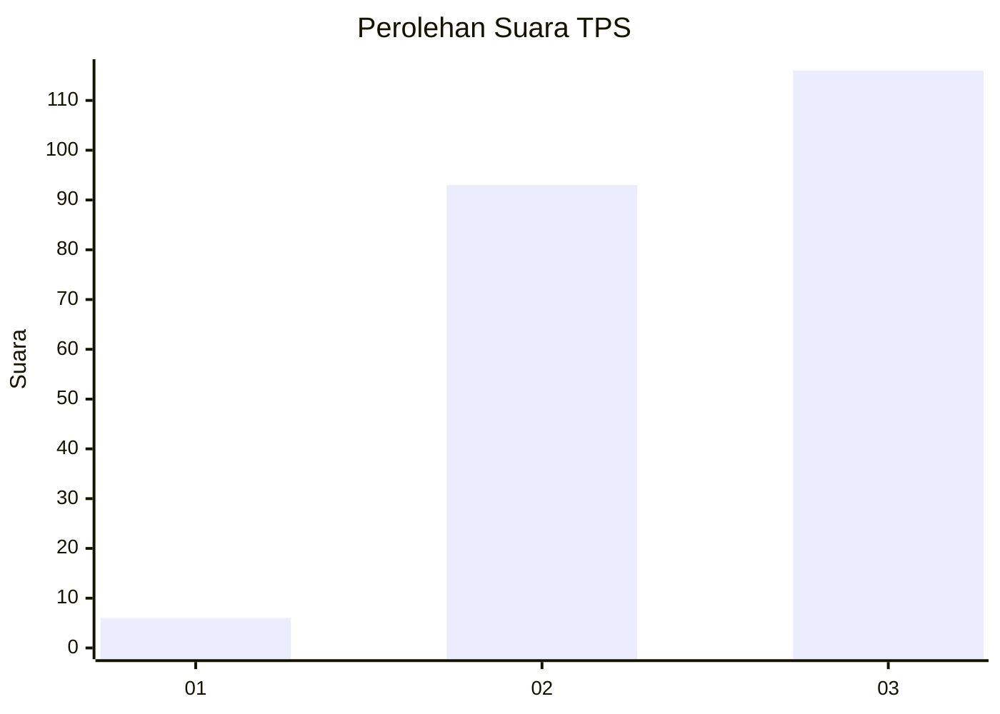
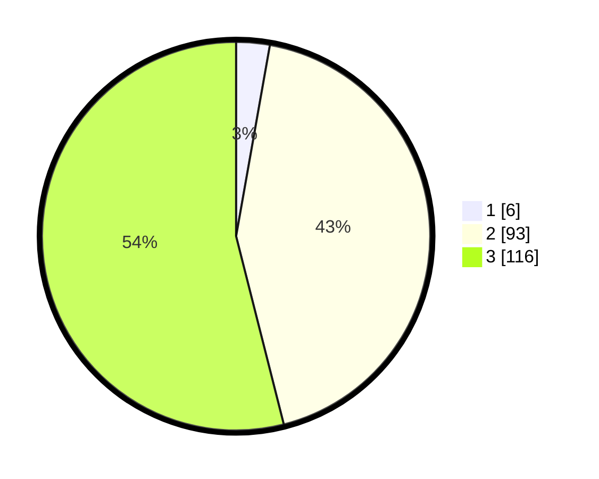

# Hasil

## Grafik

## Tabel

| No. | Nama Paslon    | Suara | Suara (raw) | Persentase |
|:--- |:-------------- | -----:| -----------:| ----------:|
| 1   | ANIES MUHAIMIN | 6     | [6][p-1]    | 2,79       |
| 2   | PRABOWO GIBRAN | 93    | [93][p-2]   | 43,26      |
| 3   | GANJAR MAHFUD  | 116   | [116][p-3]  | 53,95      |

[p-1]: https://github.com/gigit-pemilu/pemilu-2024/blob/main/pilpres/hitung-suara/sub/33-jawa-tengah/sub/09-boyolali/sub/06-mojosongo/sub/2005-jurug/sub/002-tps/sub/paslon-1.txt
[p-2]: https://github.com/gigit-pemilu/pemilu-2024/blob/main/pilpres/hitung-suara/sub/33-jawa-tengah/sub/09-boyolali/sub/06-mojosongo/sub/2005-jurug/sub/002-tps/sub/paslon-2.txt
[p-3]: https://github.com/gigit-pemilu/pemilu-2024/blob/main/pilpres/hitung-suara/sub/33-jawa-tengah/sub/09-boyolali/sub/06-mojosongo/sub/2005-jurug/sub/002-tps/sub/paslon-3.txt

## Foto C Plano

https://sirekap-obj-formc.kpu.go.id/9019/pemilu/ppwp/33/09/06/20/05/3309062005002-20240216-211501--e259bf57-519b-474b-a449-95d9433ec537.jpg

https://sirekap-obj-formc.kpu.go.id/9019/pemilu/ppwp/33/09/06/20/05/3309062005002-20240216-211634--ae68aea7-0f7f-41de-8898-0b9004793a79.jpg

https://sirekap-obj-formc.kpu.go.id/9019/pemilu/ppwp/33/09/06/20/05/3309062005002-20240216-211745--8eb99169-743b-4b20-b282-b2d07ea78e34.jpg

## Metadata

| Key        | Value               |
| ---------- | ------------------- |
| Time Stamp | 2024-02-24 22:31:28 |

