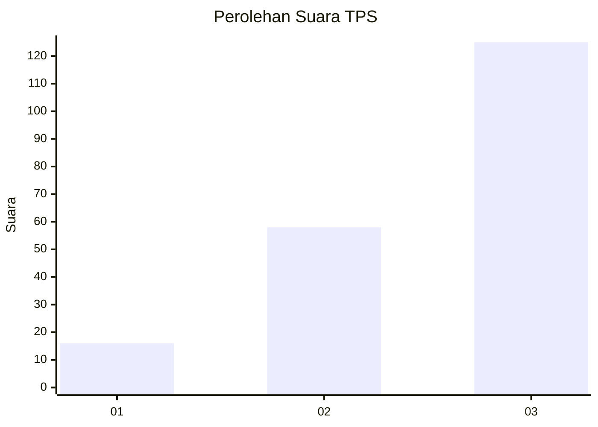
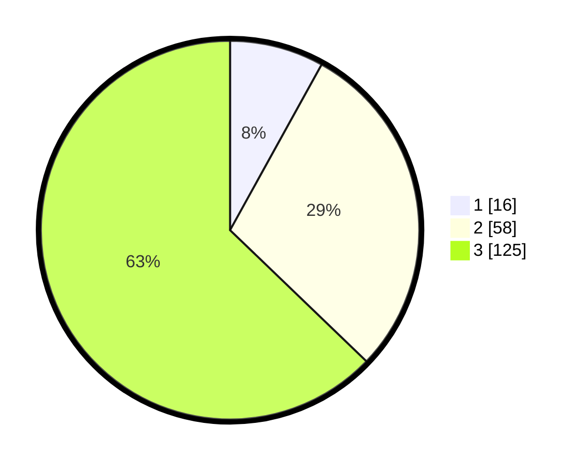

# Hasil

## Grafik

## Tabel

| No. | Nama Paslon    | Suara | Suara (raw) | Persentase |
|:--- |:-------------- | -----:| -----------:| ----------:|
| 1   | ANIES MUHAIMIN | 16    | [16][p-1]   | 8,04       |
| 2   | PRABOWO GIBRAN | 58    | [58][p-2]   | 29,15      |
| 3   | GANJAR MAHFUD  | 125   | [125][p-3]  | 62,81      |

[p-1]: https://github.com/gigit-pemilu/pemilu-2024/blob/main/pilpres/hitung-suara/sub/33-jawa-tengah/sub/09-boyolali/sub/06-mojosongo/sub/2005-jurug/sub/005-tps/sub/paslon-1.txt
[p-2]: https://github.com/gigit-pemilu/pemilu-2024/blob/main/pilpres/hitung-suara/sub/33-jawa-tengah/sub/09-boyolali/sub/06-mojosongo/sub/2005-jurug/sub/005-tps/sub/paslon-2.txt
[p-3]: https://github.com/gigit-pemilu/pemilu-2024/blob/main/pilpres/hitung-suara/sub/33-jawa-tengah/sub/09-boyolali/sub/06-mojosongo/sub/2005-jurug/sub/005-tps/sub/paslon-3.txt

## Foto C Plano

https://sirekap-obj-formc.kpu.go.id/a5ed/pemilu/ppwp/33/09/06/20/05/3309062005005-20240214-155132--ea04e84b-3729-463f-91de-3f4e8adaf50b.jpg

https://sirekap-obj-formc.kpu.go.id/a5ed/pemilu/ppwp/33/09/06/20/05/3309062005005-20240214-155230--efd72eed-252d-47f7-af79-cf67afe7c855.jpg

https://sirekap-obj-formc.kpu.go.id/a5ed/pemilu/ppwp/33/09/06/20/05/3309062005005-20240214-155400--ba1e1d9f-39d1-49c0-9d3e-6a02da57c8d1.jpg

## Metadata

| Key        | Value               |
| ---------- | ------------------- |
| Time Stamp | 2024-02-15 21:30:27 |

