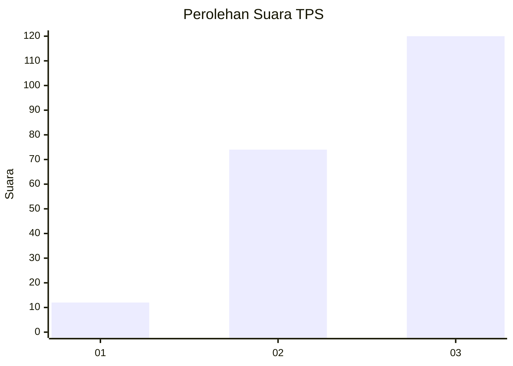
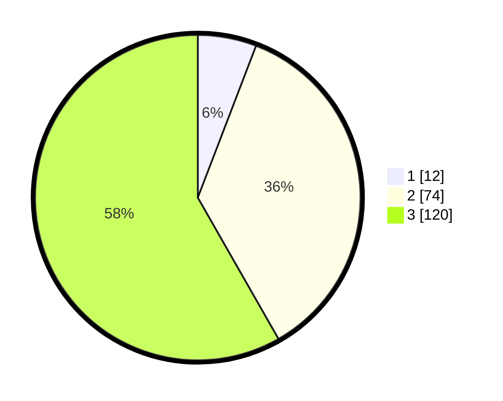

# Hasil

## Grafik

## Tabel

| No. | Nama Paslon    | Suara | Suara (raw) | Persentase |
|:--- |:-------------- | -----:| -----------:| ----------:|
| 1   | ANIES MUHAIMIN | 12    | [12][p-1]   | 5,83       |
| 2   | PRABOWO GIBRAN | 74    | [74][p-2]   | 35,92      |
| 3   | GANJAR MAHFUD  | 120   | [120][p-3]  | 58,25      |

[p-1]: https://github.com/gigit-pemilu/pemilu-2024-33-jawa-tengah/blob/main/pilpres/hitung-suara/sub/33-jawa-tengah/sub/09-boyolali/sub/06-mojosongo/sub/2008-butuh/sub/001-tps/sub/paslon-1.txt
[p-2]: https://github.com/gigit-pemilu/pemilu-2024-33-jawa-tengah/blob/main/pilpres/hitung-suara/sub/33-jawa-tengah/sub/09-boyolali/sub/06-mojosongo/sub/2008-butuh/sub/001-tps/sub/paslon-2.txt
[p-3]: https://github.com/gigit-pemilu/pemilu-2024-33-jawa-tengah/blob/main/pilpres/hitung-suara/sub/33-jawa-tengah/sub/09-boyolali/sub/06-mojosongo/sub/2008-butuh/sub/001-tps/sub/paslon-3.txt

## Foto C Plano

https://sirekap-obj-formc.kpu.go.id/4fdb/pemilu/ppwp/33/09/06/20/08/3309062008001-20240215-174204--43f68982-bc8b-4c3a-ac7d-5e576e4bd18a.jpg

https://sirekap-obj-formc.kpu.go.id/4fdb/pemilu/ppwp/33/09/06/20/08/3309062008001-20240215-170625--a11ee8ff-017c-4e4d-b4b5-067848c8b1b3.jpg

https://sirekap-obj-formc.kpu.go.id/4fdb/pemilu/ppwp/33/09/06/20/08/3309062008001-20240215-170723--b1c6c952-2dee-4ada-b038-8d5ea645c6e9.jpg

## Metadata

| Key        | Value               |
| ---------- | ------------------- |
| Time Stamp | 2024-02-15 22:00:27 |

