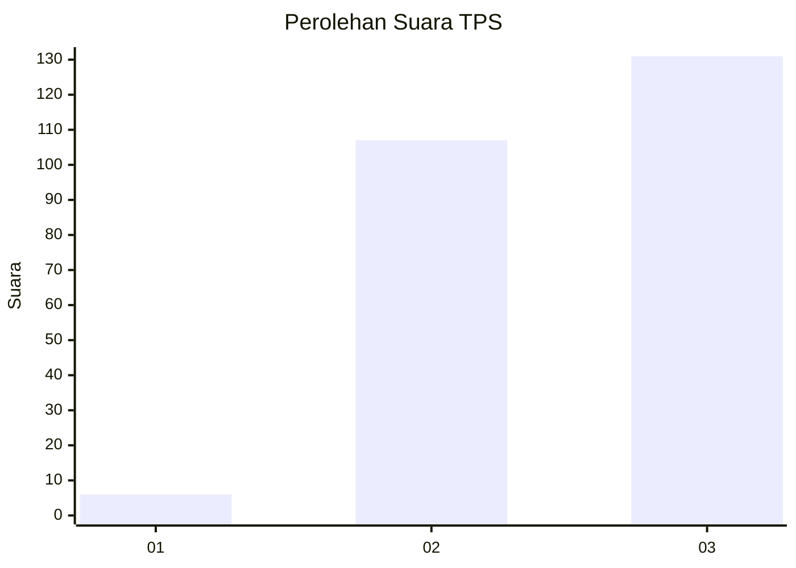
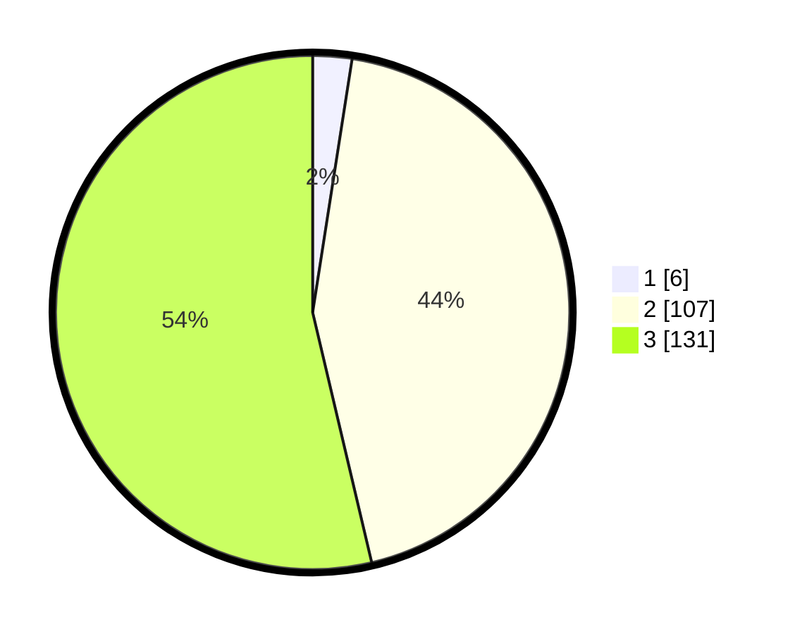

# Hasil

## Grafik

## Tabel

| No. | Nama Paslon    | Suara | Suara (raw) | Persentase |
|:--- |:-------------- | -----:| -----------:| ----------:|
| 1   | ANIES MUHAIMIN | 6     | [6][p-1]    | 2,46       |
| 2   | PRABOWO GIBRAN | 107   | [107][p-2]  | 43,85      |
| 3   | GANJAR MAHFUD  | 131   | [131][p-3]  | 53,69      |

[p-1]: https://github.com/gigit-pemilu/pemilu-2024/blob/main/pilpres/hitung-suara/sub/33-jawa-tengah/sub/09-boyolali/sub/06-mojosongo/sub/2008-butuh/sub/003-tps/sub/paslon-1.txt
[p-2]: https://github.com/gigit-pemilu/pemilu-2024/blob/main/pilpres/hitung-suara/sub/33-jawa-tengah/sub/09-boyolali/sub/06-mojosongo/sub/2008-butuh/sub/003-tps/sub/paslon-2.txt
[p-3]: https://github.com/gigit-pemilu/pemilu-2024/blob/main/pilpres/hitung-suara/sub/33-jawa-tengah/sub/09-boyolali/sub/06-mojosongo/sub/2008-butuh/sub/003-tps/sub/paslon-3.txt

## Foto C Plano

https://sirekap-obj-formc.kpu.go.id/4b6e/pemilu/ppwp/33/09/06/20/08/3309062008003-20240215-195330--a3165a6c-8334-401a-af29-a46543aa2011.jpg

https://sirekap-obj-formc.kpu.go.id/4b6e/pemilu/ppwp/33/09/06/20/08/3309062008003-20240215-195502--26423889-d234-4bed-a7ce-3f33f68fd53a.jpg

https://sirekap-obj-formc.kpu.go.id/4b6e/pemilu/ppwp/33/09/06/20/08/3309062008003-20240215-151503--3a5ff883-344d-4d69-bfb6-6a44bedb483f.jpg

## Metadata

| Key        | Value               |
| ---------- | ------------------- |
| Time Stamp | 2024-02-15 23:29:50 |

