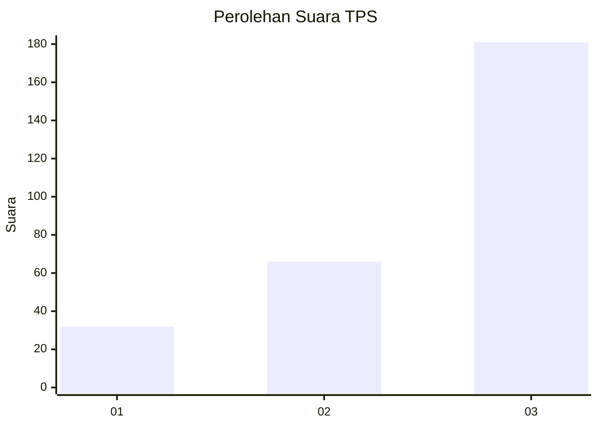
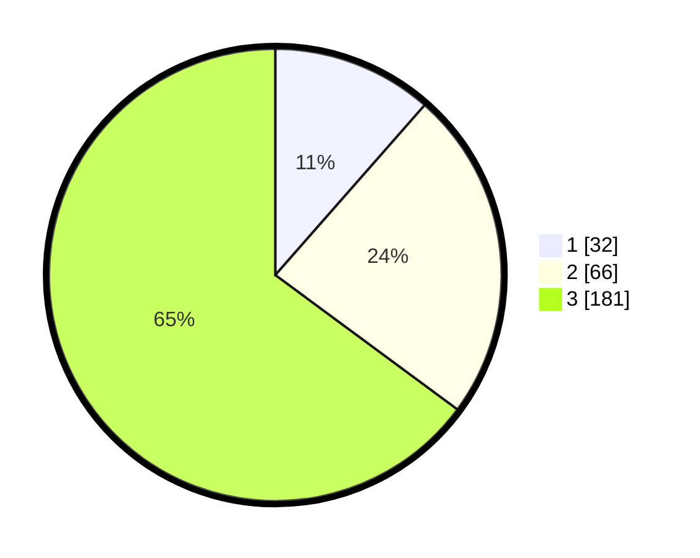

# Hasil

## Grafik

## Tabel

| No. | Nama Paslon    | Suara | Suara (raw) | Persentase |
|:--- |:-------------- | -----:| -----------:| ----------:|
| 1   | ANIES MUHAIMIN | 32    | [32][p-1]   | 11,47      |
| 2   | PRABOWO GIBRAN | 66    | [66][p-2]   | 23,66      |
| 3   | GANJAR MAHFUD  | 181   | [181][p-3]  | 64,87      |

[p-1]: https://github.com/gigit-pemilu/pemilu-2024-33-jawa-tengah/blob/main/pilpres/hitung-suara/sub/33-jawa-tengah/sub/09-boyolali/sub/06-mojosongo/sub/2008-butuh/sub/006-tps/sub/paslon-1.txt
[p-2]: https://github.com/gigit-pemilu/pemilu-2024-33-jawa-tengah/blob/main/pilpres/hitung-suara/sub/33-jawa-tengah/sub/09-boyolali/sub/06-mojosongo/sub/2008-butuh/sub/006-tps/sub/paslon-2.txt
[p-3]: https://github.com/gigit-pemilu/pemilu-2024-33-jawa-tengah/blob/main/pilpres/hitung-suara/sub/33-jawa-tengah/sub/09-boyolali/sub/06-mojosongo/sub/2008-butuh/sub/006-tps/sub/paslon-3.txt

## Foto C Plano

https://sirekap-obj-formc.kpu.go.id/5ebd/pemilu/ppwp/33/09/06/20/08/3309062008006-20240214-194032--47f362ab-ea38-42ac-b40d-9f625ce956bd.jpg

https://sirekap-obj-formc.kpu.go.id/5ebd/pemilu/ppwp/33/09/06/20/08/3309062008006-20240214-194050--1d7da49d-7260-49cd-950f-66d287645df7.jpg

https://sirekap-obj-formc.kpu.go.id/5ebd/pemilu/ppwp/33/09/06/20/08/3309062008006-20240214-194024--c72fb8c8-6c96-4a19-af80-f2548ce97471.jpg

## Metadata

| Key        | Value               |
| ---------- | ------------------- |
| Time Stamp | 2024-02-19 06:16:00 |

