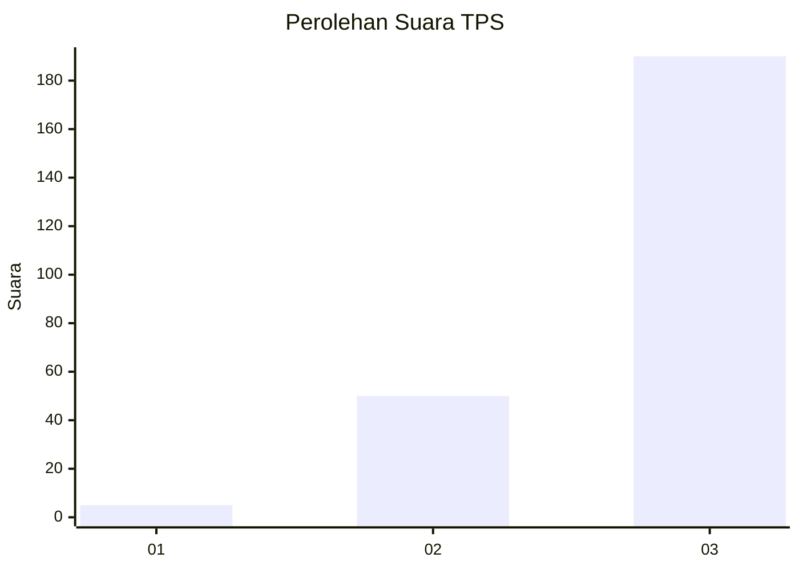
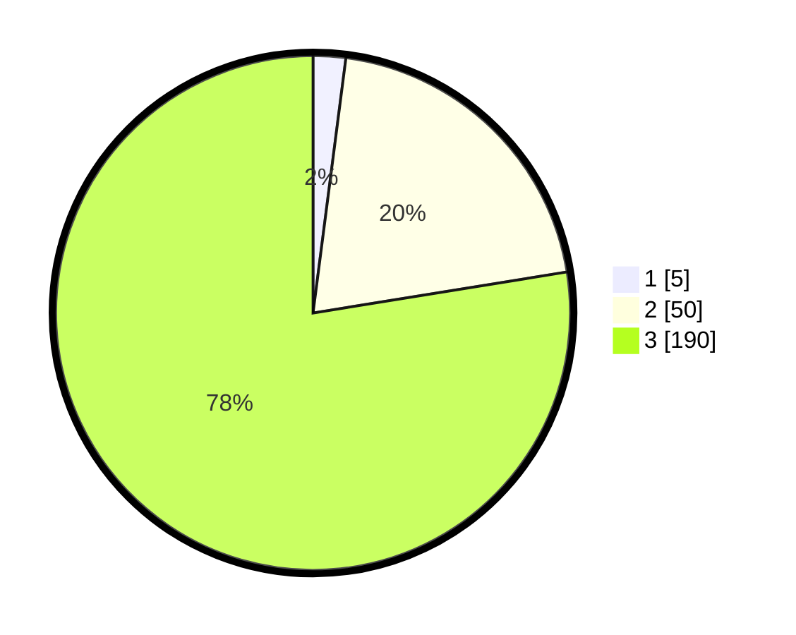

# Hasil

## Grafik

## Tabel

| No. | Nama Paslon    | Suara | Suara (raw) | Persentase |
|:--- |:-------------- | -----:| -----------:| ----------:|
| 1   | ANIES MUHAIMIN | 5     | [5][p-1]    | 2,04       |
| 2   | PRABOWO GIBRAN | 50    | [50][p-2]   | 20,41      |
| 3   | GANJAR MAHFUD  | 190   | [190][p-3]  | 77,55      |

[p-1]: https://github.com/gigit-pemilu/pemilu-2024/blob/main/pilpres/hitung-suara/sub/33-jawa-tengah/sub/09-boyolali/sub/06-mojosongo/sub/2011-brajan/sub/001-tps/sub/paslon-1.txt
[p-2]: https://github.com/gigit-pemilu/pemilu-2024/blob/main/pilpres/hitung-suara/sub/33-jawa-tengah/sub/09-boyolali/sub/06-mojosongo/sub/2011-brajan/sub/001-tps/sub/paslon-2.txt
[p-3]: https://github.com/gigit-pemilu/pemilu-2024/blob/main/pilpres/hitung-suara/sub/33-jawa-tengah/sub/09-boyolali/sub/06-mojosongo/sub/2011-brajan/sub/001-tps/sub/paslon-3.txt

## Foto C Plano

https://sirekap-obj-formc.kpu.go.id/66f7/pemilu/ppwp/33/09/06/20/11/3309062011001-20240214-190640--ae4f896a-1809-4308-992a-9479efa35bba.jpg

https://sirekap-obj-formc.kpu.go.id/66f7/pemilu/ppwp/33/09/06/20/11/3309062011001-20240214-211119--635ad526-524f-4356-b3d1-50281bae014f.jpg

https://sirekap-obj-formc.kpu.go.id/66f7/pemilu/ppwp/33/09/06/20/11/3309062011001-20240214-211415--29830ea6-0b00-4879-9943-fecedc8e32b1.jpg

## Metadata

| Key        | Value               |
| ---------- | ------------------- |
| Time Stamp | 2024-02-15 22:00:27 |

