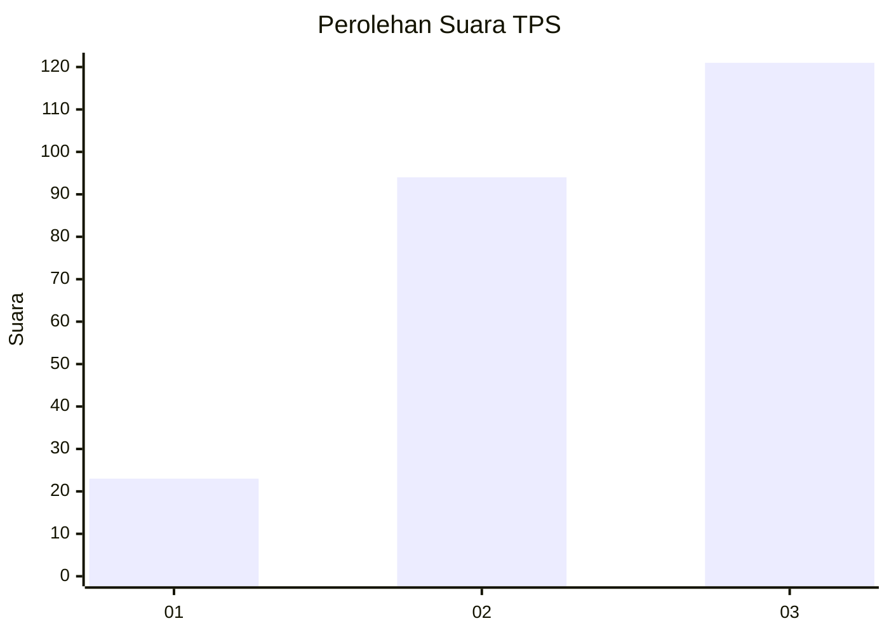
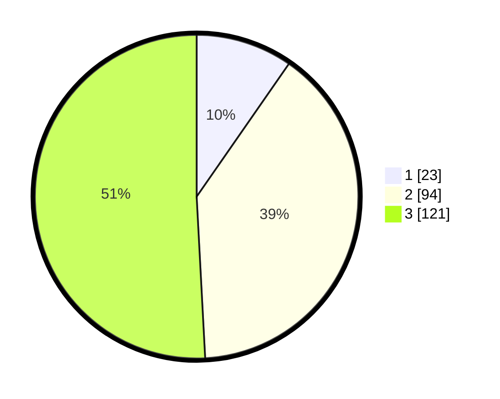

# Hasil

## Grafik

## Tabel

| No. | Nama Paslon    | Suara | Suara (raw) | Persentase |
|:--- |:-------------- | -----:| -----------:| ----------:|
| 1   | ANIES MUHAIMIN | 23    | [23][p-1]   | 9,66       |
| 2   | PRABOWO GIBRAN | 94    | [94][p-2]   | 39,50      |
| 3   | GANJAR MAHFUD  | 121   | [121][p-3]  | 50,84      |

[p-1]: https://github.com/gigit-pemilu/pemilu-2024/blob/main/pilpres/hitung-suara/sub/33-jawa-tengah/sub/09-boyolali/sub/06-mojosongo/sub/2011-brajan/sub/002-tps/sub/paslon-1.txt
[p-2]: https://github.com/gigit-pemilu/pemilu-2024/blob/main/pilpres/hitung-suara/sub/33-jawa-tengah/sub/09-boyolali/sub/06-mojosongo/sub/2011-brajan/sub/002-tps/sub/paslon-2.txt
[p-3]: https://github.com/gigit-pemilu/pemilu-2024/blob/main/pilpres/hitung-suara/sub/33-jawa-tengah/sub/09-boyolali/sub/06-mojosongo/sub/2011-brajan/sub/002-tps/sub/paslon-3.txt

## Foto C Plano

https://sirekap-obj-formc.kpu.go.id/326a/pemilu/ppwp/33/09/06/20/11/3309062011002-20240218-210712--9fbb52ba-4be3-45df-9643-9f9f4dbdb142.jpg

https://sirekap-obj-formc.kpu.go.id/326a/pemilu/ppwp/33/09/06/20/11/3309062011002-20240218-210817--a09c9ebc-78d8-499e-8b2b-97c17c7b6b5d.jpg

https://sirekap-obj-formc.kpu.go.id/326a/pemilu/ppwp/33/09/06/20/11/3309062011002-20240218-210934--76a86e44-be7e-433a-9b69-0b8ff5f4f48b.jpg

## Metadata

| Key        | Value               |
| ---------- | ------------------- |
| Time Stamp | 2024-02-25 15:00:00 |

