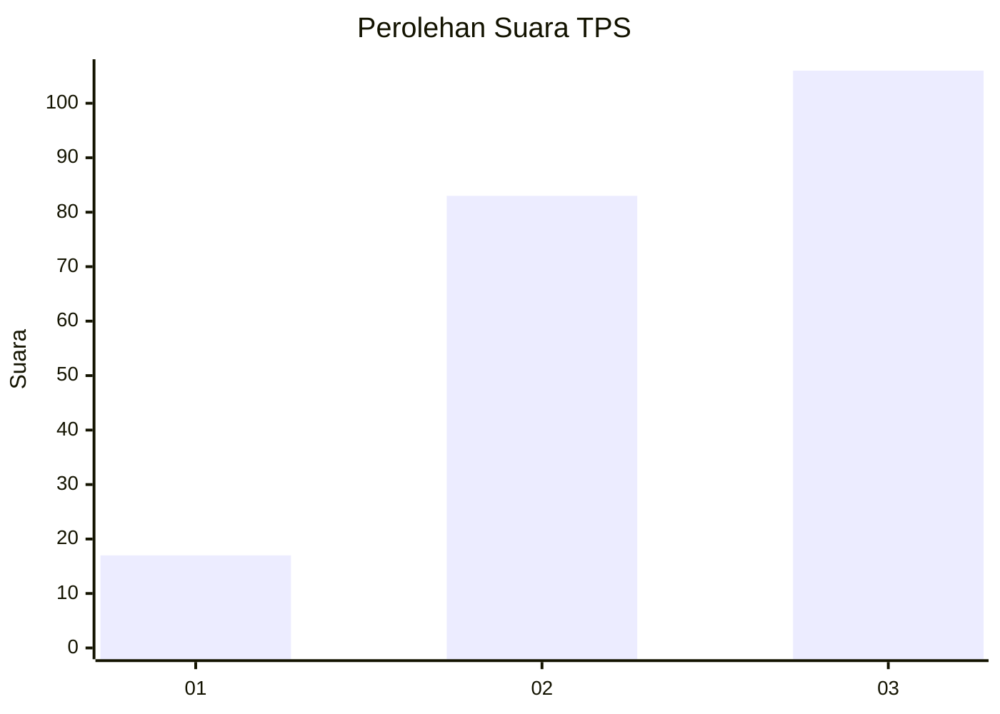
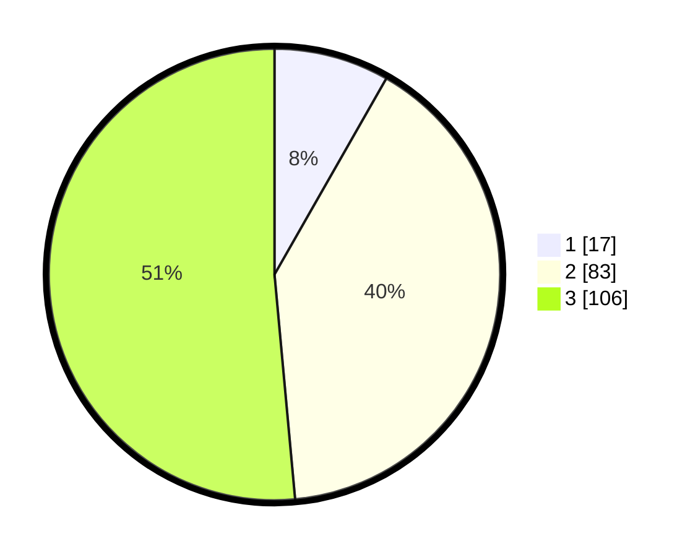

# Hasil

## Grafik

## Tabel

| No. | Nama Paslon    | Suara | Suara (raw) | Persentase |
|:--- |:-------------- | -----:| -----------:| ----------:|
| 1   | ANIES MUHAIMIN | 17    | [17][p-1]   | 8,25       |
| 2   | PRABOWO GIBRAN | 83    | [83][p-2]   | 40,29      |
| 3   | GANJAR MAHFUD  | 106   | [106][p-3]  | 51,46      |

[p-1]: https://github.com/gigit-pemilu/pemilu-2024-33-jawa-tengah/blob/main/pilpres/hitung-suara/sub/33-jawa-tengah/sub/09-boyolali/sub/06-mojosongo/sub/2013-dlingo/sub/001-tps/sub/paslon-1.txt
[p-2]: https://github.com/gigit-pemilu/pemilu-2024-33-jawa-tengah/blob/main/pilpres/hitung-suara/sub/33-jawa-tengah/sub/09-boyolali/sub/06-mojosongo/sub/2013-dlingo/sub/001-tps/sub/paslon-2.txt
[p-3]: https://github.com/gigit-pemilu/pemilu-2024-33-jawa-tengah/blob/main/pilpres/hitung-suara/sub/33-jawa-tengah/sub/09-boyolali/sub/06-mojosongo/sub/2013-dlingo/sub/001-tps/sub/paslon-3.txt

## Foto C Plano

https://sirekap-obj-formc.kpu.go.id/db62/pemilu/ppwp/33/09/06/20/13/3309062013001-20240214-194503--e7103e5f-d96c-4193-b500-5b38344c88f3.jpg

https://sirekap-obj-formc.kpu.go.id/db62/pemilu/ppwp/33/09/06/20/13/3309062013001-20240214-194511--8e68bc7d-d3f4-4c40-a16b-6b1bae79cf19.jpg

https://sirekap-obj-formc.kpu.go.id/db62/pemilu/ppwp/33/09/06/20/13/3309062013001-20240214-194518--82377d57-d245-467a-8ca3-8b02b4b380fb.jpg

## Metadata

| Key        | Value               |
| ---------- | ------------------- |
| Time Stamp | 2024-02-15 22:00:27 |

