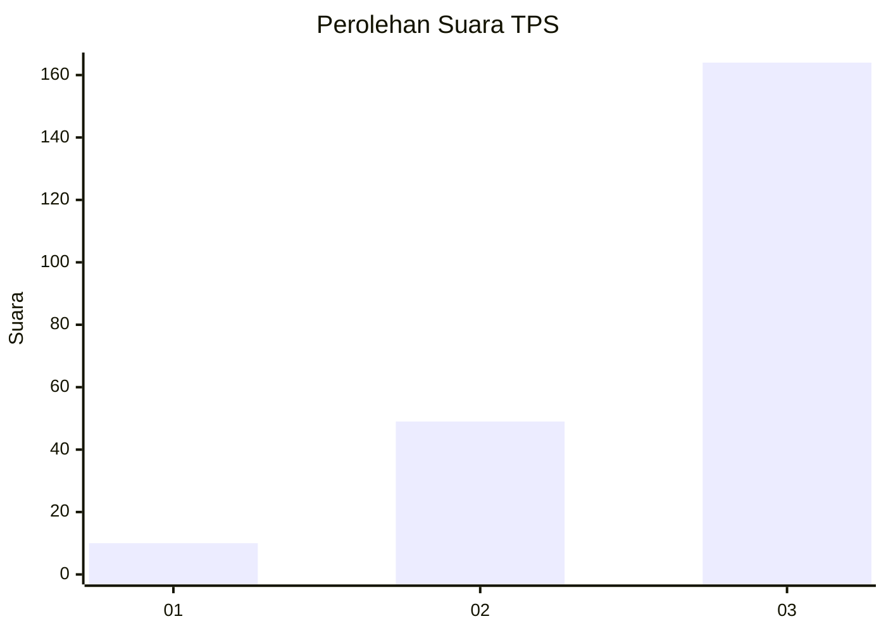
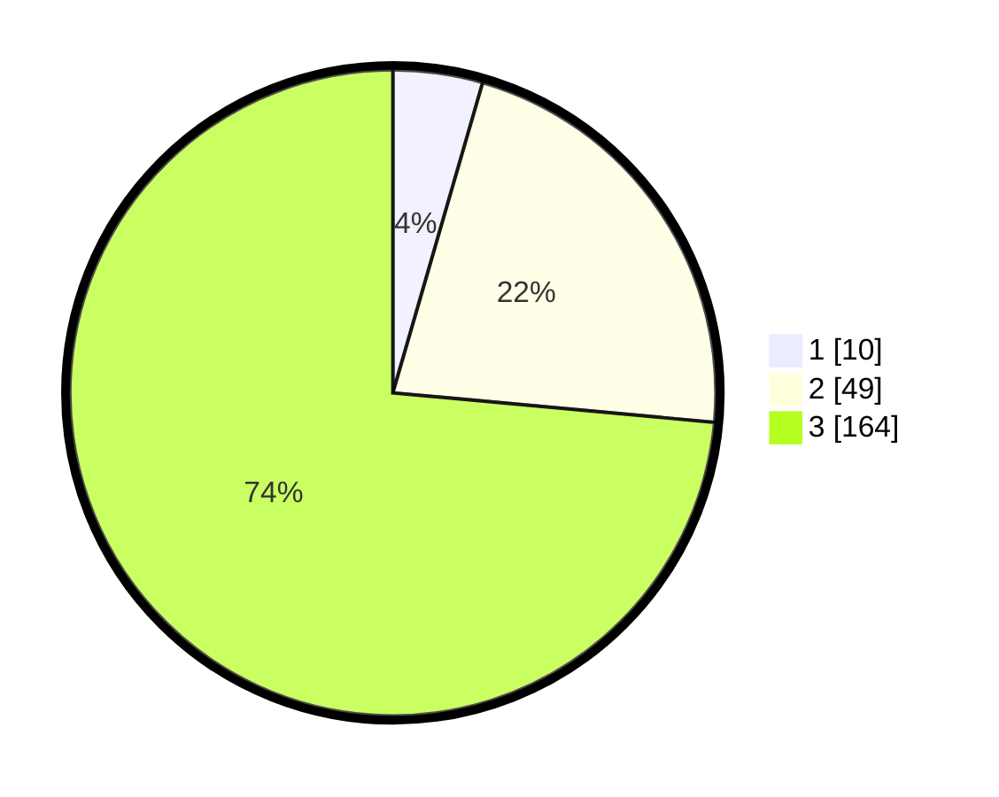

# Hasil

## Grafik

## Tabel

| No. | Nama Paslon    | Suara | Suara (raw) | Persentase |
|:--- |:-------------- | -----:| -----------:| ----------:|
| 1   | ANIES MUHAIMIN | 10    | [10][p-1]   | 4,48       |
| 2   | PRABOWO GIBRAN | 49    | [49][p-2]   | 21,97      |
| 3   | GANJAR MAHFUD  | 164   | [164][p-3]  | 73,54      |

[p-1]: https://github.com/gigit-pemilu/pemilu-2024-33-jawa-tengah/blob/main/pilpres/hitung-suara/sub/33-jawa-tengah/sub/09-boyolali/sub/07-teras/sub/2001-kopen/sub/001-tps/sub/paslon-1.txt
[p-2]: https://github.com/gigit-pemilu/pemilu-2024-33-jawa-tengah/blob/main/pilpres/hitung-suara/sub/33-jawa-tengah/sub/09-boyolali/sub/07-teras/sub/2001-kopen/sub/001-tps/sub/paslon-2.txt
[p-3]: https://github.com/gigit-pemilu/pemilu-2024-33-jawa-tengah/blob/main/pilpres/hitung-suara/sub/33-jawa-tengah/sub/09-boyolali/sub/07-teras/sub/2001-kopen/sub/001-tps/sub/paslon-3.txt

## Foto C Plano

https://sirekap-obj-formc.kpu.go.id/8f7f/pemilu/ppwp/33/09/07/20/01/3309072001001-20240215-185835--3637cae0-59b8-414d-957d-4624c5f89ab8.jpg

https://sirekap-obj-formc.kpu.go.id/8f7f/pemilu/ppwp/33/09/07/20/01/3309072001001-20240217-093102--0df2333e-28d4-4891-9124-ac65a0cf71ca.jpg

https://sirekap-obj-formc.kpu.go.id/8f7f/pemilu/ppwp/33/09/07/20/01/3309072001001-20240215-034226--cb0ae6e7-0611-47e5-b660-f4cd1884aa33.jpg

## Metadata

| Key        | Value               |
| ---------- | ------------------- |
| Time Stamp | 2024-02-24 22:31:28 |

