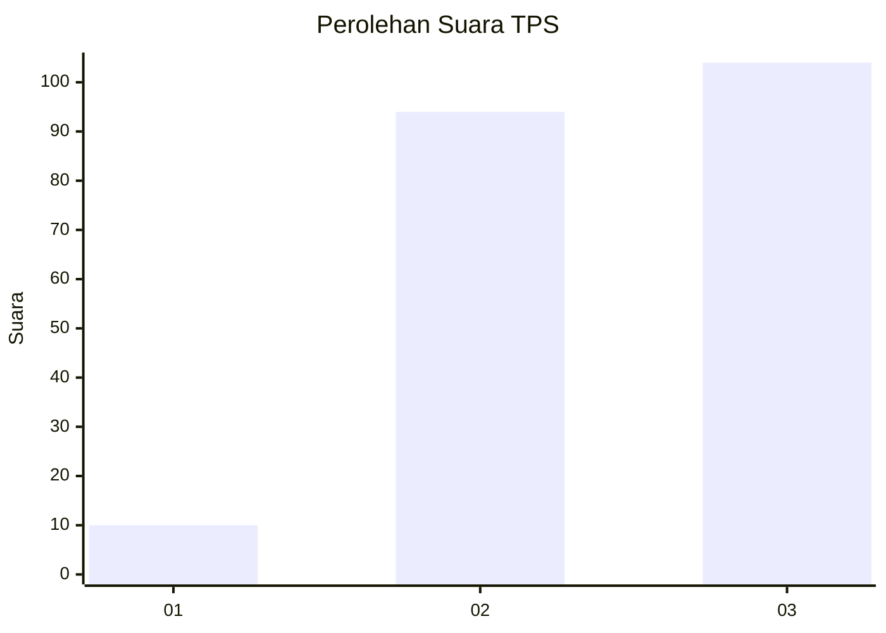
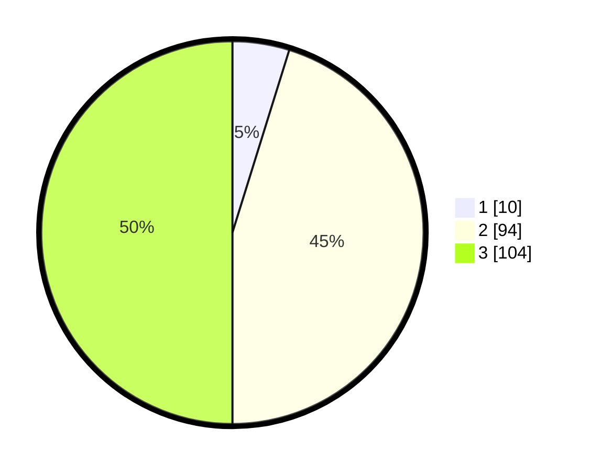

# Hasil

## Grafik

## Tabel

| No. | Nama Paslon    | Suara | Suara (raw) | Persentase |
|:--- |:-------------- | -----:| -----------:| ----------:|
| 1   | ANIES MUHAIMIN | 10    | [10][p-1]   | 4,81       |
| 2   | PRABOWO GIBRAN | 94    | [94][p-2]   | 45,19      |
| 3   | GANJAR MAHFUD  | 104   | [104][p-3]  | 50,00      |

[p-1]: https://github.com/gigit-pemilu/pemilu-2024/blob/main/pilpres/hitung-suara/sub/33-jawa-tengah/sub/09-boyolali/sub/07-teras/sub/2001-kopen/sub/004-tps/sub/paslon-1.txt
[p-2]: https://github.com/gigit-pemilu/pemilu-2024/blob/main/pilpres/hitung-suara/sub/33-jawa-tengah/sub/09-boyolali/sub/07-teras/sub/2001-kopen/sub/004-tps/sub/paslon-2.txt
[p-3]: https://github.com/gigit-pemilu/pemilu-2024/blob/main/pilpres/hitung-suara/sub/33-jawa-tengah/sub/09-boyolali/sub/07-teras/sub/2001-kopen/sub/004-tps/sub/paslon-3.txt

## Foto C Plano

https://sirekap-obj-formc.kpu.go.id/534c/pemilu/ppwp/33/09/07/20/01/3309072001004-20240214-223211--04974277-044f-4846-8438-f7faae5a8459.jpg

https://sirekap-obj-formc.kpu.go.id/534c/pemilu/ppwp/33/09/07/20/01/3309072001004-20240214-223312--be71908b-53fa-4844-a948-5583ef2bc120.jpg

https://sirekap-obj-formc.kpu.go.id/534c/pemilu/ppwp/33/09/07/20/01/3309072001004-20240214-223523--dfd52a3f-54b8-4f12-b37a-2f7fb8db5243.jpg

## Metadata

| Key        | Value               |
| ---------- | ------------------- |
| Time Stamp | 2024-02-15 21:30:27 |

